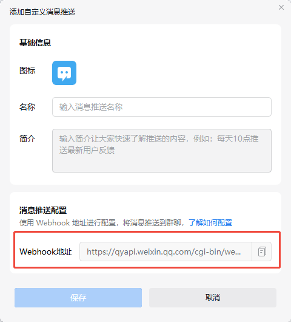

# Notify Plugin

> CoStrict CLI system-level notifications keep you informed when tasks are completed

Github: https://github.com/zgsm-ai/costrict-system-notify

## Version Requirements

Please ensure that CoStrict CLI version is 3.0.8 or above

## Notification Events

The plugin will send notifications for the following events:

- Main session enters waiting state

<!--  -->

- Permission request

<!--  -->

- Question tool invocation

<!--  -->

## Notification Channels and Configuration

The plugin provides the following three notification channels:

### 1. System Notification Bar

<!--  -->

Based on the [node-notify](https://github.com/mikaelbr/node-notifier) library, supports Windows, macOS, and Linux

Enabled by default. No configuration required. To disable, configure the following environment variable:

```bash
export NOTIFY_ENABLE_SYSTEM=false
```

### 2. WeCom Group Message Bot Notification

Based on WeCom group message bot webhook mechanism for notifications

Enable by configuring the following environment variables, disabled by default:

```bash
export NOTIFY_ENABLE_WECOM=true
export WECOM_WEBHOOK_URL=YOUR_WEBHOOK_URL
```

How to get the webhook URL:

1. Open WeCom group settings and select message push feature

<!--  -->

2. Add custom message push

<!--  -->

3. Add push bot and get the push webhook URL

<!--  -->

### 3. Bark Notification (iOS Users Only)

[Bark](https://github.com/Finb/Bark) is a free notification app based on Apple's unified push center mechanism. It doesn't consume additional battery power and doesn't need to run in the background

Enable by configuring the following environment variables, disabled by default:

```bash
export NOTIFY_ENABLE_BARK=true
export BARK_URL="https://api.day.app/BARK_KEY"
```

BARK_KEY can be obtained from the Bark App interface:

<!--  -->
