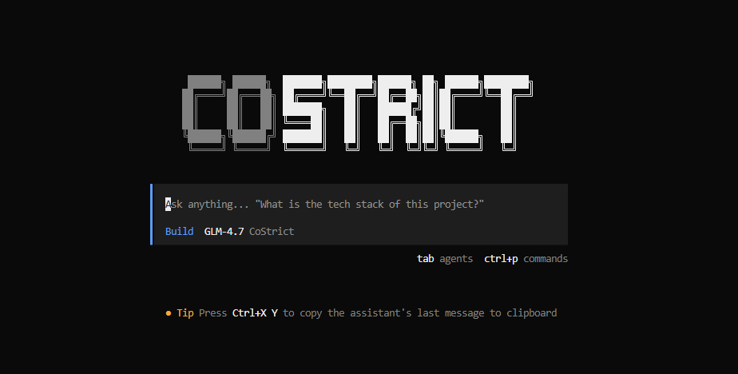
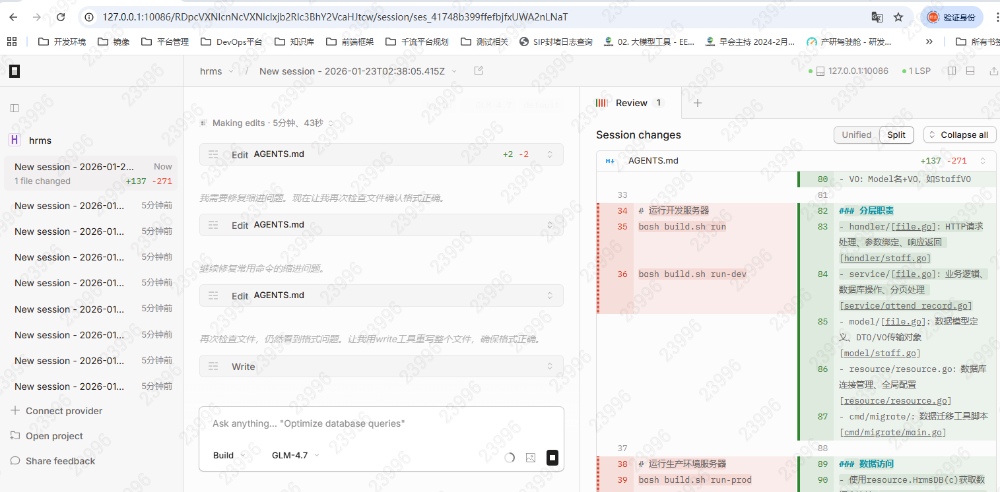

# Getting Started with Features

## Launch

- TUI:

```bash
cs
```



- Command Line:

```bash
cs run  --agent build  --model costrict/GLM-4.7   "hello"
# Hello! How can I help you?
```

- Web:

```bash
cs web     # You can specify IP and port using --hostname --port
```

Then open the address in a browser, default: http://127.0.0.1:4096/



- Container

```bash
docker pull zgsm/costrict-cli:latest
docker run -it zgsm/costrict-cli:latest
```

## Select Model

Inside the CLI, enter `/models` to select a model

## Start New Session
Inside the CLI, enter `/new`

## Continue Last Session

```
cs  --continue
```

Or enter `/session` and select the corresponding session to confirm.

## Switch Agent

● Parent Agent: Use the Tab key to switch in the dialog box. Build/StrictPlan Agents are built-in by default.

● Sub-Agent: Use @name to invoke.

## Enter/Exit Sub-Agent Dialog

- Enter: Double-click the sub-agent dialog to enter the sub-agent.

- Exit: Follow the shortcut key prompts at the top of the page. If there's a shortcut key conflict, you can click "Parent" in the upper left corner to exit.

## Other Commands

Please use `cs --help` to view.
