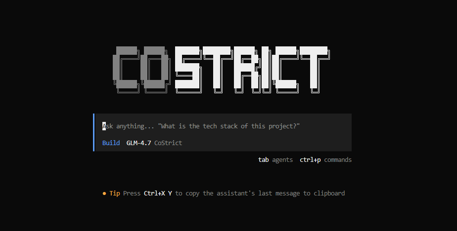
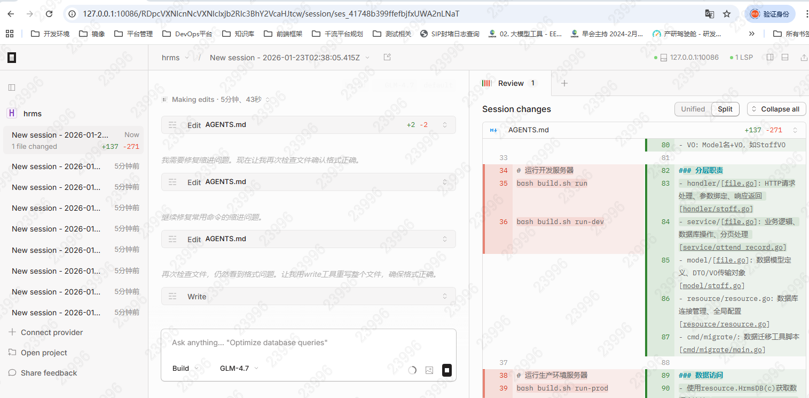

# Getting Started

## Launch Methods

### TUI Interactive Interface

```bash
cs
```

Starts the terminal UI (TUI) in the current directory. You can also specify a working directory:

```bash
cs /path/to/project
```



### Non-interactive Mode

Pass a prompt directly — useful for scripts and automation:

```bash
cs run --agent build --model costrict/GLM-4.7 "Hello"
# Hello! How can I help you?
```

### Web Interface

```bash
cs web                                    # Default: http://127.0.0.1:4096/
cs web --hostname 0.0.0.0 --port 8080    # Custom host and port
```



### Docker Container

```bash
docker pull zgsm/costrict-cli:latest
docker run -it zgsm/costrict-cli:latest
```

---

## Input Methods

### File References

Use `@` in a message to reference a file. Fuzzy search is supported for files in the current working directory:

```
@packages/src/api/index.ts How is the authentication logic implemented in this file?
```

The file contents are automatically added to the conversation context.

### Shell Commands

Messages starting with `!` are executed as shell commands, and the output is added to the conversation:

```bash
!ls -la
!git log --oneline -10
```

---

## Session Management

### Start a New Session

```bash
/new
```

Shortcut: `ctrl+x n`

### Resume a Previous Session

```bash
cs --continue
```

Or type `/sessions` in the TUI and select a session from the list.

Shortcut: `ctrl+x l`

### Undo / Redo

`/undo` reverts the last message and all associated file changes. `/redo` restores what was undone.

> Undo/redo relies on Git to track file changes — the project must be a Git repository.

Shortcuts: `ctrl+x u` / `ctrl+x r`

### Compact Context

When the context gets too long, compress the current session:

```bash
/compact
```

Shortcut: `ctrl+x c`

---

## Model Management

### Select a Model

```bash
/models
```

Shortcut: `ctrl+x m`

### Switch Model Variants

Use `ctrl+t` to cycle through variants of the same model (e.g., different reasoning intensities).

### Set the Default Model

In `costrict.json`:

```json
{
  "$schema": "https://opencode.ai/config.json",
  "model": "anthropic/claude-sonnet-4-5"
}
```

See the [Models & Providers documentation](../config/models) for details.

---

## Agent Management

### Switch Agents

- **Parent agent**: Use `Tab` / `Shift+Tab` in the input box to cycle through agents. The built-in agents are **Build** and **StrictPlan**.
- **Sub-agent**: Invoke with `@name` syntax.

### Enter / Exit a Sub-agent Conversation

- **Enter**: Double-click a sub-agent conversation to step into it.
- **Exit**: Press the shortcut shown at the top of the page. If there is a key conflict, click **Parent** in the top-left corner to exit.

---

## Slash Commands

Type `/` followed by a command name in the TUI:

| Command | Description | Shortcut |
| ------- | ----------- | -------- |
| `/new` | Start a new session (alias: `/clear`) | `ctrl+x n` |
| `/sessions` | List and switch sessions (alias: `/resume`) | `ctrl+x l` |
| `/models` | Select a model | `ctrl+x m` |
| `/compact` | Compact the current session (alias: `/summarize`) | `ctrl+x c` |
| `/undo` | Undo the last message and file changes | `ctrl+x u` |
| `/redo` | Redo undone changes | `ctrl+x r` |
| `/connect` | Add a provider API key | — |
| `/init` | Create or update the `AGENTS.md` file | `ctrl+x i` |
| `/editor` | Compose a message in an external editor | `ctrl+x e` |
| `/export` | Export the conversation as Markdown | `ctrl+x x` |
| `/theme` | Choose a UI theme | `ctrl+x t` |
| `/thinking` | Toggle display of thinking process | — |
| `/details` | Toggle display of tool execution details | — |
| `/help` | Show help | `ctrl+x h` |
| `/exit` | Quit (aliases: `/quit`, `/q`) | `ctrl+x q` |

---

## External Editor Setup

The `/editor` and `/export` commands use the editor specified by the `EDITOR` environment variable.

**Linux / macOS:**

```bash
export EDITOR="code --wait"   # VS Code
export EDITOR=vim
```

Add this to `~/.bashrc` or `~/.zshrc` to make it permanent.

**Windows (PowerShell):**

```powershell
$env:EDITOR = "code --wait"
```

Common editors: `code` (VS Code), `cursor`, `windsurf`, `nvim`, `vim`, `nano`, `notepad`.

> GUI editors (VS Code, Cursor, etc.) require the `--wait` flag so that the editor blocks until the file is closed.

---

## TUI Configuration

Customize TUI behavior via `costrict.json`:

```json title="costrict.json"
{
  "$schema": "https://opencode.ai/config.json",
  "tui": {
    "scroll_speed": 3,
    "scroll_acceleration": {
      "enabled": true
    },
    "diff_style": "auto"
  }
}
```

- `scroll_speed` — Scroll speed multiplier (default: `3`, minimum: `1`)
- `scroll_acceleration.enabled` — Enable smooth scroll acceleration; when enabled, takes precedence over `scroll_speed`
- `diff_style` — Diff rendering style: `"auto"` adapts to terminal width, `"stacked"` always shows single-column diffs

---

For more CLI flags and environment variable options, see the [CLI Reference](./cli).
