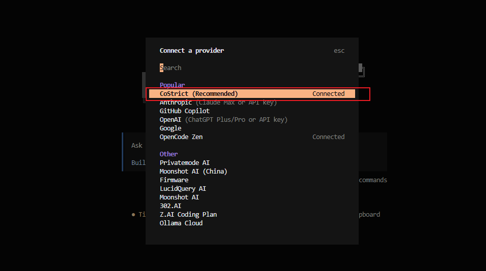

# Account Login

- Select CoStrict Provider
After executing `cs`, when the tool starts, a dialog box will appear. Enter `/connect` and select the CoStrict provider.

Or:
```bash
cs auth login
```



- Log in through the browser. (If the browser does not open automatically, manually copy the URL to the browser to log in)


- Return to the terminal and wait for the login to complete (usually within a few seconds).

Note: If Linux cannot open the browser, there are the following solutions:

1. Open the terminal in VSCode and remotely connect to the server. VSCode can automatically open the browser.

2. Copy the URL from the login window and manually open it in the browser to log in (some terminals, such as Mobaxterm, cannot copy URLs. Please switch to another terminal, such as using the ssh command directly to connect to the server).

3. Log in to CoStrict on Windows first (either CLI or plugin), then copy `%USER_PROFILE%/.costrict/share/auth.json` to the server at `${HOME}/.costrict/share/auth.json`, and then use it. If the directory does not exist, please create it manually.
