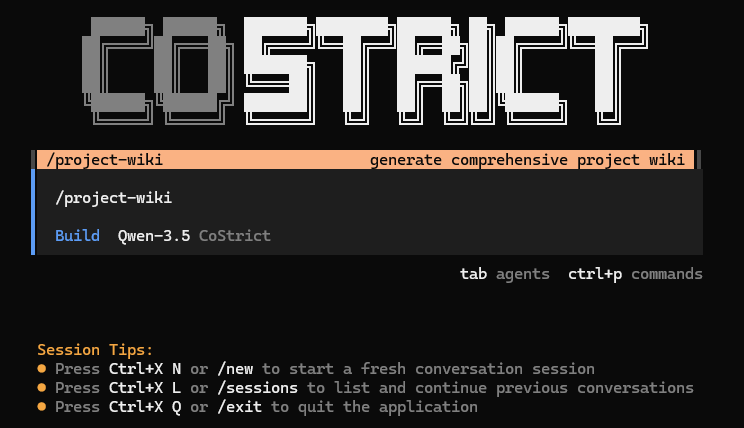
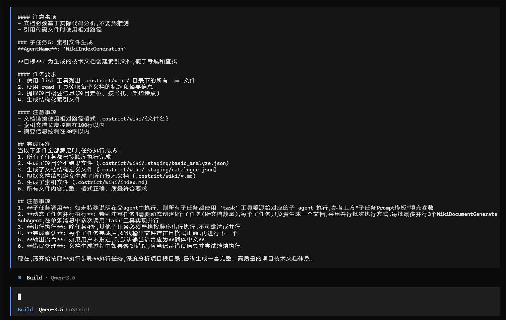

# Project Wiki

This feature uses AI to perform comprehensive, multi-dimensional deep analysis of code repositories, combining project characteristics to generate a technical documentation system tailored to the project.

## Usage

In **build** mode, enter `/project-wiki`, press Enter to execute, and wait for completion. Execution time ranges from a few minutes to tens of minutes, depending on the project size.



<!--  -->

Final output example:

```
└─wiki/
    01-Project-Overview-and-Architecture-Analysis.md
    02-Core-Module-Deep-Analysis.md
    03-Data-Flow-and-State-Management.md
    04-API-and-Interface-Design.md
    05-Technical-Implementation-Details.md
    06-Testing-and-Quality-Assurance.md
    index.md
```

