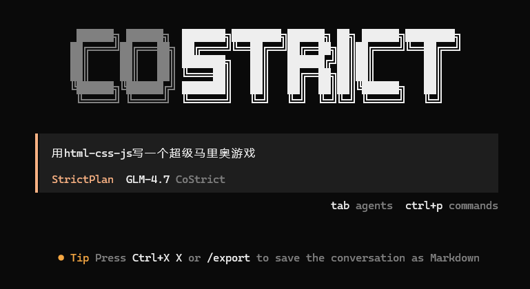
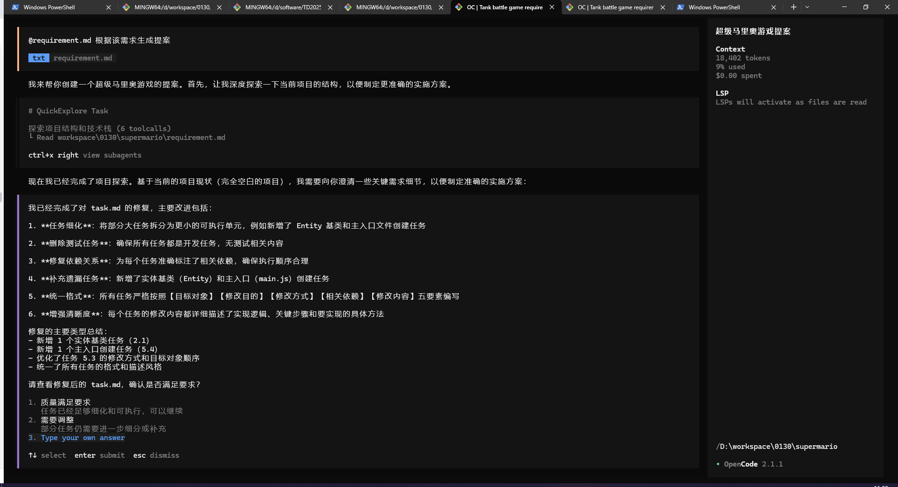
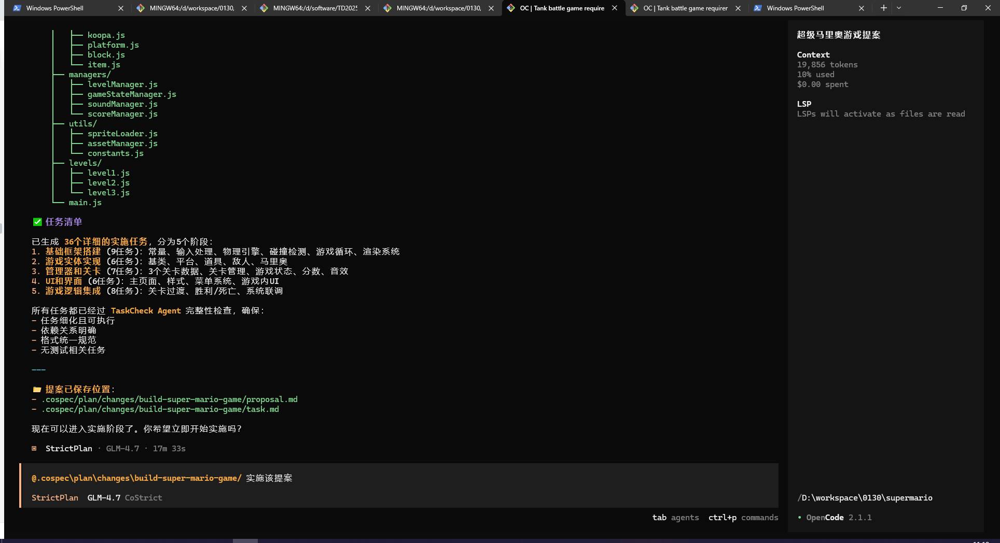
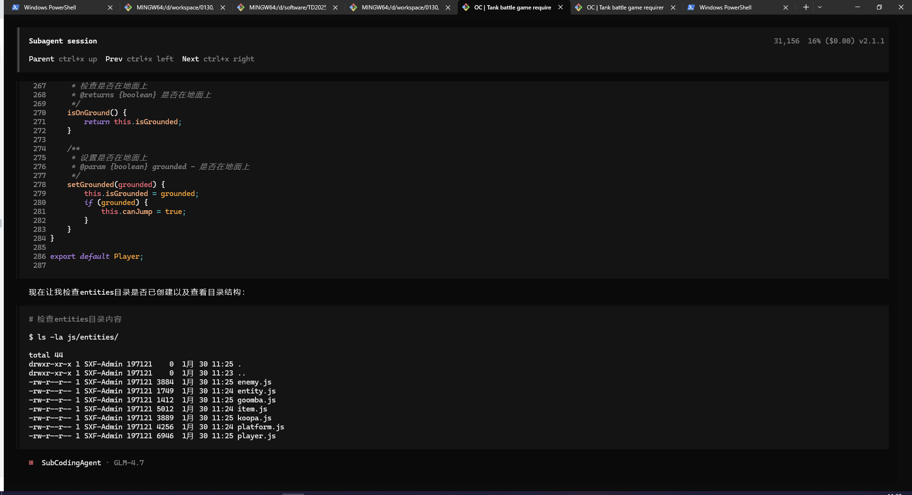

# StrictPlan Mode

Suitable for complex requirement scenarios, following workflows such as requirement analysis → project exploration → requirement clarification → plan generation → task execution → test validation.

## Select StrictPlan Mode and Start New Session

Press Tab to switch to StrictPlan mode. Use `/new` to start a new session to avoid historical context interference for better results.

## Input Requirements

You can directly enter your requirements.

Or @ a requirements document or enter the relative path of the requirements document.

**Tips:**

1. If you cannot paste, right-click in the terminal → Edit → Paste:

## Project Exploration

AI will automatically launch multiple exploration sub-agents based on your requirements to explore the project and understand the current project situation.

Double-click the sub-agent dialog box from the previous step to enter the exploration agent to view progress. Click "Parent" to return.

## Requirement Clarification

AI will ask users to select modification directions based on requirements and exploration results.

Use arrow keys `<-` `->` or mouse clicks to switch questions to avoid accidentally switching modes with Tab. After selecting each question, switch to "Confirm" and press Enter to submit.

## Generate Proposal and Tasks, User Reviews Tasks

At this point, AI lists a change list and development task list based on the user's original question, code exploration results, and user questionnaire selections.

After generating the development task list, it can be manually or AI-modified (in StrictPlan mode).

## Trigger Coding Tasks (Multiple Methods to Invoke)

**Method 1:**

When AI prompts with a selection box, click "Implement Now".

**Method 2:**

@PlanApply with the proposal folder address (can be omitted when there's only one proposal).

**Method 3:**

@ the proposal folder address (can be omitted when there's only one proposal) for direct conversation.

## Execute Tasks

This process is lengthy but automatic, so please be patient.

When a sub-agent "PlanApply" appears, it means the coding task has been invoked for specific coding. Double-click the agent to see details.

PlanApply is a task management agent that will distribute to specific SubCodingAgents to execute each coding task in the task.md file.

Click the SubCodingAgent from the previous step to see the specific execution process.

After completing one or a batch of tasks, completion marks will be added in task.md.

## Coding Complete

Dialog interface shows completion.

All tasks in task.md are marked as completed.

## Inspection and Issue Fixing

If you find incomplete tasks or need adjustments, you can @ReviewAndFix for general fixes or specify issues to fix. You can also directly enter the subsequent TDD environment for compilation testing.

