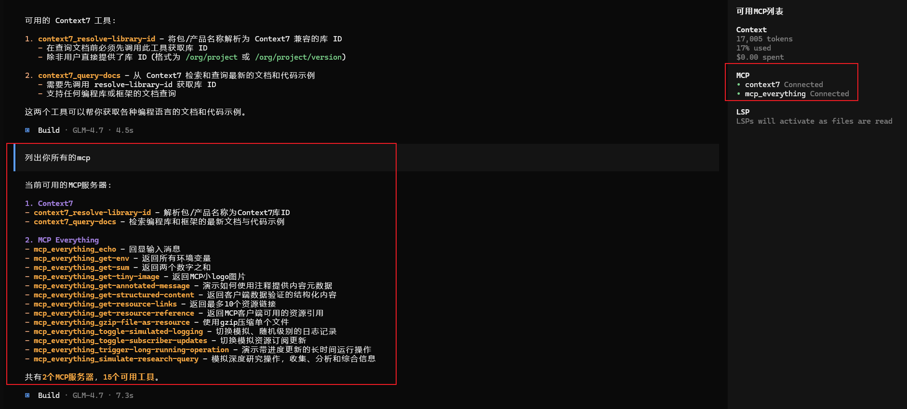

# MCP

## Configuration Location

● Global configuration: ~/.config/costrict/costrict.json

● Project configuration: costrict.json in the project root directory

## Configuration Example

The following configures two MCPs, one remote and one local.

```
{
  "$schema": "https://opencode.ai/config.json",
  "mcp": {
    "context7": {
      "type": "remote",
      "url": "https://mcp.context7.com/mcp",
      "headers": {
        "CONTEXT7_API_KEY": "{env:CONTEXT7_API_KEY}"
      }
    },
	"mcp_everything": {
      "type": "local",
      "command": ["npx", "-y", "@modelcontextprotocol/server-everything"],
    }
  }
}

```

Configuration description:

● Local

| **Option**      | **Type** | **Required** | **Description**                                              |
| --------------- | -------- | ------------ | ------------------------------------------------------------ |
| **type**        | String   | Y            | MCP server connection type, must be **"local"**.             |
| **command**     | Array    | Y            | Command and parameters to run the MCP server.                |
| **environment** | Object   |              | Environment variables to set when running the server.        |
| **enabled**     | Boolean  |              | Enable or disable the MCP server on startup.                 |
| **timeout**     | Number   |              | Timeout for fetching tools from the MCP server (milliseconds). Default is 5000 (5 seconds). |

● Remote

| **Option**  | **Type** | **Required** | **Description**                                              |
| ----------- | -------- | ------------ | ------------------------------------------------------------ |
| **type**    | String   | Y            | MCP server connection type, must be **"remote"**.            |
| **url**     | String   | Y            | URL of the remote MCP server.                                |
| **enabled** | Boolean  |              | Enable or disable the MCP server on startup.                 |
| **headers** | Object   |              | Headers to send with requests.                               |
| **oauth**   | Object   |              | OAuth authentication configuration.                          |
| **timeout** | Number   |              | Timeout for fetching tools from the MCP server (milliseconds). Default is 5000 (5 seconds). |

OAuth configuration:

| **Option**       | **Type**        | **Description**                                              |
| ---------------- | --------------- | ------------------------------------------------------------ |
| **oauth**        | Object \| false | OAuth configuration object, or **false** to disable OAuth auto-detection. |
| **clientId**     | String          | OAuth client ID. If not provided, will attempt dynamic client registration. |
| **clientSecret** | String          | OAuth client secret, required if the authorization server requires it. |
| **scope**        | String          | OAuth permission scope requested during authorization.       |

## Testing

Execute: `cs  mcp list`



