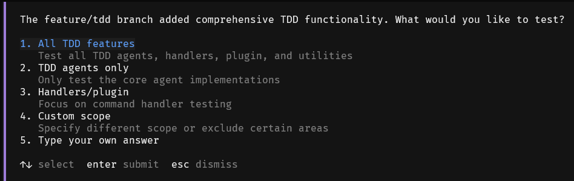
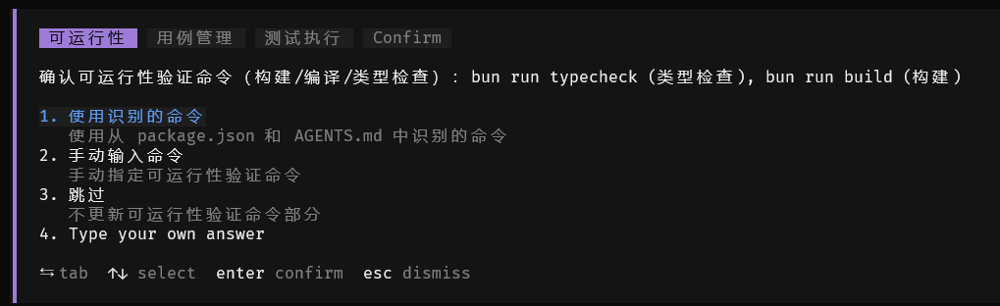

# Test-Driven Development (TDD)

## Start TDD Mode

Return to **Build** mode (press Tab key to switch) and execute the **/test** command (or combine with input test requirements */test test the TDD agent functionality*) to start self-testing self-loop.

After the previous coding process ends, AI will recommend whether to test immediately based on the specific situation. After selecting, you can start testing with the same effect as /test.

## /test Command Automation Process Description

1) Runability verification. The RunAndFix agent will be automatically invoked for runability verification to ensure that the current project has no basic running issues. Currently, it mainly verifies **compilation issues** and will execute compilation commands and fix **coding defects** until compilation passes.

2) Test requirement confirmation. Test requirements will be obtained from the plan mode proposal, historical context, current changed files, and recent commit history in order of priority, and user confirmation will be required:

You can select or customize input test requirements.

3) Execute the TestDesign agent for test design. Based on the functions to be tested, test point design will be performed, with priority given to integration testing. Unit testing will be performed for missing points. Test point documents for the current task will be generated under .cospec/test-plans/. Finally, test case files will be generated.

4) Execute the TestAndFix agent for testing and fixing process. Based on test points and test cases, tests will be executed and coding issues will be fixed.

## TestPrepare Agent's Automatic Generation of Test Guidance

During the test execution process, operations related to the current project will be involved, including compilation commands, test commands, use case design specifications, etc.

Each agent will prioritize reading the **test guidance document (TEST_GUIDE.md)** in the project. If it exists, it will be followed as the only test plan. Otherwise, the TestPrepare agent will be **automatically enabled** for automatic generation of test guidance plans.

TestPrepare agent's retrieval application priority is:

1) User-configured extension commands and skill capabilities. If they can assist testing, they will be automatically identified.

2) AGENTS.md, CONTRIBUTING.md, DEVELOPMENT.md and other documents.

3) Configuration files such as package.json, makefile.

4) Script storage directories such as scripts/.

5) Automatically decide and generate based on the current project's programming language and framework.

After retrieval is completed, the core three parts of test guidance will be included for user confirmation (all support manual adjustment):

1) Runability verification method (such as using commands like go build, npm run build).

2) Test case organization method (using organization like xxx.test.go, storage in corresponding tests/ directory, etc.).

3) Test execution method (using knowledge like npm run test, bun test tests/play.test.ts).

After confirmation, the results will be saved in `<project>.cospec/TEST_GUIDE.md` for subsequent reuse.

## TEST_GUIDE.md Test Guidance File Description

All test-related agents will load the TEST_GUIDE.md test guidance document content by default. The loading path is as follows (if there are multiple copies, they will be merged):

- `<project>.cospec/TEST_GUIDE.md`

- `<project>TEST_GUIDE.md`

You can also manually write this document to customize the test plan. It can be used to supplement additional testing knowledge points to assist the testing process.

**Notes:**

This version has LSP functionality (refer to section 4.4.9). It is recommended to install the corresponding environment for better and faster convergence.

