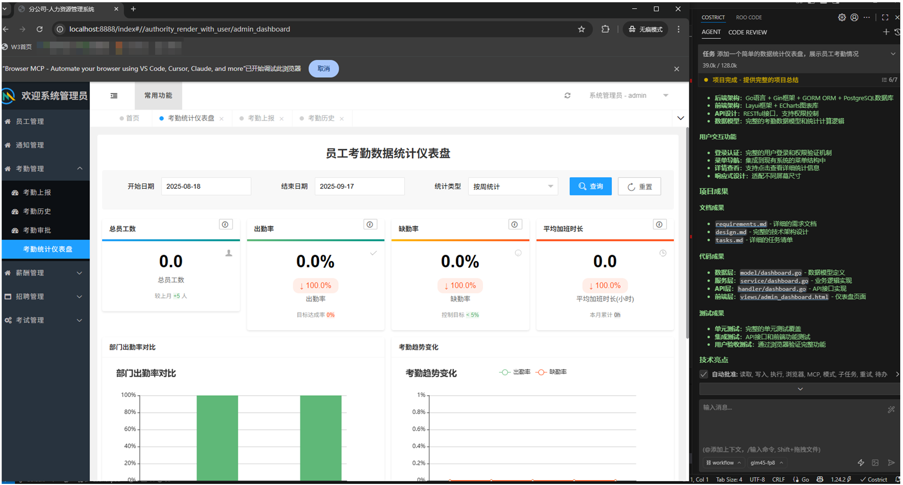

# Case Study 2 – Code Generation: Building a Project from Scratch

### Background

A while ago I was tasked with building a user-analytics dashboard that displays daily active users, attendance frequency, and related metrics on the front end, plus the back-end APIs to aggregate and serve the data. As a back-end engineer, I was only vaguely familiar with front-end frameworks and the ECharts charting library, so the full-stack requirement became the biggest bottleneck.

Rather than stretch the sprint or pull in another teammate, I decided to let the CoStrict AI pair-programmer shoulder the cross-stack work.

### How I Used AI

#### 1. Requirements Analysis & Skeleton

I opened with this prompt:

```
Please analyze the current project structure and design an attendance-statistics feature for me.  
I need both front-end and back-end implementation.  
Start by reviewing the project layout, then propose a solution.
```

CoStrict scanned the repo, recognized a Python back-end + plain-HTML front-end stack, and returned a plan:

- Back-end: add a new data-access layer  
- Front-end: create a statistics page that uses ECharts for visualization  
- DB: add an operation-type column and a timestamp column to the existing user-behavior table  

#### 2. Back-End Code

I drilled down:

```
Generate the back-end code. Expose three endpoints:
1. Daily active users for the last 30 days  
2. Attendance data  
3. Absence data  
```

CoStrict emitted a complete Controller, Service, models, and DTOs—clean, layered, and ready to compile.

#### 3. Front-End Implementation

For the UI I fed CoStrict a step-by-step spec:

```
Use Element UI plus ECharts. Include:
1. Date-range picker  
2. Line chart for daily absences  
3. Pie chart for user distribution  
4. Data table with details  

Make it responsive so it works on phones and desktops.
```

The first cut was functional but visually rough. I iterated:

```
Switch the color palette to the system theme, add animation,  
stack the charts on small screens, and show loading & error states.
```

<!--  -->

#### 4. Testing & Polish

After the code was generated, I asked CoStrict to write unit and integration tests, then pasted any failing output back into the chat for instant debugging.  
In one working day I had a feature that would normally have taken a week—and the sprint stayed green.

<!--  -->

### Key Takeaways

1. **Clear, granular prompts win**  
   The AI needs explicit, bite-sized instructions. Break the epic into stories, then into tasks.

2. **Iterate, don’t chase perfection**  
   Treat the first generation as scaffolding. Refine in quick loops instead of hoping for a single flawless dump.

3. **Code review is still mandatory**  
   AI is fast, but you still own the architecture, security, and style. Read every line.

4. **Cross-stack velocity skyrockets**  
   A back-end dev can now ship a polished front-end feature without hand-offs, cutting calendar time and team dependencies.

This experience convinced me that AI pair-programming isn’t a replacement—it’s an amplifier. It crushes boilerplate and crosses tech-stack borders so engineers can stay focused on core logic and creative design.
