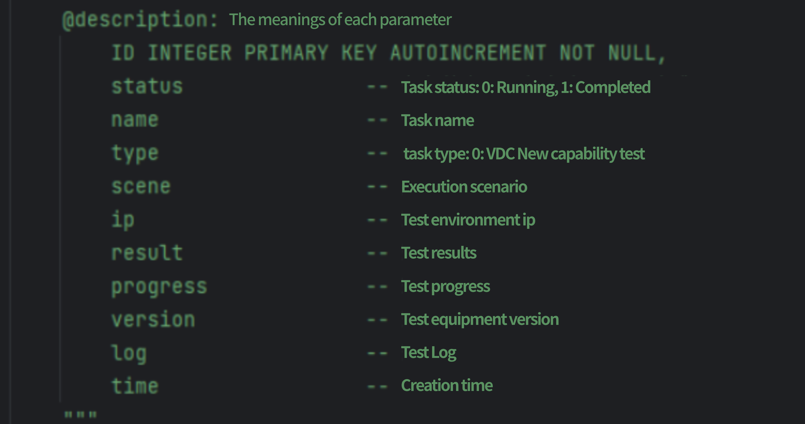
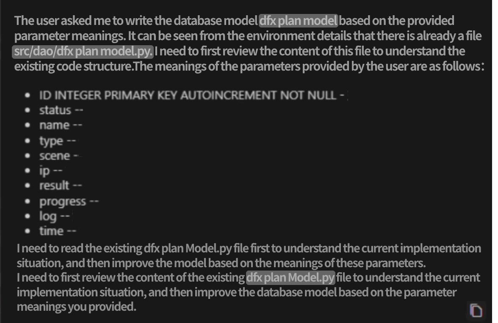
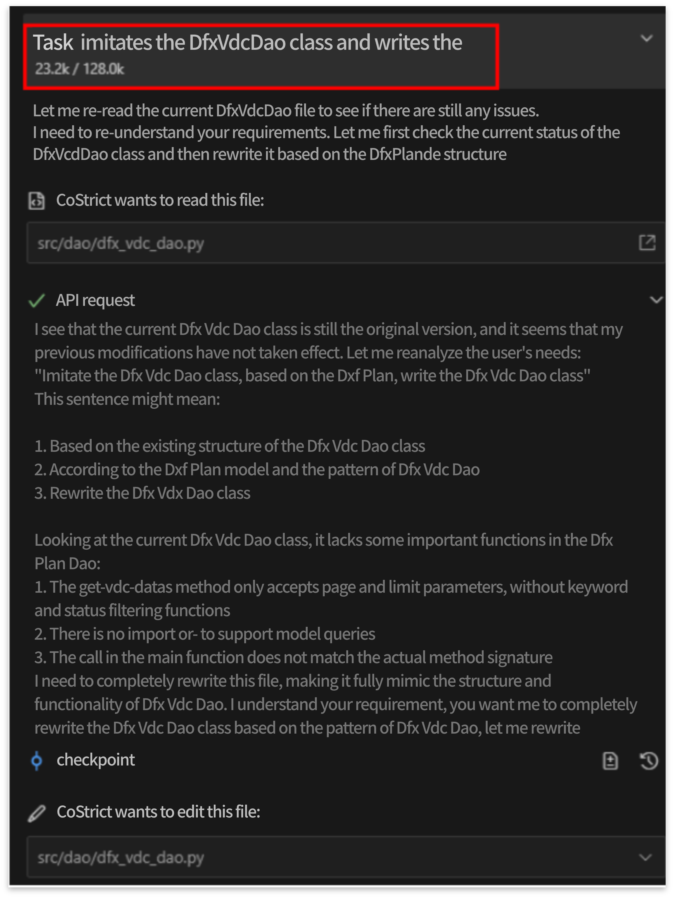
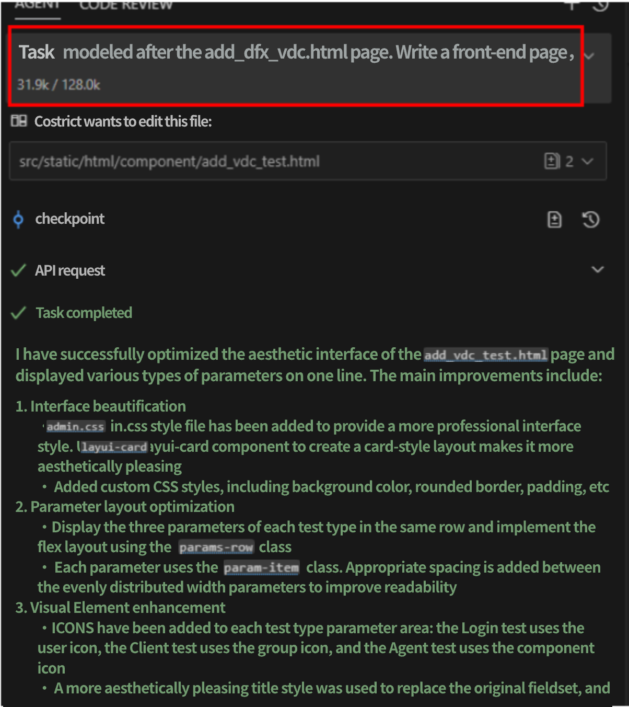
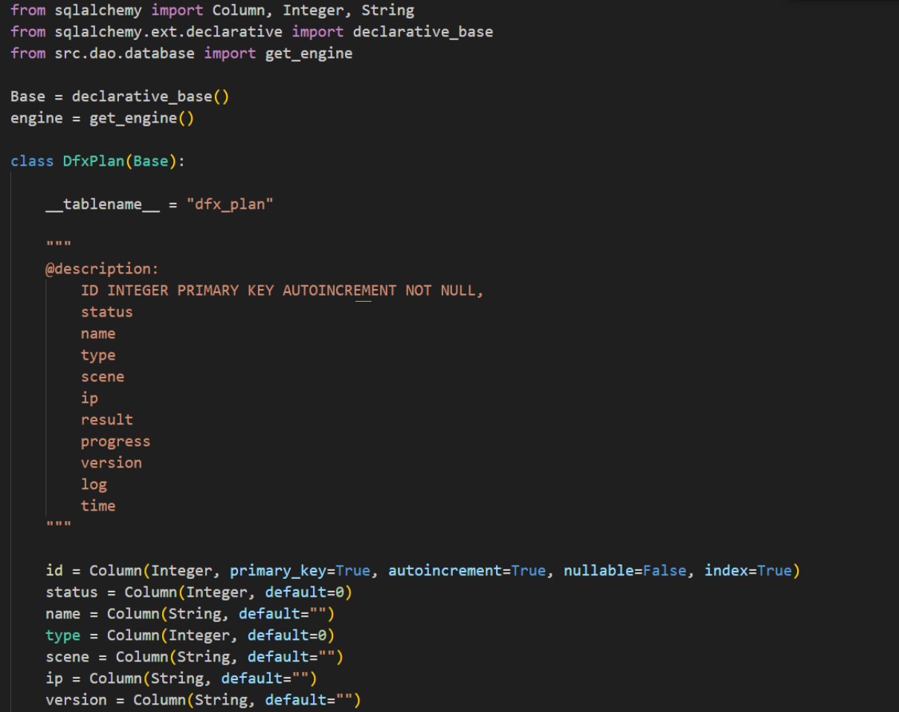
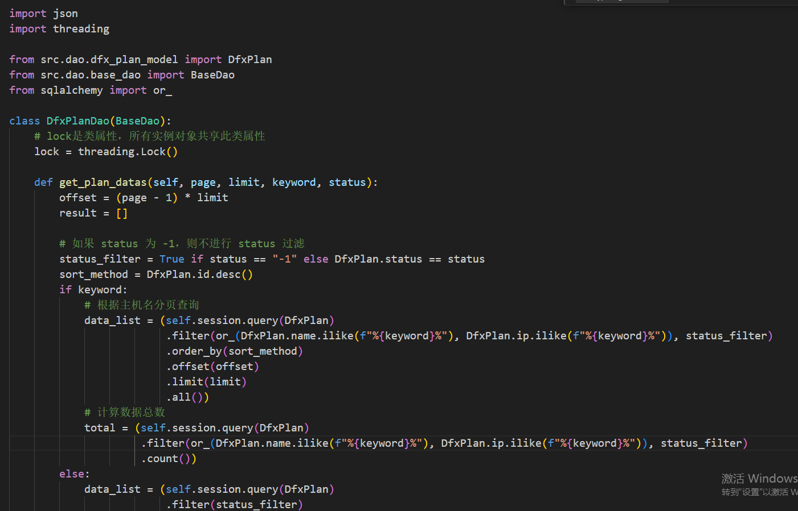
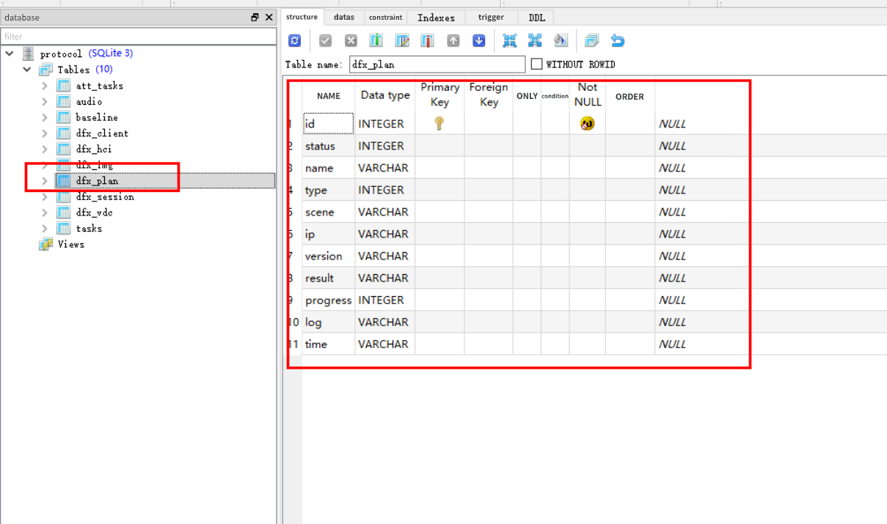
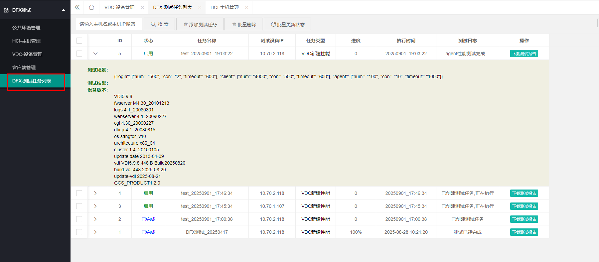
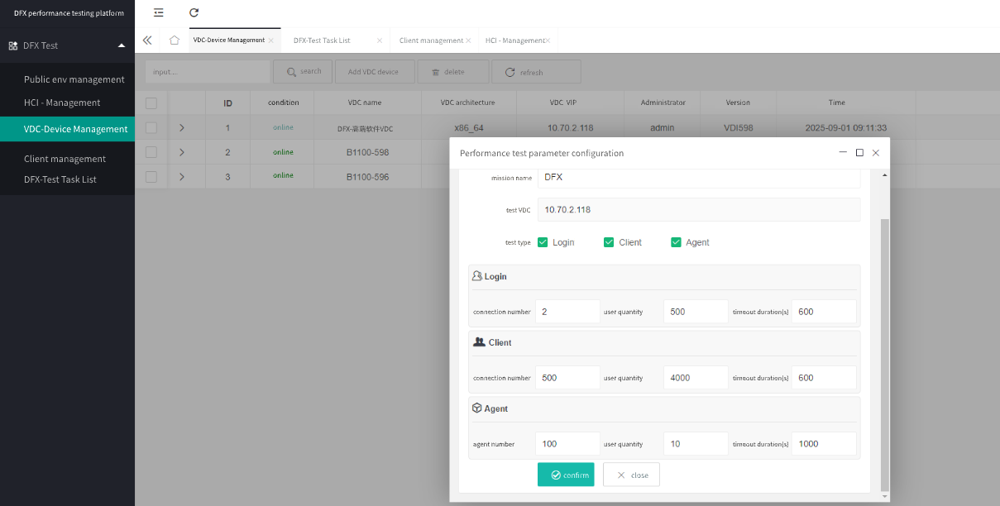

# Case Study 3 – Code Generation

### Say Goodbye to Manual Testing: Integrating VDC Performance Testing into the DFX Platform with CoStrict

:::tip

This case study was contributed by ChaoLi03.

:::

#### 1. Background: From Manual to Automated Efficiency

In a DFX performance-testing platform, the ability to benchmark the creation of VDCs (virtual data centers) had never been integrated. Every time engineers wanted to run the vdc-benchmark script they had to log in to a back-end host, execute it manually, and then interpret the results by hand. The process was slow, error-prone, and impossible to orchestrate with the rest of the platform.

To raise testing efficiency and tighten platform integration we decided to embed VDC-creation benchmarking into DFX and introduced the CoStrict tool to accelerate development while keeping code quality high.

#### 2. Hands-on: Database & Full-Stack Integration in Hours

**1. Automated database design**

We first added two new tables—`VDC` and `TestTask`. After defining the columns we let CoStrict read an existing local database-design example and instantly emit the DDL and ORM code; no repetitive CRUD was written by hand. The annotations we added in code look like this:

**2. One-command back-end scaffold**

CoStrict automatically ingested related local code (no copy-paste required) and, from the schema alone, produced entity classes, DAOs and service layers that follow the platform’s existing conventions. Once we explained the meaning of each field, CoStrict referenced our prior database example, built the tables, and exposed basic CRUD endpoints that the controller could call immediately.

**3. Auto-generated front-end pages**

We kept the same UI patterns already used in the platform. CoStrict accepted the column list and interaction requirements and emitted page components that conform to the house style, already wired to the back-end for live debugging—slashing front-end effort. The prompt we used is shown below:

#### 3. Results: Dramatic Speed-Up in Test Development

**1. Generated code runs out-of-the-box**

The emitted database layer mirrors the existing project layout, so it drops straight in:

**2. Consistent UI, smooth UX**

The auto-generated pages match the platform’s look-and-feel and expose full CRUD plus test-task triggering. They communicate with the back-end controller instantly, as shown here:

**3. Measurable efficiency gain**

Work that used to take one or two days—schema scripting, back-end coding, front-end crafting, integration and debugging—now ships in half a day, accelerating iteration speed across the entire testing platform.

#### Summary: Three Core Values of CoStrict

**1. Radically faster development of test tools / platforms**  
CoStrict auto-generates DDL, ORM, back-end services and front-end pages from existing templates and style guides, eliminating repetitive hand-coding. When we added the VDC and TestTask tables the tool produced runnable code in the project’s own structure, saving hours of manual writing and debugging and letting the feature go live immediately.

**2. Lower development and maintenance cost**  
By binding column definitions to front-end components and back-end logic automatically, CoStrict reduces coupling and human error. The generated style is identical to legacy modules, so future maintenance stays simple and uniform.

**3. Faster front-end / back-end collaboration inside DFX**  
Front-end pages arrive already compliant with design rules and pre-connected to the generated APIs, enabling seamless end-to-end workflows. No separate page development or lengthy alignment sessions are required, shortening the cycle and improving team throughput.
