# Login Configuration Guide

## Configuration Page

### Accessing the Configuration Page

Visit http://\{COSTRICT_BACKEND\}:\{PORT_CASDOOR\} to access the admin login page.

```commandline
Default account: admin
Default password: 123
```
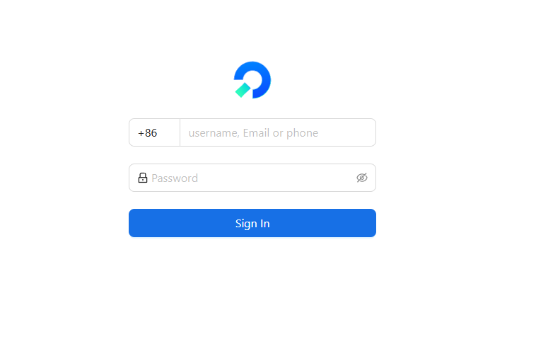

Then enter the admin dashboard.

#### Adding an `oauth` Authentication Provider

Go to Identity → Providers → `Oauth` (template).

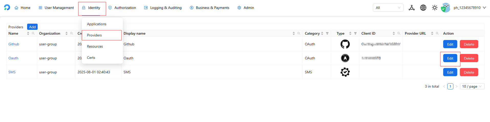

Fill in the standard `oauth` information.

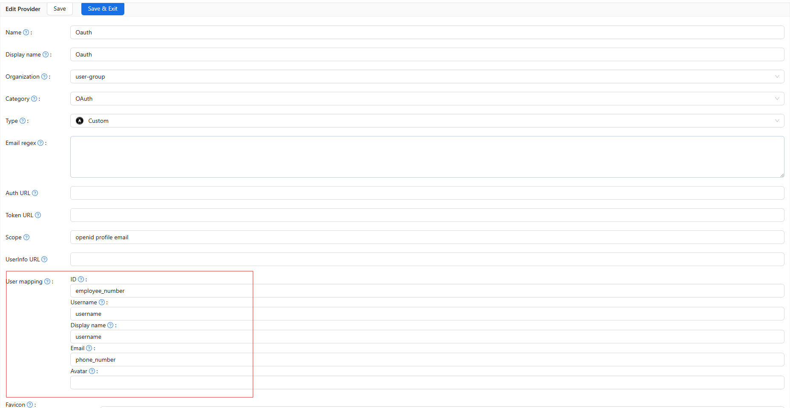

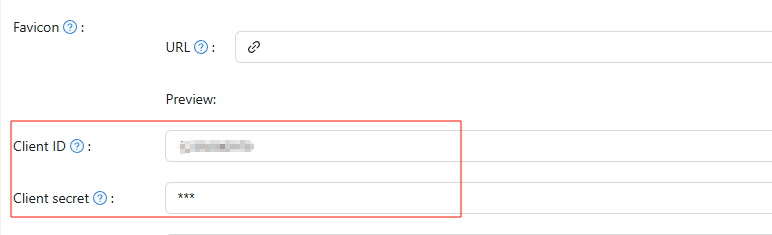

After editing, scroll to the bottom of the page and click `Save & Exit`.

### Adding an SMS Authentication Provider

First, go to Identity → Providers → SMS (template).

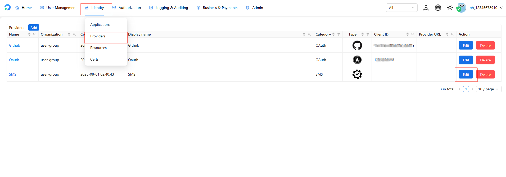

You only need to configure the region node settings.

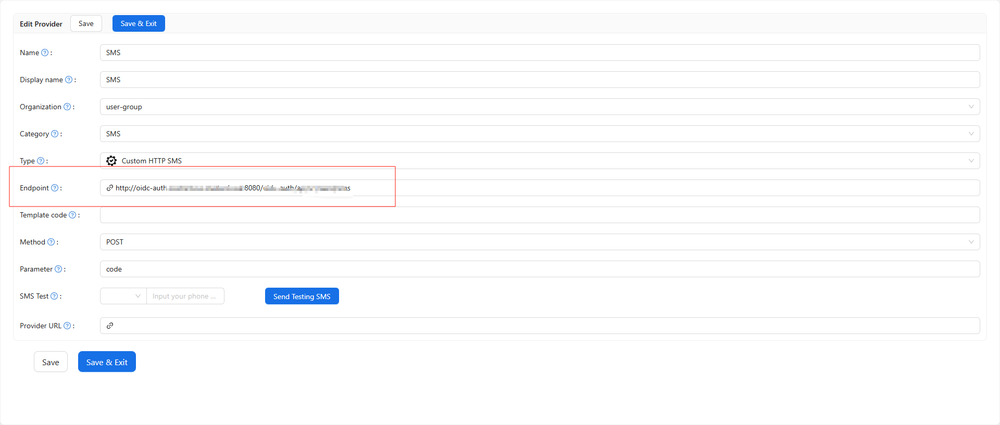

### Login Configuration

First, let's look at the normally enabled user login page.

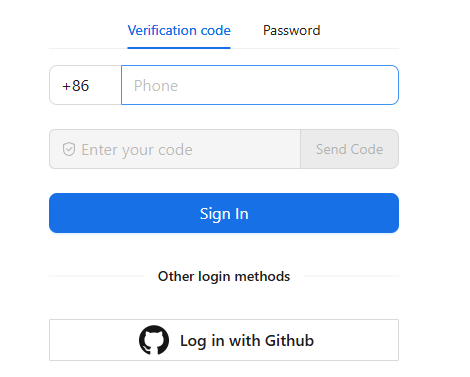

Password login is for testing purposes and includes a built-in account that can be used directly.

```commandline
Account: demo
Password: test123
```

To configure login: go to Identity → Applications → loginApp (template).

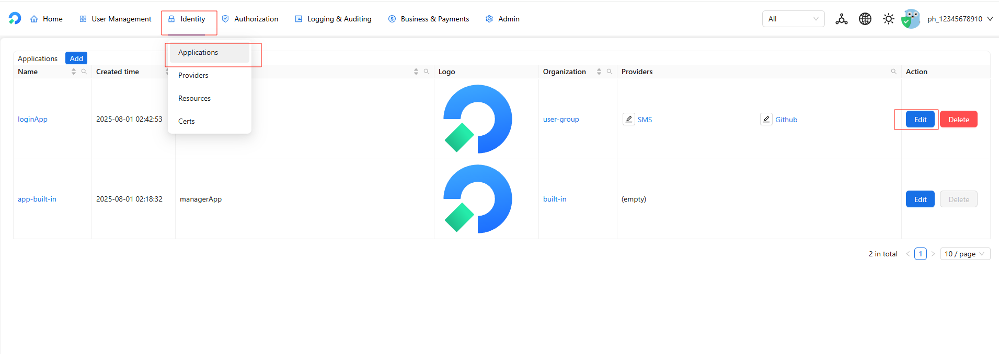

First, modify the login page icon.

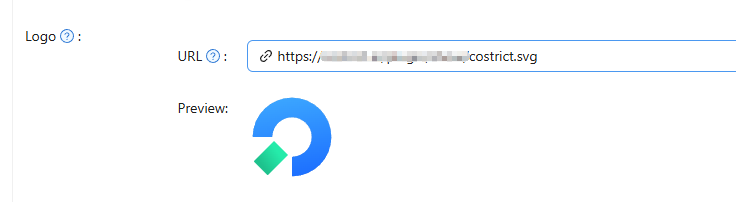

Click the delete button to remove the password login method.

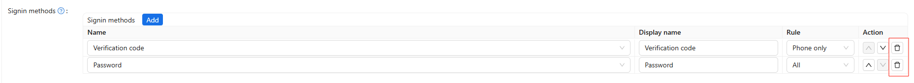

You can also remove the oauth login method (SMS verification cannot be removed).

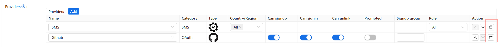

After configuration, scroll to the bottom of the page and click `Save & Exit`.

## Organization Configuration

> This section is mainly used to configure icons and title names.

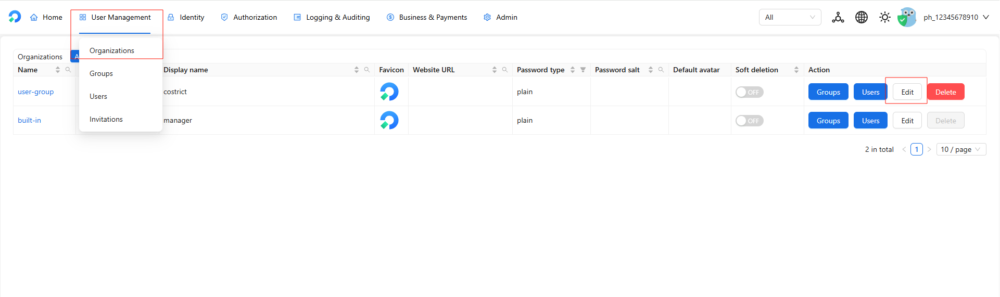

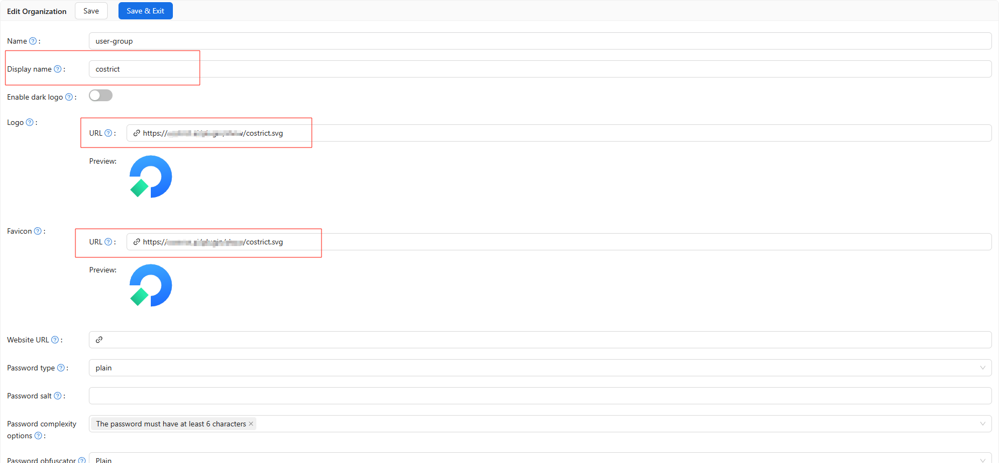

Please ensure the display name in `built-in` matches the user-group name, and replace `logo` and `Organization Favicon` with your own.