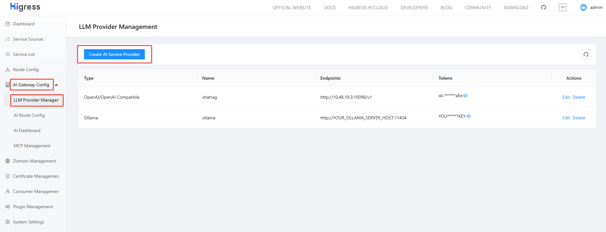
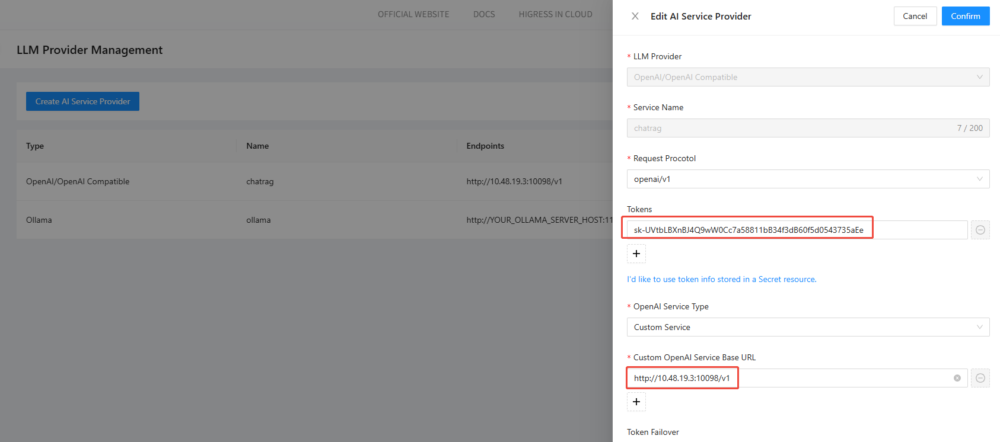
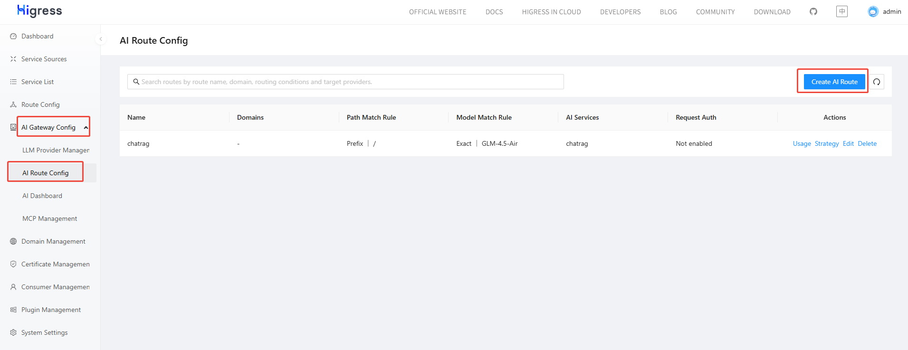
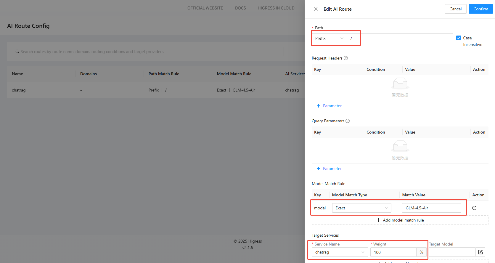

# How to Configure Higress

This document explains how to configure the Higress AI gateway to integrate with your self-hosted large language models.

## 1. Log in to the Higress AI Gateway

Default credentials:  
Username: `admin`  
Password: `test123`

## 2. Add a New Model Endpoint

To register a newly deployed model in CoStrict’s model list, follow the three steps below.

### 2.1 Configure an AI Service Provider

1. In the left-hand navigation pane, choose **AI Gateway Config** → **LLM Provider Management**.
2. Click **Create AI Service Provider**.
3. In the **Create AI Service Provider** dialog, fill in the model details:
   - **LLM Provider**: e.g `OpenAI`.  
   - **Service Name**: a custom name such as `{{MODEL_PROVIDER}}`.  
   - **Request Procotol**: select the one required by the vendor, e.g `openaiv1`.  
   - **Tokens**: your model-service API key, e.g `{{MODEL_APIKEY}}`.  
   - **OpenAI Service Type**: choose **Custom OpenAI Service BaseURL**.  
   - **Custom OpenAI Service Base URL**: enter your model’s base URL (`{{MODEL_BASEURL}}`).  
     **Include the version path**, e.g `https://zgsm.sangfor.com/v1/`.





### 2.2 Configure an AI Route

AI routes forward requests to the correct AI service provider based on request characteristics such as path or model name.

1. In the left-hand navigation pane, choose **AI Gateway Config** → **AI Route Config**.
2. Click **Create AI Route**.
3. In the **Create AI Route** dialog, configure:
   - **Path**: a frontend-matching path, e.g `/`.  
   - **Model Match Rule**:
     - **Key**: `model` (matches the `model` field in the request body).  
     - **Model Match Type**: `Exact`.  
     - **Match Value**: `{{MODEL_NAME}}` (the exact model name).  
     - *Tip*: you can also choose **Prefix** and supply a case-sensitive prefix of the model name.  
   - **Target Services**:
     - **Service Name**: select the provider created in the previous step, e.g `{{MODEL_PROVIDER}}`.

*The rule above means: if the request path starts with `/` and the model name matches, forward the request to the specified AI service provider.*





### 2.3 Update the Model List

*This step exposes the new model in the user-facing model picker. Without it, users must manually type the full model name.*

1. On the **Plugin Management** page, locate the **AI Quota** card and click **Configure**.
2. Switch to **YAML View** and append the new model under `spec.defaultConfig.providers`:

```yaml
spec:
  defaultConfig:
    ...
    providers:
    - id: {{MODEL_PROVIDER}}
      models:
      - contextWindow: {{MODEL_CONTEXTSIZE}}
        description: {{MODEL_DESC}}
        maxTokens: 8192
        name: {{MODEL_NAME}}
        supportsComputerUse: true
        supportsImages: false
        supportsPromptCache: false
        supportsReasoningBudget: false
      type: {{MODEL_TYPE}}
