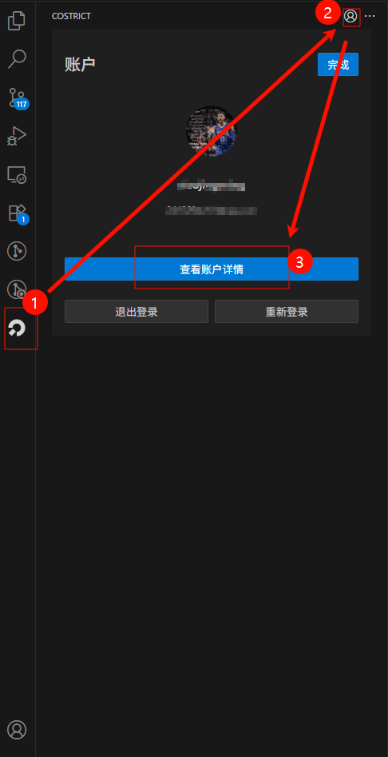
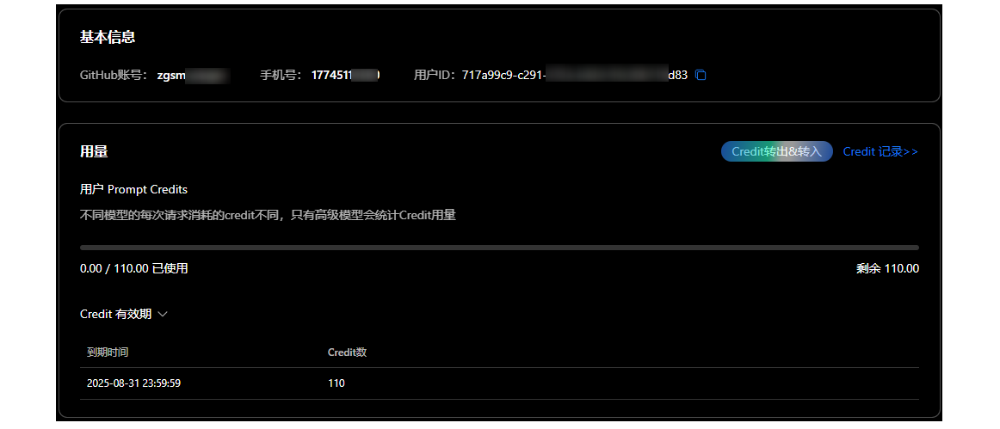

import Tabs from '@theme/Tabs';
import TabItem from '@theme/TabItem';

# Getting Credits

## View Login and Credit Information

> Click the `costrict` icon, then click `Credit Usage Management`, and finally click `View Credit Usage`.



> On the `Credit Management` page, you can view your login information and `credit` usage details.


## Getting Credits

> If you haven't linked an account yet, the `Credit Management` page will show **Link Now**, for example:

<Tabs>
  <TabItem value="phone" label="手机 登录" default>

```
基本信息

Github账号: 立即绑定      手机号: 151********      用户id:  ************************
```

  </TabItem>

  <TabItem value="github" label="github 登录">

```
基本信息

Github账号: git用户**   手机号: 立即绑定            用户id:  ************************
```

  </TabItem>
</Tabs>


> If you logged in with a GitHub account, go to: https://github.com/zgsm-ai/costrict and give it a `star` with your current account to receive an additional `50` `Credits`. The credits will arrive in about `2-3` minutes.


## Link Account

> If you logged in with a phone number, you can link a `GitHub` account. This allows you to sync credits from your `GitHub` account and also provides a convenient login method without needing a VPN/proxy.

> Click "Link Now" and follow the prompts to log in to your `GitHub` account (one may be created automatically if it doesn't exist, but it's best to register a `GitHub` account first).

- Click "Link Now"
- Log in to your GitHub account

> After completing these steps, you will be automatically redirected to the credit management page.

