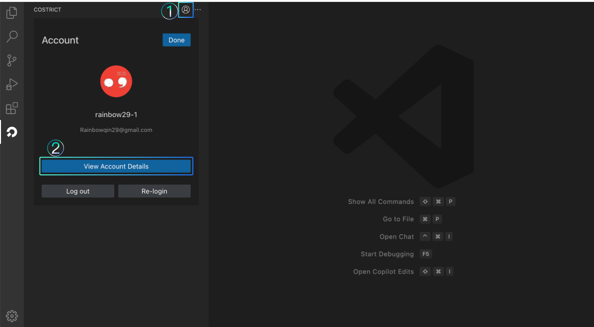
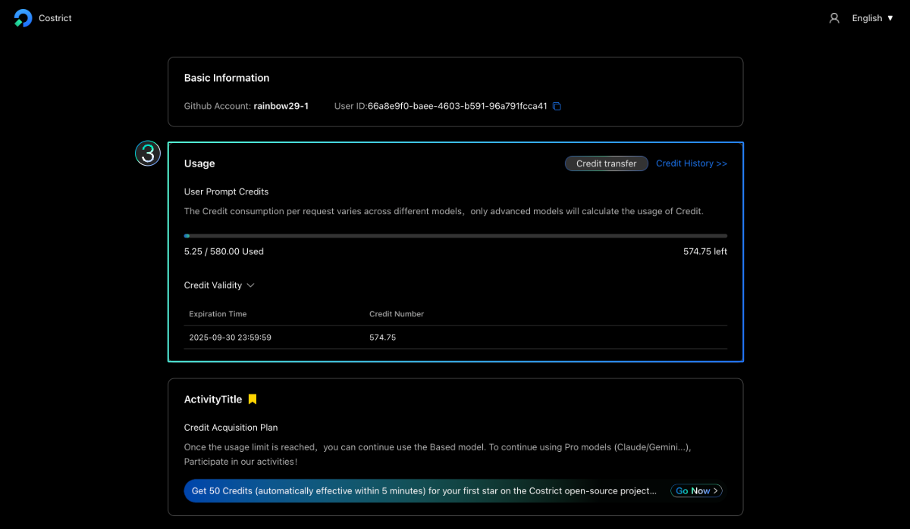
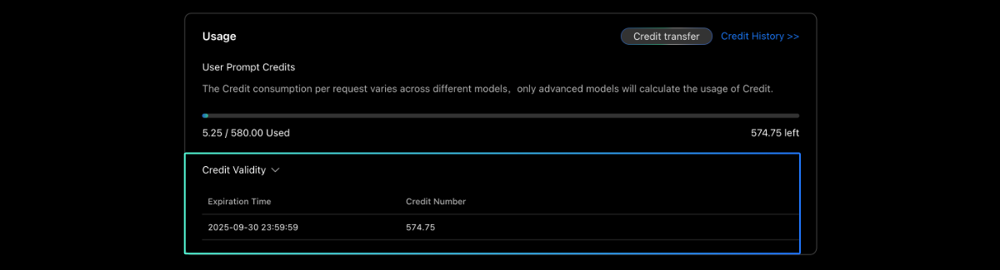
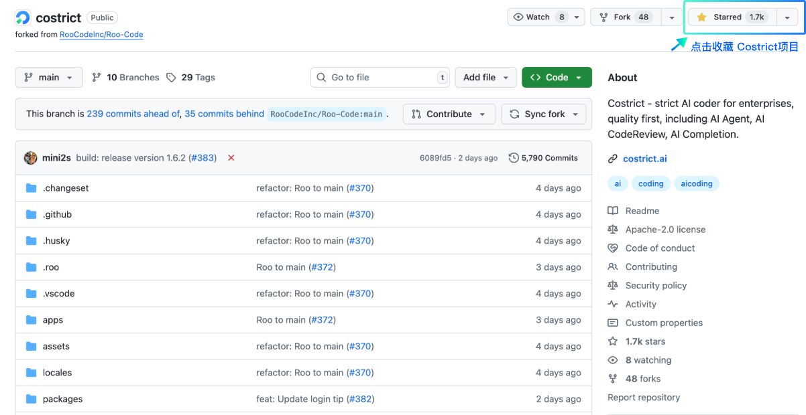
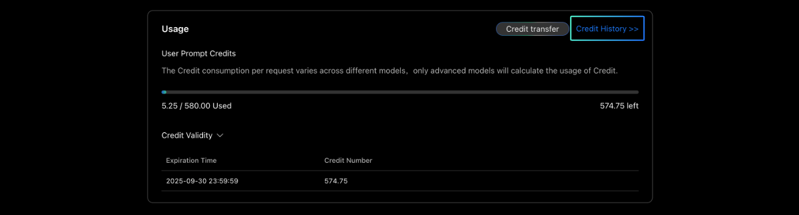
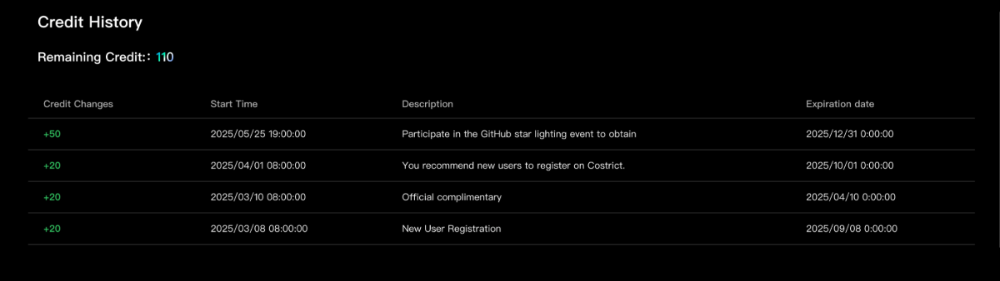

# Credit 

## Credit Description

CoStrict is free to use, but to ensure a smooth experience under high load we meter usage through a Credit quota (similar to a points system). While you have Credits, CoStrict remains fully available (usage via other providers is unaffected). New registrations and participation in official campaigns both award Credit bonuses.

Each interaction is billed at 1 Credit by default; actual cost varies by model (e.g., a deepseekr1 request may deduct 0.5 Credits, while a Claude request may deduct 1.5 Credits). The live deduction rate always prevails.

Open the CoStrict plugin’s Account page to see your balance and consumption, then click “View Account Details” to open the web portal. The Usage section shows your total Credits and how many have been spent.

The “Credit Validity Period” area under Usage displays the expiry date—please consume your Credits before they lapse.

## Credit Acquisition

Official channels to earn Credits:
- New registration: 50 Credits
- Weekly gift: ~10 Credits
- Campaigns (e.g., star our GitHub repo at https://github.com/zgsm-ai/costrict): variable bonus  
(Reward amounts are adjusted periodically; the actual figure at the time prevails.)

Visit the “Credit Record” tab under Usage for a detailed ledger of every Credit earned.

