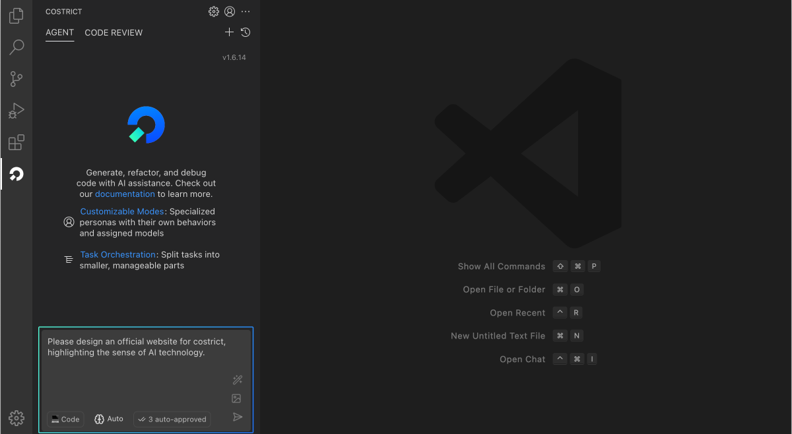
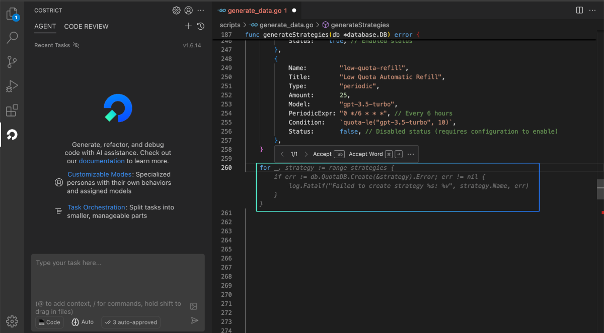
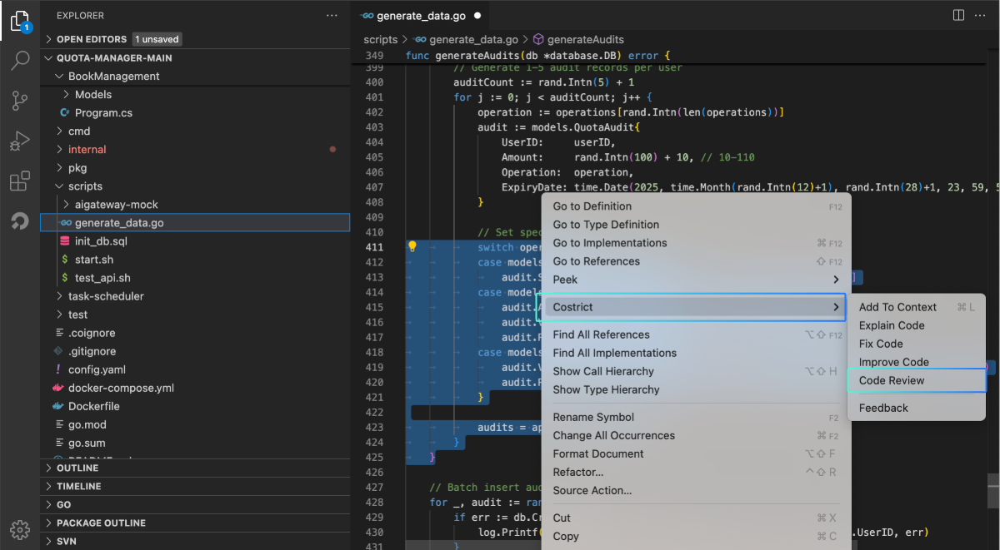
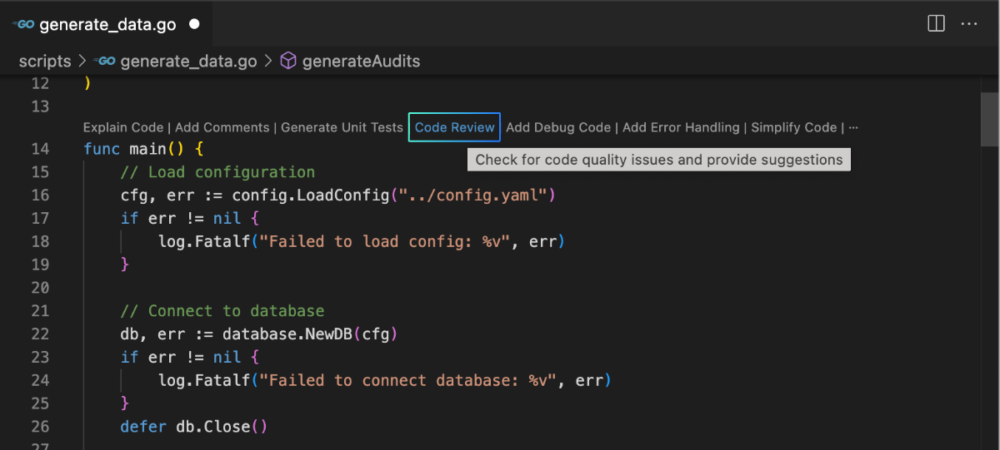
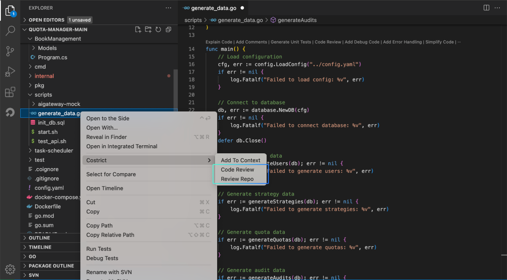

# Getting Started with Basic Features

## Agent 
The Agent panel is similar to AI chat software, allowing developers to converse with an AI Agent assistant. It supports end-to-end output of results through natural language. The Agent is suitable for consulting relatively broad questions, as well as more complex issues that may require multiple rounds of communication between the developer and the AI to arrive at an ideal answer.

## Code Completion

With automatic code completion, CoStrict can generate subsequent code based on the context at the cursor's position, delivering rapid code generation within seconds. It supports mainstream programming languages such as Python, Go, Java, JavaScript, TypeScript, C/C++, and more. Simply open a code file in the editor, and while editing, CoStrict will automatically trigger intelligent code completion suggestions at appropriate times, as shown in the figure below:

## Code Review

Code review can be triggered in multiple ways:

- Function: Click the shortcut key above a function to trigger a review.

- Code Line: Select a line of code and right-click to trigger a code review via the context menu.

- File/Repository: Select a file, right-click, and choose to review either the single file or the entire repository.

