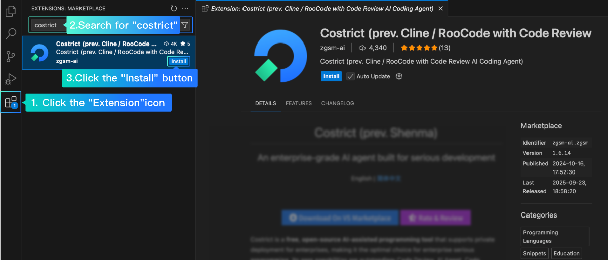
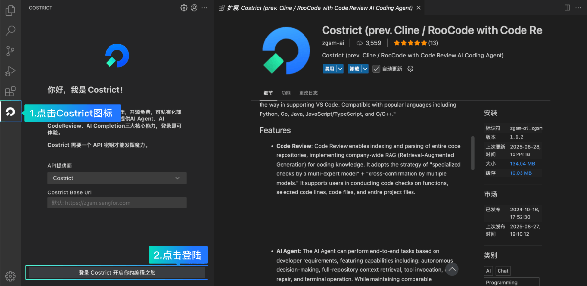

# Installation

:::tip[Installation Requirements]

`CoStrict` supports the minimum VS Code version is `1.86.3`, and it is recommended to upgrade to the latest VS Code version for the best user experience.

  
 You can check the current version by pressing the shortcut key `Ctrl + Shift + p`, entering `about`. 

:::

## Plugin Installation

- In the vscode plugin store，search for `zgsm` / `shenma` / `CoStrict` 
-  Click to install

- The CoStrict icon will default to appearing on the left side

