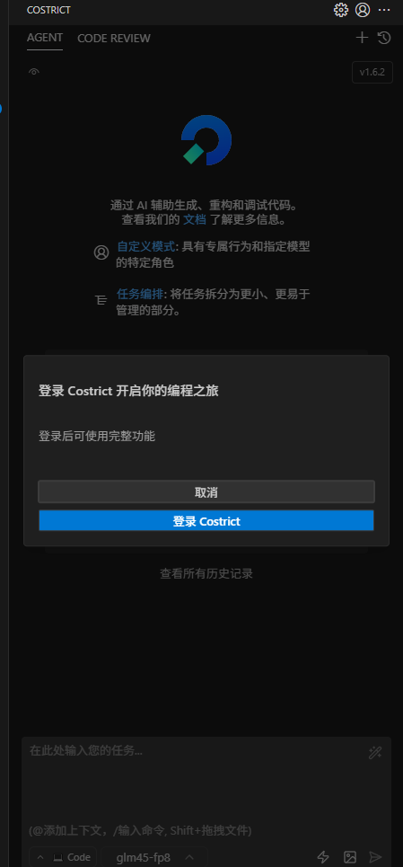
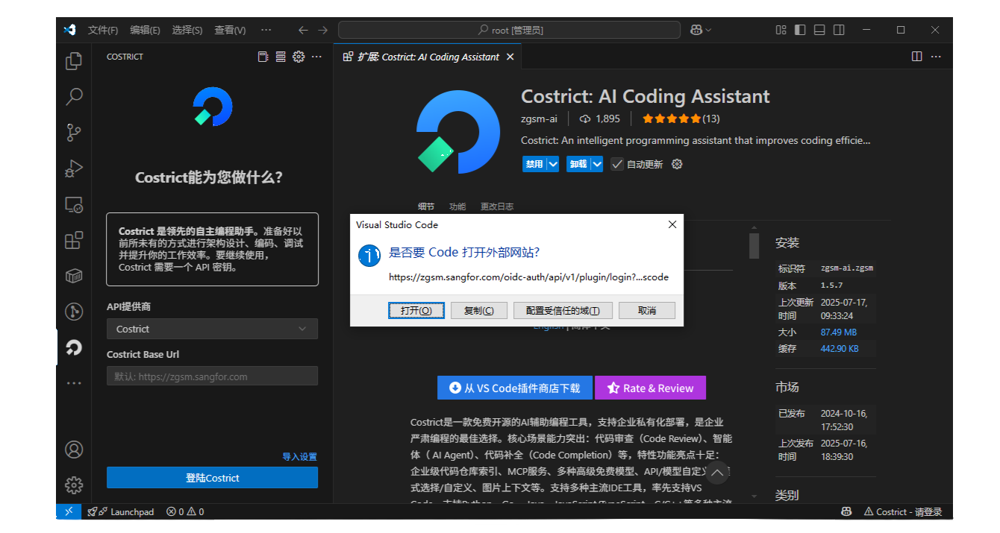

# Installation Process

:::tip[Requirements]

The minimum supported `vscode` version for Zhuge Shenma is `1.86`. It is recommended to upgrade to the latest `vscode` version for the best experience.

  
 You can check your current version by using the shortcut 'Ctrl + Shift + P' and typing 'about'. 

:::

## Extension Installation

- In the `vscode` Extensions Marketplace, search for `zgsm`, `shenma`, or `costrict`.
- Click 'Install'.
- The costrict icon will appear in the Activity Bar on the left by default.

> Click the costrict icon in the Activity Bar. If the following interface appears after a few seconds, the installation is successful.

## Login

> Click 'Login to costrict'.

> A dialog will pop up on the first use. Click 'Open'. (If you click 'Configure Trusted Domains', you will be redirected to the browser directly).

> Choose any method to log in (logging in with `GitHub` is recommended).

> After you see the successful login page in your browser, return to VS Code. The login process will complete in a few seconds.