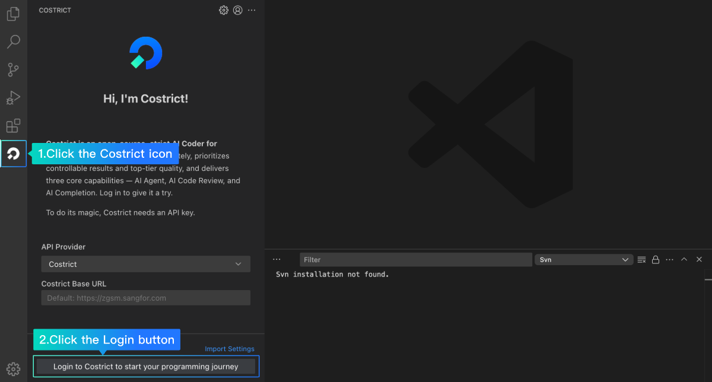
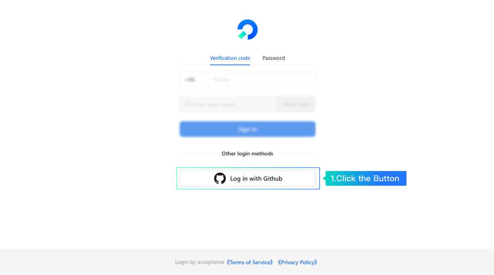
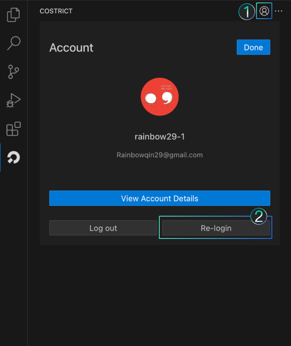
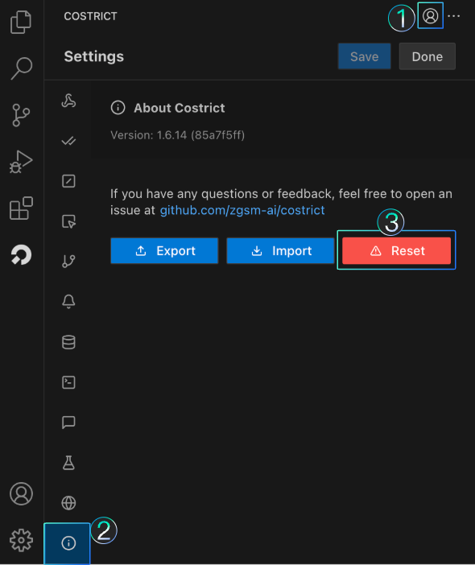
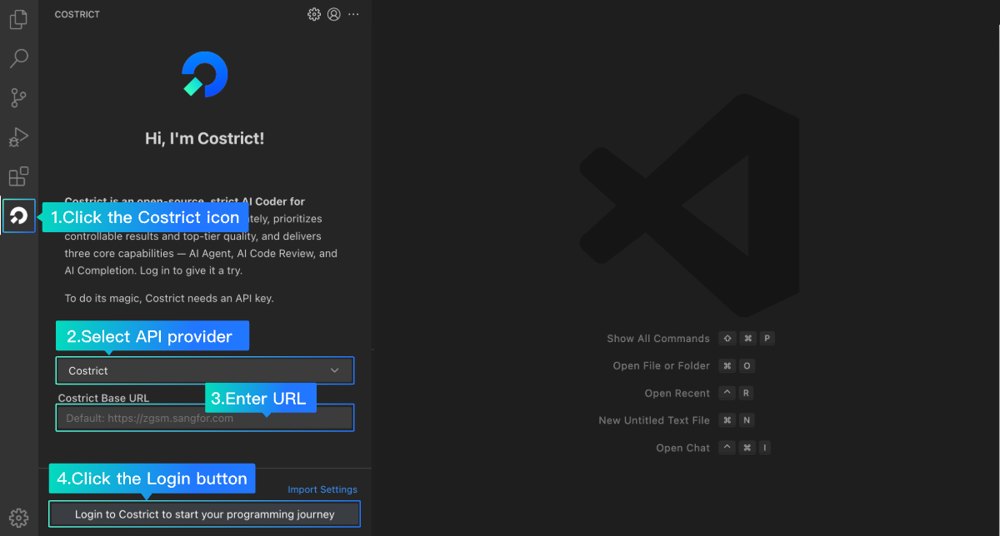

# Account Login

## Method 1: Costrict Account Login

1. Click the `Costrict` icon in the sidebar to open the `Costrict` window.
2. Click`Login to Costric`. You will be redirected to the login page, which supports logging in via `mobile number` or `GitHub`. Using `GitHub` is recommended.
3. After logging in, return to the IDE to start using the `Costrict`.

**Other Login Entries**

Users who have logged in before can log in again through the following two methods:

- **Re-login**：Click the `Account` button in the upper right corner to access the account page. Click `Re-login` as needed.

- **Reset**：Click the `Settings` button to enter the setting page, select `About Costrict`, and then click the `Reset` button to return to the initial state. Please use this with caution, as it will delete all records. Only perform this action if absolutely necessary.

### Method 2: Third-party API Account Login

1. Click the `Costrict` icon in the sidebar to open the `Costrict` window.
2. Select an `API provider`, fill in the `Base URL`, and click `Login to Costrict`.
3. After logging in, return to the IDE plugin to start using the Costrict.

