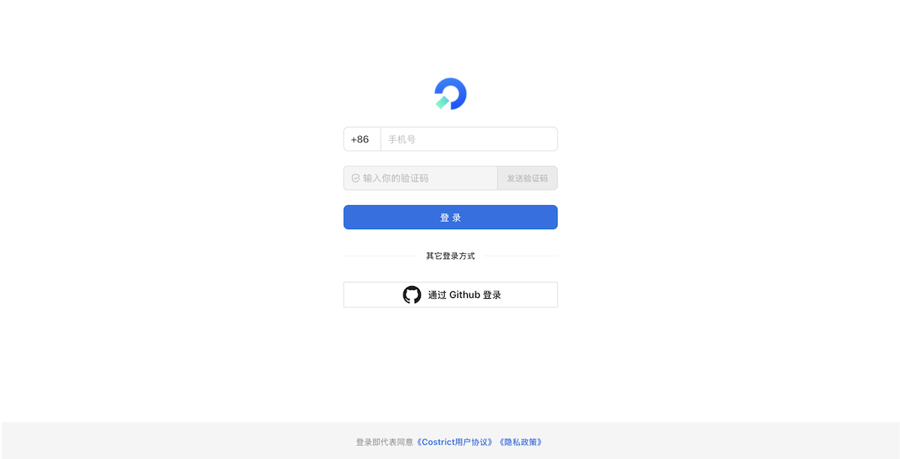
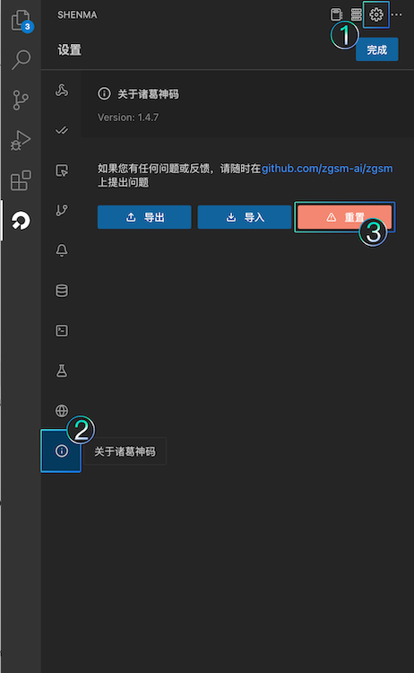
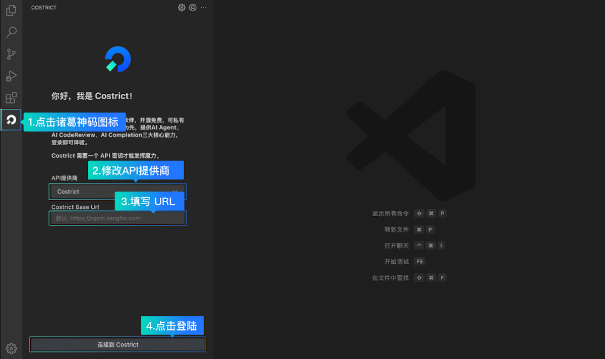

# 账号登录

## 方式1：Costrict账号登录

1. 点击侧边栏的Costrict图标，打开Costrict窗口
2. 点击"登录Costrict"，页面跳转至登录页面，支持手机号和GitHub两种登录方式，鼓励使用Github的方式登录
3. 登录完成后返回IDE插件端即可开始使用

**其它登录入口**

非首次登录的用户可以通过以下两种方式重新登录：

- **重新登录**：点击右上角"Account"按钮进入账户页面，根据需要点击"重新登录"即可

- **重置**：点击"配置"按钮进入配置页面，选中"关于Costrict"，点击"重置"按钮则进入初始化状态，非必要情况请慎用，该操作会删除所有的记录

### 方式2：第三方API账号登录

1. 点击侧边栏的诸葛神码图标，打开诸葛神码窗口
2. 选择API提供商，填写Base URL后点击"登录Costrict"
3. 登录完成后返回IDE插件端即可开始使用

