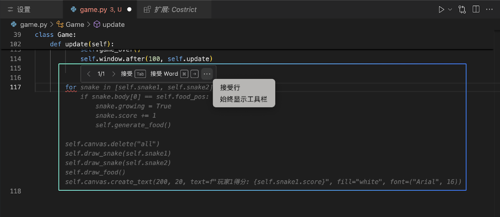
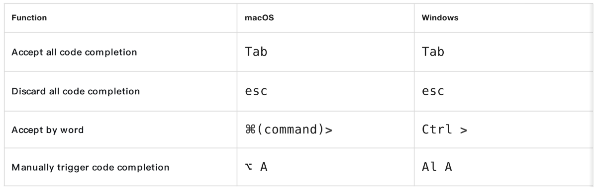

# Code Completion

When you are writing code in the VSCode editor, Costrict will automatically provide line-level or function-level code suggestions based on the context of the current and related code files. You can then use shortcut keys`enter` to accept or `esc` to dismiss these suggestions. Costrict supports accepting completions by word or by line.

**Shortcut Keys Overview**

