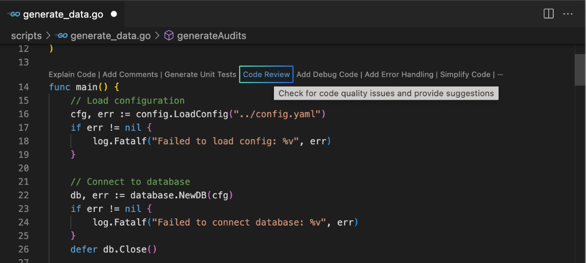
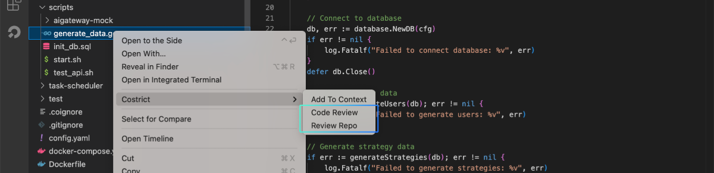
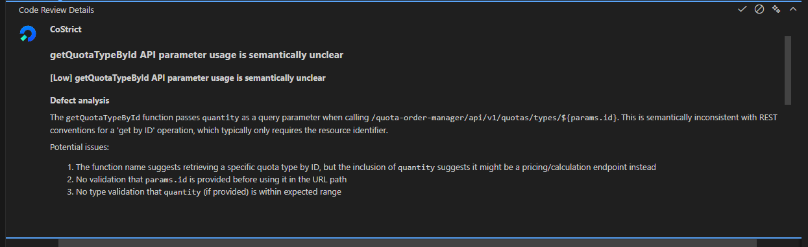
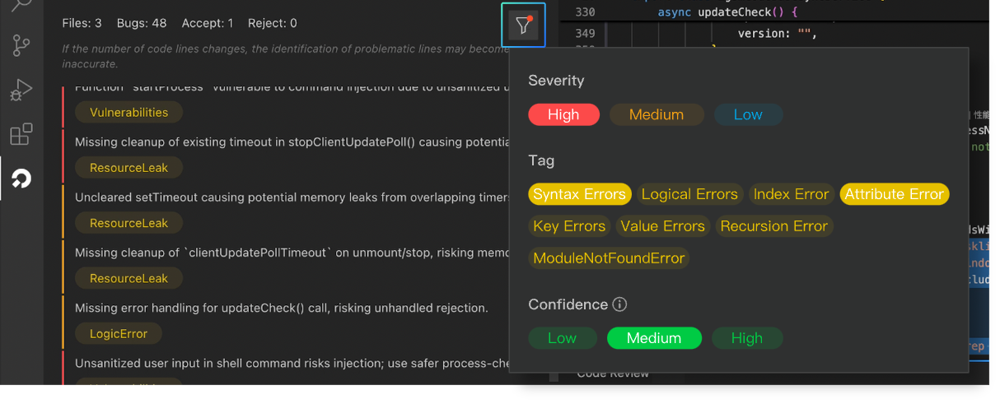
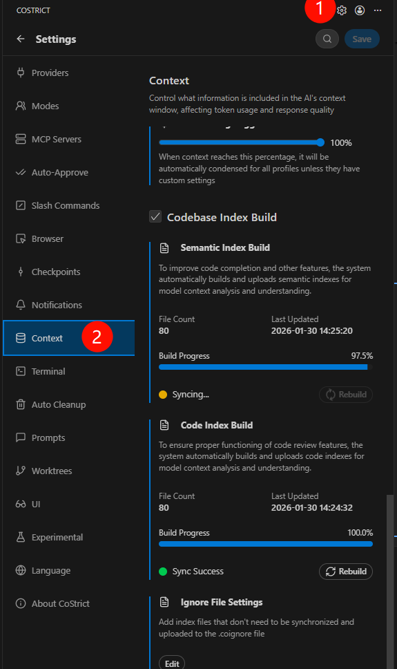

# Code Review

CoStrict Code Review enables full repository indexing (codebase), along with a company-level coding knowledge base RAG (coming soon). It supports users in conducting code checks on functions, selected code, code files and entire project files. To identify and confirm issues, it employs a "multi-expert model inspection" + "multi-model cross-validation" strategy. Ensure a thorough review with zero oversight of vulnerabilities, fortifying the security defenses for enterprise code.

## Trigger Methods

Users can trigger code reviews for functions, code blocks, code files, and entire code repositories.

For code lines and functions, use the universal trigger method: right-click and select `CoStrict > Code Review`.

For functions, you can also click the quick action button `Code Review`" `at the top.

For code files and code repositories, open the EXPLORE panel, select a file, right-click, and choose `CoStrict > Code Review` to review that specific code file. Click `CoStrict > Review Repo` to review the entire code repository where the file is located.

## Execution Process & Results

After triggering a code review, the CODE REVIEW panel in CoStrict will display the real-time progress. The scanning duration is proportional to the amount of code being processed, ranging from a few seconds to several tens of minutes.

The review results will be displayed as a list. Accodring to the title description,  the color bar on the left , and the issue labels.
You can get a general overview of the issues and its severity.

Three color bars—red, yellow, and blue—correspond to the severity levels: high, medium, and low. Click on an issue to view details in the code editor. The corresponding problematic code line will be automatically located and highlighted`. A pop-up window below the issue line displays detailed information.

In order to make the Codereview feature more intelligent and better trained for future use, we encourage users to click the buttons in the top-right corner of the detail card according to the actual situation. There are three buttons: `Accept`, `Reject,` and `Close`.
- Accept: Indicates that you agree with the issue identified by the AI.

- Reject: Indicates that you believe this is not an issue or the output is incorrect, and you do not agree with the result.

- Close: Closes the current detail window.

## Filter Conditions

Code Review supports filtering issues based on three dimensions: severity, issue labels, and confidence level.

- **Severity**: High, medium, low, corresponding to the color bars on the left side of the issue list: red, yellow, blue.

- **Labels**: The AI automatically categorizes and tags issues based on their descriptions. Typically, an issue will have one or more tags. Common issue label types include: syntax errors, logic errors, memory leaks, security vulnerabilities, etc.

- **Confidence**: Refers to how certain the AI is about the issue. Higher confidence levels indicate greater reliability, and fewer issues will meet the filter criteria. Conversely, lower confidence levels will include more issues. The default setting is "Medium."

## Codebase Index

The Codebase index is an intelligent system designed for structured parsing, association, and storage of code repositories. By establishing an efficient retrieval mechanism for code elements (such as functions, classes, variables, call relationships, etc.), CoStrict constructs the Codebase index before performing code reviews to improve the accuracy of code reviews.

You can view the progress and specifics of the Codebase Index in the `Settings > Context` module. The CoStrict plugin defaults to checking and synchronizing the Codebase index every few minutes. If there are file changes, it will also automatically trigger index synchronization.

If users need to set up excluded files, they can click the `Edit` button under the "Ignore File Settings" module to configure the index files in the `.coignore` file. The plugin will automatically filter out files listed in `.coignore` during Codebase index synchronization. This exclusion file is project-bound. If users switch projects, they will need to reconfigure the exclusion file. The system will use the default exclusion configuration if there is no exclusion file.