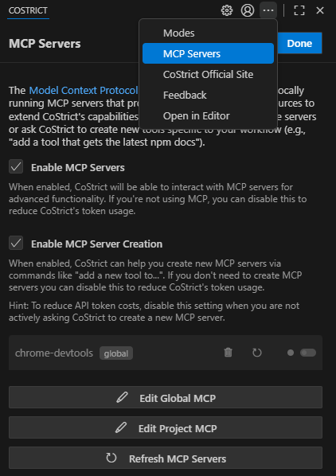
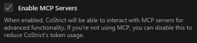
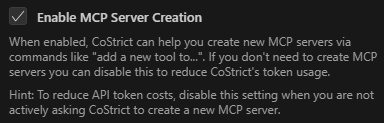
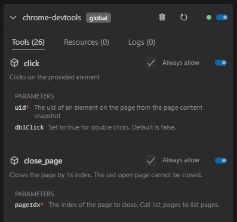
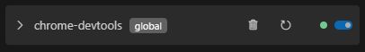
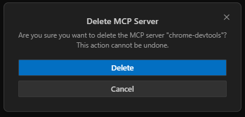
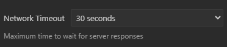
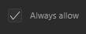

# MCP

### MCP Overview

#### Model Context Protocol (MCP)

The Model Context Protocol (MCP) is a standard for extending CoStrict's capabilities by connecting to external tools and services. MCP servers provide additional tools and resources that help CoStrict accomplish tasks beyond its built-in capabilities, such as accessing databases, custom APIs, and specialized functionality.

#### MCP Documentation

This documentation is organized into several sections:

- **Using MCP in CoStrict** - Comprehensive guide to configuring, enabling, and managing MCP servers with CoStrict. Includes server settings, tool approval, and troubleshooting.

- **What is MCP?** - Clear explanation of the Model Context Protocol, its client-server architecture, and how it enables AI systems to interact with external tools.

- **Recommended MCP Servers** - Curated list of tested and recommended MCP servers for CoStrict, including a setup guide for Context7.

### Using MCP in CoStrict

#### Configuring MCP Servers

MCP server configurations can be managed at two levels:

- **Global Configuration:** Stored in the mcp_settings.json file, accessible via VS Code settings (see below). These settings apply across all your workspaces unless overridden by a project-level configuration.

- **Project-level Configuration:** Defined in a .roo/mcp.json file within your project's root directory. This allows you to set up project-specific servers and share configurations with your team by committing the file to version control. CoStrict automatically detects and loads this file if it exists.

**Precedence:** If a server name exists in both global and project configurations, the project-level configuration takes precedence.

##### Editing MCP Settings Files

You can edit both global and project-level MCP configuration files directly from the CoStrict MCP settings view:

1.  Click the icon in the top navigation of the CoStrict pane.



2.  Scroll to the bottom of the MCP settings view.

3.  Click the appropriate button:

    1.  Edit Global MCP: Opens the global mcp_settings.json file.

    2.  Edit Project MCP: Opens the project-specific .roo/mcp.json file. If this file doesn't exist, CoStrict will create it for you.


Both files use a JSON format with a mcpServers object containing named server configurations:

```json
{
    "mcpServers": {
        "server1": {
            "command": "python",
            "args": ["/path/to/server.py"],
            "env": {
                "API_KEY": "your_api_key"
            },
            "alwaysAllow": ["tool1", "tool2"],
            "disabled": false
        }
    }
}
```

*Example of MCP Server config in CoStrict (STDIO Transport)*

##### Understanding Transport Types

MCP supports three transport types for server communication: STDIO for local servers, Streamable HTTP (recommended for new remote servers), and SSE (for legacy remote servers).

###### STDIO Transport

Used for local servers running on your machine:

- Communicates via standard input/output streams

- Lower latency (no network overhead)

- Better security (no network exposure)

- Simpler setup (no HTTP server needed)

- Runs as a child process on your machine

**STDIO configuration parameters:**

- command (required): The executable to run (e.g., node, python, npx, or an absolute path).

- args (optional): An array of string arguments to pass to the command. You can reference system environment variables using \$\{env:VARIABLE_NAME\} syntax.

- cwd (optional): The working directory from which to launch the server process. If omitted, defaults to the first workspace folder path or the main process's working directory. Useful if the server script relies on relative paths.

- env (optional): An object containing environment variables to set for the server process.

- alwaysAllow (optional): An array of tool names from this server to automatically approve.

- disabled (optional): Set to true to disable this server configuration.

**STDIO configuration example:**
```json
{
    "mcpServers": {
        "local-server": {
            "command": "node",
            "args": ["server.js"],
            "cwd": "/path/to/project/root", // Optional: Specify working directory
            "env": {
                "API_KEY": "your_api_key"
            },
            "alwaysAllow": ["tool1", "tool2"],
            "disabled": false
        }
    }
}
```

###### Using System Environment Variables in Arguments

You can reference system-level environment variables within the args array using \$\{env:VARIABLE_NAME\} syntax. This allows you to pass sensitive information like API keys or tokens from your system environment without hardcoding them in your configuration:
```json
{
    "mcpServers": {
        "github": {
            "command": "docker",
            "args": [
                "run",
                "-i",
                "--rm",
                "-e",
                "GITHUB_PERSONAL_ACCESS_TOKEN=${env:GITHUB_PERSONAL_ACCESS_TOKEN}",
                "ghcr.io/github/github-mcp-server"
            ],
            "alwaysAllow": [
                "get_pull_request"
            ]
        }
    }
}
```

In this example, \$\{env:GITHUB_PERSONAL_ACCESS_TOKEN\} will be replaced with the value of the GITHUB_PERSONAL_ACCESS_TOKEN environment variable from your system. This is particularly useful when:

- Working with Docker containers that need environment variables passed through

- Keeping sensitive credentials out of your configuration files

- Using the same configuration across different environments with different credentials

Note: The environment variable must exist in your system environment for this to work. You can set system environment variables through your operating system's settings or shell configuration files (e.g., .bashrc, .zshrc, or Windows Environment Variables).

###### Streamable HTTP Transport

This is the modern standard for remote servers accessed over HTTP/HTTPS, offering more flexibility and replacing the legacy SSE transport for new implementations.

- Communicates via HTTP POST/GET to a single MCP endpoint

- Optionally uses Server-Sent Events (SSE) for streaming

- Can be hosted on a different machine

- Supports multiple client connections

- Requires network access

- Allows centralized deployment and management

For more in-depth information about how Streamable HTTP transport works, see Streamable HTTP Transport.

Streamable HTTP configuration parameters:

- type (required): Must be set to "streamable-http".

- url (required): The full URL of the remote MCP server's single endpoint (e.g., https://your-server.com/mcp).

- headers (optional): An object containing custom HTTP headers to send with requests (e.g., for authentication tokens).

- alwaysAllow (optional): An array of tool names from this server to automatically approve.

- disabled (optional): Set to true to disable this server configuration.

Streamable HTTP configuration example:
```json
{
    "mcpServers": {
        "modern-remote-server": {
            "type": "streamable-http",
            "url": "https://your-modern-server.com/api/mcp-endpoint",
            "headers": {
                "X-API-Key": "your-secure-api-key"
            },
            "alwaysAllow": ["newToolA", "newToolB"],
            "disabled": false
        }
    }
}
```

###### SSE Transport (Legacy)

Used for older remote servers accessed over HTTP/HTTPS. For new remote server implementations, Streamable HTTP Transport is recommended.

- Communicates via Server-Sent Events protocol (typically requires separate endpoints for client-to-server and server-to-client communication)

- Can be hosted on a different machine

- Supports multiple client connections

- Requires network access

- Allows centralized deployment and management

For more in-depth information about how legacy SSE transport works, see SSE Transport (Legacy).

SSE (Legacy) configuration parameters:

- type (optional, but recommended for clarity): Should be set to "sse" if providing a url for an SSE server, to distinguish from Streamable HTTP. If url is present and type is omitted, CoStrict might try to infer, but explicit declaration is safer.

- url (required): The base URL for the remote MCP server. For legacy SSE, this usually implies separate paths like /events (for SSE stream) and /message (for POST requests) will be derived or expected by the server.

- headers (optional): An object containing custom HTTP headers to send with requests (e.g., for authentication tokens).

- alwaysAllow (optional): An array of tool names from this server to automatically approve.

- disabled (optional): Set to true to disable this server configuration.

SSE (Legacy) configuration example:
```json
{
    "mcpServers": {
        "legacy-remote-server": {
            "type": "sse", // Explicitly define as SSE
            "url": "https://your-legacy-server-url.com/mcp-base", // Base URL
            "headers": {
                "Authorization": "Bearer your-legacy-token"
            },
            "alwaysAllow": ["oldToolX"],
            "disabled": false
        }
    }
}
```

#### Enabling or Disabling MCP Servers

Disabling your MCP Servers here will remove all MCP related logic and definitions from your system prompt, reducing your token usage. This will prevent CoStrict from connecting to any MCP servers, and the use_mcp_tool and access_mcp_resource tools will not be available. Check this off if you don't intend to use MCP Servers. This is on by default.

1.  Click the icon in the top navigation of the CoStrict pane

2.  Check/Uncheck Enable MCP Servers



#### Enabling or Disabling MCP Server Creation

Disabling your MCP Server Creation here will just remove the instructions from your system prompt that CoStrict uses to write MCP servers while not removing the context related to operating them. This reduces token usage. This is on by default.

1.  Click the icon in the top navigation of the CoStrict pane

2.  Check/Uncheck Enable MCP Server Creation



#### How to Use CoStrict to Create an MCP Server

If you need a specific tool or capability that isn't available through existing MCP servers, you can ask CoStrict to build a new one for you.

**Prerequisite:** Ensure the Enable MCP Server Creation setting is checked ON in the MCP settings panel. If this is disabled, CoStrict will not have the necessary instructions to build a server.

**How to Initiate:**

1.  Make a Request: Clearly ask CoStrict for the new tool or capability. For example:

    1.  "Create an MCP tool that gets the current price of Bitcoin."

    2.  "I need a tool that connects to my company's internal user database via its API."

    3.  "Build an MCP server to interact with the GitHub Gist API."

2.  CoStrict's Process (Simplified): Once you make the request (and the setting is enabled), CoStrict will:

    1.  Fetch internal instructions for server creation.

    2.  Scaffold a basic server project (usually TypeScript) in the default MCP directory (e.g., ~/Documents/Cline/MCP on macOS) unless you specify otherwise.

    3.  Write the code to implement the requested tool, including handling necessary API calls.

    4.  Handle Secrets: If the tool requires API keys or other credentials, CoStrict will ask you for them using the ask_followup_question tool to ensure they are configured securely as environment variables for the server.

    5.  Configure: Automatically add the new server's configuration to your global mcp_settings.json or project .roo/mcp.json file.

    6.  Activate: Attempt to connect to the newly configured server so its tools are immediately available.

3.  Outcome: If successful, CoStrict will confirm the creation, and the new server and its tools will appear in your MCP server list, ready for use.

#### Managing Individual MCP Servers



Each MCP server has its own configuration panel where you can modify settings, manage tools, and control its operation. To access these settings:

1.  Click the icon in the top navigation of the CoStrict pane

2.  Locate the MCP server you want to manage in the list



##### Deleting a Server

1.  Press the next to the MCP server you would like to delete

2.  Press the Delete button on the confirmation box



##### Restarting a Server

1.  Press the button next to the MCP server you would like to restart

##### Enabling or Disabling a Server

1.  Press the toggle switch next to the MCP server to enable/disable it

##### Network Timeout

To set the maximum time to wait for a response after a tool call to the MCP server:

1.  Click the Network Timeout pulldown at the bottom of the individual MCP server's config box and change the time. Default is 1 minute but it can be set between 30 seconds and 5 minutes.



##### Auto Approve Tools

MCP tool auto-approval works on a per-tool basis and is disabled by default. To configure auto-approval:

1.  First enable the global "Use MCP servers" auto-approval option in auto-approving-actions

2.  In the MCP server settings, locate the specific tool you want to auto-approve

3.  Check the Always allow checkbox next to the tool name



When enabled, CoStrict will automatically approve this specific tool without prompting. Note that the global "Use MCP servers" setting takes precedence - if it's disabled, no MCP tools will be auto-approved.

#### Finding and Installing MCP Servers

CoStrict does not come with any pre-installed MCP servers. You'll need to find and install them separately.

- Community Repositories: Check for community-maintained lists of MCP servers on GitHub

- Ask CoStrict: You can ask CoStrict to help you find or even create MCP servers (when "Enable MCP Server Creation" is enabled)

- Build Your Own: Create custom MCP servers using the SDK to extend CoStrict with your own tools

For full SDK documentation, visit the MCP GitHub repository[Model Context Protocol · GitHub](https://github.com/modelcontextprotocol/).

### What is MCP?

MCP (Model Context Protocol) is a standardized communication protocol for LLM systems to interact with external tools and services. It functions as a universal adapter between AI assistants and various data sources or applications.

#### How It Works

MCP uses a client-server architecture:

1.  The AI assistant (client) connects to MCP servers

2.  Each server provides specific capabilities (file access, database queries, API integrations)

3.  The AI uses these capabilities through a standardized interface

4.  Communication occurs via JSON-RPC 2.0 messages

Think of MCP as similar to a USB-C port in the sense that any compatible LLM can connect to any MCP server to access its functionality. This standardization eliminates the need to build custom integrations for each tool and service.

For example, an AI using MCP can perform tasks like "search our company database and generate a report" without requiring specialized code for each database system.

#### Common Questions

- Is MCP a cloud service? MCP servers can run locally on your computer or remotely as cloud services, depending on the use case and security requirements.

- Does MCP replace other integration methods? No. MCP complements existing tools like API plugins and retrieval-augmented generation. It provides a standardized protocol for tool interaction but doesn't replace specialized integration approaches.

- How is security handled? Users control which MCP servers they connect to and what permissions those servers have. As with any tool that accesses data or services, use trusted sources and configure appropriate access controls.

#### MCP in CoStrict

CoStrict implements the Model Context Protocol to:

- Connect to both local and remote MCP servers

- Provide a consistent interface for accessing tools

- Extend functionality without core modifications

- Enable specialized capabilities on demand

MCP provides a standardized way for AI systems to interact with external tools and services, making complex integrations more accessible and consistent.

### Recommended MCP Servers

While CoStrict can connect to any Model Context Protocol (MCP) server that follows the specification, the community has already built several high-quality servers that work out-of-the-box. This page curates the servers we actively recommend and provides step-by-step setup instructions so you can get productive in minutes.

#### Context7

Context7 is our first-choice general-purpose MCP server. It ships a collection of highly-requested tools, installs with a single command, and has excellent support across every major editor that speaks MCP.

##### Why we recommend Context7

- One-command install – everything is bundled, no local build step.

- Cross-platform – runs on macOS, Windows, Linux, or inside Docker.

- Actively maintained – frequent updates from the Upstash team.

- Rich toolset – database access, web-search, text utilities, and more.

- Open source – released under the MIT licence.

#### Installing Context7 in CoStrict

There are two common ways to register the server:

1.  Global configuration – available in every workspace.

2.  Project-level configuration – checked into version control alongside your code.

We'll cover both below.

##### 1. Global configuration

1.  Open the CoStrict MCP settings panel by clicking the icon.

2.  Click Edit Global MCP.

3.  Paste the JSON below inside the mcpServers object and save.
```json
{
    "mcpServers": {
        "context7": {
            "command": "npx",
            "args": ["-y", "@upstash/context7-mcp@latest"]
        }
    }
}
```
**Windows (cmd.exe)**
```json
{
    "mcpServers": {
        "context7": {
            "type": "stdio",
            "command": "cmd",
            "args": ["/c", "npx", "-y", "@upstash/context7-mcp@latest"]
        }
    }
}
```

##### 2. Project-level configuration

If you prefer to commit the configuration to your repository, create a file called .roo/mcp.json at the project root and add the same snippet:
```json
{
    "mcpServers": {
        "context7": {
            "command": "npx",
            "args": ["-y", "@upstash/context7-mcp@latest"]
        }
    }
}
```
Windows (cmd.exe)
```json
{
    "mcpServers": {
        "context7": {
            "type": "stdio",
            "command": "cmd",
            "args": ["/c", "npx", "-y", "@upstash/context7-mcp@latest"]
        }
    }
}
```


When both global and project files define a server with the same name, the project configuration wins.

#### Verifying the installation

1.  Make sure Enable MCP Servers is turned on in the MCP settings panel.

2.  You should now see Context7 listed. Click the toggle to start it if it isn't already running.

3.  CoStrict will prompt you the first time a Context7 tool is invoked. Approve the request to continue.


