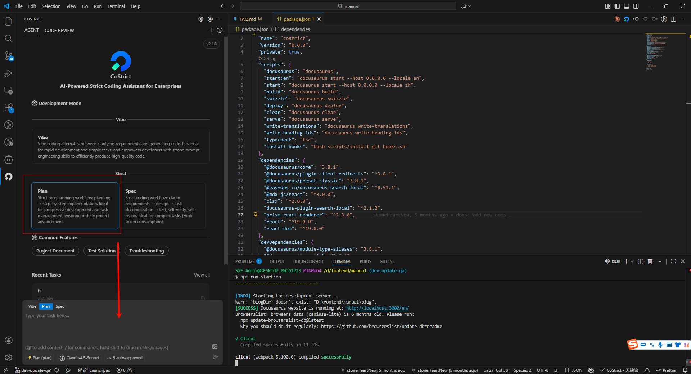
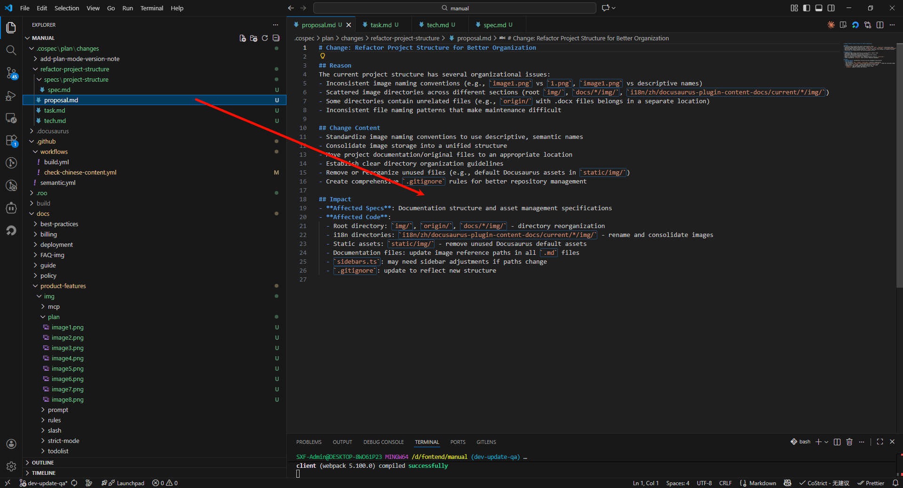
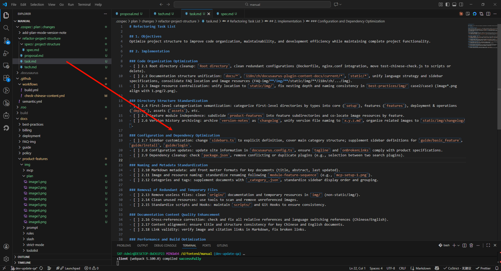
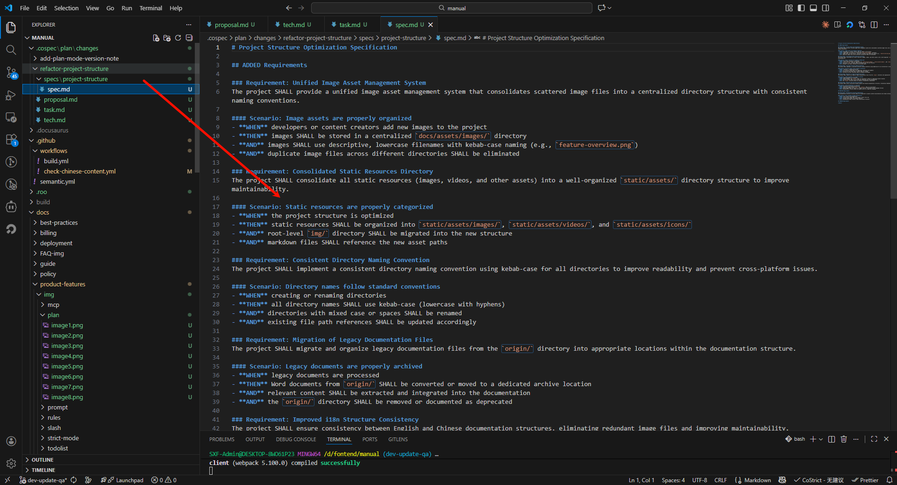

# Strict Mode (Plan Mode)

Serious programming following the **"Plan Formulation → Step-by-Step Implementation"** workflow. Suitable for incremental development and task management, ensuring orderly project progress.

## Software Version

CoStrict version updated to 2.0.24 or higher

## Usage Steps

### Initiate Proposal

#### Click on plan mode and input your requirements in the dialog box

After AI processes your requirements, it generates proposals, specs, tasks, and designs (AI will determine whether they need to be generated)

#### Generated Proposal

#### Generated Tasks

#### Generated Spec

### Execute Tasks

#### Execute Changes

When there is only one change folder, you can omit the change name and directly input "execute changes"

#### Successfully Modified Corresponding Code in Tasks

### Execute with Existing Requirements Documents

If you already have written requirements, you can directly implement them under the Plan-Apply Agent

#### Tasks can be executed according to the requirements in the document
