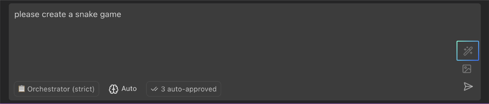

# Prompt

## Enhance Prompt

The "Enhance Prompt" feature in CoStrict helps you improve quality and effectiveness of your prompts before sending them to the AI model. By clicking the wand icon in the chat input, you can automatically refine your initial request, making it clearer, more specific, and more likely to produce the desired results.

### How to Use Enhance Prompt

1.  **Type your initial prompt:** Enter your request in CoStrict chat input box as you normally would. This can be a simple question, a complex task description, or anything in between.

2.  **Click the Wand Icon:** Instead of pressing Enter, click the wand icon located in the top right corner of the chat input box. While CoStrict processes your enhancement request, the wand icon will spin to indicate it's working.

3.  **Review the Enhanced Prompt:** CoStrict will replace your original prompt with an enhanced version. Review the enhanced prompt to make sure it accurately reflects your intent. You can further refine the enhanced prompt before sending. Changed your mind? You can undo the enhancement using Ctrl+Z (Cmd+Z on Mac) to restore your original prompt.

4.  **Send the Enhanced Prompt:** Press Enter or click the Send icon to send the enhanced prompt to CoStrict.

**Tips:** If you click the enhance button with an empty prompt, CoStrict will show you a helpful message explaining how the feature works. This is a great way to learn about the enhancement feature if you're new to it.

### Why Use Enhance Prompt?

- **Improved Clarity:** CoStrict can rephrase your prompt to make it more understandable for the AI model.
- **Added Context:** The enhancement process can add relevant context to your prompt, such as the current file path or selected code.
- **Better Instructions:** CoStrict can add instructions to guide the AI towards a more helpful response (e.g., requesting specific formatting or a particular level of detail).
- **Reduced Ambiguity:** Enhance Prompt helps eliminate ambiguity and ensures that CoStrict understands your intent.
- **Consistency**: CoStrict will consistently format prompts the same way to the AI.
- **Context-Aware Suggestions:** When enabled, uses your recent conversation history to generate more relevant and accurate enhancements.

### Customizing the Enhancement Process

The "Enhance Prompt" feature uses a customizable prompt template. You can modify this template to tailor the enhancement process to your specific needs.

### Prompts Settings

1.  **Open Settings:** Click the gear icon in the CoStrict panel or use the settings command.
2.  **Navigate to Prompts:** Go to the "Prompts" tab in the settings.
3.  **Select "ENHANCE":** From the dropdown menu, select "ENHANCE" to view and edit the enhancement prompt.
4.  **Editing the Enhancement Prompt：** It is not recommended for users to modify this directly. If necessary, you can edit the content within the prompt input box, the `${userInput}` placeholder will be replaced with your original prompt.
5.  **Testing Your Custom Prompt：** After editing your enhancement prompt, Click "Test" to see how your custom prompt would enhance it, you can adjust your enhancement prompt as needed based on the results.

## Prompt Structure

This page explains the technical structure of prompts in CoStrict - how messages are constructed and sent to Large Language Models (LLMs).

### Core Message Types

CoStrict uses three primary message types when communicating with LLMs:

- **System Prompt:** The initial instructions that define CoStrict's capabilities, persona, and operational rules
- **User Messages:** Content sent by you (the user) to CoStrict
- **Assistant Messages:** Responses generated by the LLM based on your requests
- **Tool Messages:** Results returned from tool executions, sent back to the LLM as input

At the API level, there's also a fourth message role:

- **Tool Messages:** Results returned from tool executions, sent back to the LLM as input

Understanding these message types helps you work more effectively with CoStrict and can be valuable for troubleshooting or advanced customization.

### System Prompt

The system prompt is the foundation of CoStrict's behavior. It contains:

- **Role Definition:** The core persona instructions based on the selected mode (Code, Ask, Debug, etc.)
- **Tool Descriptions:** Detailed information about available tools, including parameters and examples
- **Tool Use Guidelines:** Rules for how tools should be used (sequential execution, waiting for results)
- **Capabilities:** Description of what Costrict can do in the current environment
- **Available Modes:** List of all available modes and their descriptions
- **Operational Rules:** Critical guidelines for handling files, project structure, and user interaction
- **System Information:** Details about your environment (OS, shell, working directory)
- **Custom Instructions:** Your global and mode-specific customizations

The system prompt is generated dynamically each time you interact with CoStrict, adapting to your current mode, available tools, and custom settings.

### User Messages

User messages contain your direct inputs to CoStrict, plus additional contextual information:

- **Your Query:** The text you type in the chat interface
- **Images:** Any images you include in your message (for supported models)
- **Environment Details:** Automatically appended information about your workspace state:
  - Open files/tabs
  - Cursor position
  - Active terminals with output
  - Recently modified files
  - Current time
  - Token/cost information
  - Current mode
  - File listing (on initial connection)

This automatic context enrichment helps CoStrict understand your workspace without requiring you to explicitly describe it.

### Assistant Messages

Assistant messages are the LLM's responses, which may include:

- **Text Responses:** Direct answers to your queries
- **Thinking:** Internal reasoning process (visible when enabled)
- **Tool Calls:** Requests to use specific tools like reading files or executing commands

Note that while assistant messages contain tool calls, results of those tools are sent back to the LLM in separate tool messages, not as part of the assistant message itself.

### Message Flow

Here's how these components work together:

1. **Initial Setup:** CoStrict generates the system prompt based on your selected mode and configuration
2.  **User Input:** You send a message, which is enriched with environment details
3.  **LLM Processing:** The LLM receives all previous messages plus your new input
4.  **Assistant Response:** The LLM generates a response, potentially using tools
5.  **Tool Execution:** If the LLM requests a tool, CoStrict executes it and provides the result
6.  **Conversation History:** All messages are maintained in a structured history for context

## Prompt Engineering Tips

Prompt engineering is the art of crafting effective instructions for AI models like CoStrict. Well-written prompts lead to better results, fewer errors, and a more efficient workflow.

### General Principles

- **Be Clear and Specific:** Clearly state what you want CoStrict to do. Avoid ambiguity.
   - **Bad:** Fix code.
   - **Good:** Fix bug in calculateTotal function that causes it to return incorrect results.

- **Provide Context:** Use Context to refer to specific files, folders, or problems.
   - **Good:** `@/src/utils.ts` Refactor `calculateTotal` function to use async/await.

- **Break Down Tasks:** Divide complex tasks into smaller, well-defined steps.

- **Give Examples:** If you have a specific coding style or pattern in mind, provide examples.

- **Specify Output Format:** If you need output in a particular format (e.g., JSON, Markdown), specify it in your prompt.
- **Iterate:** Don't be afraid to refine your prompt if the initial results aren't what you expect.

### Thinking vs. Doing

It's often helpful to guide CoStrict through a "think-then-do" process:

1.  **Analyze:** Ask CoStrict to analyze the current code, identify problems, or plan an approach.
2.  **Plan:** Have CoStrict outline the steps it will take to complete the task.
3.  **Execute:** Instruct CoStrict to implement the plan, one step at a time.
4.  **Review:** Carefully review the results of each step before proceeding.

### Using Custom Instructions

You can provide custom instructions to further tailor CoStrict's behavior. There are two types of custom instructions:

- **Global Custom Instructions:** Apply to all modes.
- **Mode-Specific Custom Instructions:** Apply only to a specific mode (e.g., Code, Architect, Ask, Debug, or a custom mode).

Custom instructions are added to the system prompt, providing persistent guidance to the AI model. You can use these to:

- Enforce coding style guidelines.
- Specify preferred libraries or frameworks.
- Define project-specific conventions.
- Adjust CoStrict's tone or personality.

### Handling Ambiguity

If your request is ambiguous or lacks sufficient detail, CoStrict might:

- **Make Assumptions:** It might proceed based on its best guess, which may not be what you intended.
- **Ask Follow-Up Questions:** It might use the ask_followup_question tool to clarify your request.

It's generally better to provide clear and specific instructions from the start to avoid unnecessary back-and-forth.

### Providing Feedback

If CoStrict doesn't produce the desired results, you can provide feedback by:

- **Rejecting Actions:** Click the "Reject" button when CoStrict proposes an action you don't want.
- **Providing Explanations:** When rejecting, explain *why* you're rejecting the action. This helps CoStrict learn from its mistakes.
- **Rewording Your Request:** Try rephrasing your initial task or providing more specific instructions.
- **Manually Correcting:** If there are a few small issues, you can also directly modify the code before accepting the changes.

### Examples

**Good Prompt:**

*`@/src/components/Button.tsx` Refactor Button component to use useState hook instead of useReducer hook.*

**Bad Prompt:**

*Fix button.*

**Good Prompt:**

*Create a new file named utils.py and add a function called calculate_average that takes a list of numbers and returns their average.*

**Bad Prompt:**

*Write some Python code.*

**Good Prompt:**

*`@/problems` Address all errors and warnings in the current file.*

**Bad Prompt:**

*Fix everything.*

**Good Prompt:**

*Describe the difference between `let`, `const`, and `var` in JavaScript. Focus on scoping, reassignment, and hoisting.*

**Bad Prompt:**

*What is `let`?*

### Tips for Effective Prompting

1. **Use Specific Language Model Features:** Leverage CoStrict's unique capabilities like file context awareness, tool calling, and multi-mode support.
2. **Reference Code Details:** When discussing code, include function names, file paths, and specific line numbers to help CoStrict locate relevant information.
3. **Chain Thought Processes:** For complex tasks, guide CoStrict to break down the problem into logical steps.
4. **Review and Iterate:** Check CoStrict's output and refine your next prompt based on results.
5. **Use System Messages:** When teaching CoStrict patterns or establishing conventions, provide clear, structured instructions.
6. **Test Incrementally:** Try prompts with simple examples first, then add complexity gradually.
