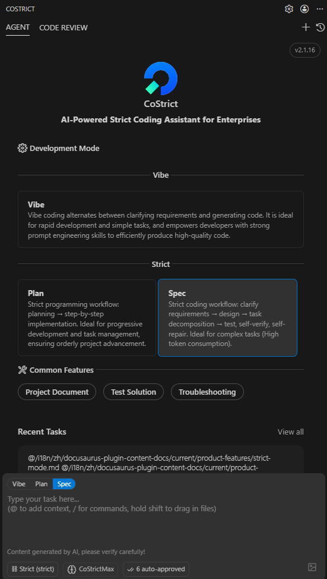

# Strict Mode

Strict Mode is a structured, systematic development approach that rigorously follows enterprise development process standards. Through project understanding, requirement clarification, task decomposition, and self-testing with self-repair, it helps AI better comprehend enterprise business logic and continuously improve code generation quality. This shifts the focus of AI programming from code generation speed to code generation quality, achieving true efficiency improvements.

------------------------------------------------------------------------

# Introducing Strict Mode for Enhanced Project Understanding and More Reliable AI Programming

In this update, we have introduced two development modes—Vibe and Strict—to meet different development scenario requirements.

<!--  -->

### 1.1 Strict Mode

Strict Mode, also known as the Serious Programming Mode, follows the **"Project Reverse Engineering → Requirement Clarification → Design → Task Decomposition → Self-Testing with Self-Repair"** workflow. It effectively helps AI accurately understand existing project dependencies and reuse established code standards, improving AI delivery quality through standardized processes and **generating more usable code.**

It is worth noting that Strict Mode consumes a significant amount of tokens and is recommended for complex task scenarios such as **"adding new features to existing code."**

### 1.2 Vibe Mode

Vibe Mode continues to use the previous development approach, alternating between requirement clarification and code generation. It is **suitable for rapid development or simple task scenarios.** If users have strong prompt engineering skills, they can still produce high-quality code through Vibe Mode.

------------------------------------------------------------------------

## Built-in Intelligent Tools to Enhance Generation Quality and Improve Coding Standards

CoStrict includes multiple intelligent tools to enhance generation quality, including project understanding, testing strategies, and troubleshooting.

### 2.1 Project Understanding

The large model generates a project knowledge base and rules **"optimized for AI reading"** to help AI understand business logic and improve code generation accuracy. This can be used in both Strict Mode and Vibe Mode.

### 2.2 Testing Strategy

Analyzes and generates project testing strategies, which can be used in both Strict Mode and Vibe Mode.

### 2.3 Troubleshooting

Input problem logs or fault descriptions, and AI assists in locating the root cause and providing repair solutions.

For detailed usage instructions, please refer to the [CoStrict 2.0 User Manual](../../best-practices/user-manual).

## Supporting Intelligent Collaboration Workflow for More Efficient and Controllable Development

Strict Mode supports visualization and editing of the task process, allowing developers to directly modify documents during execution and collaborate with AI in real-time. The entire workflow follows the automated chain of **"Requirement Clarification → Design → Task Decomposition → Self-Testing with Self-Repair."** When requirement documents are updated, they can be synchronized to the design and implementation stages with one click. At the same time, decomposed subtasks can be executed and tested independently, making the overall process more efficient and controllable.

------------------------------------------------------------------------

### 3.1 Visualizable and Editable Task Process

During execution, corresponding documents can be edited to collaborate with AI.

<!--  -->

### 3.2 Automatic Process Synchronization

Following the **"Requirement Clarification → Design → Task Decomposition → Self-Testing with Self-Repair"** workflow, when requirement documents are updated, clicking update will automatically synchronize to the design stage.

<!--  -->

### 3.3 Independent Execution of Subtasks

Each task decomposed from requirements can be executed and tested independently, making tasks more controllable.

<!--  -->

# Get CoStrict 2.0

Open VS Code, click on the Extensions Marketplace, search for CoStrict, and update the extension.

# Notes

1. Due to the high token consumption in Strict Mode, please ensure you have sufficient model tokens before use.

2. To ensure optimal generation results, it is recommended to use GLM4.5 or GLM4.6 models.

------------------------------------------------------------------------
