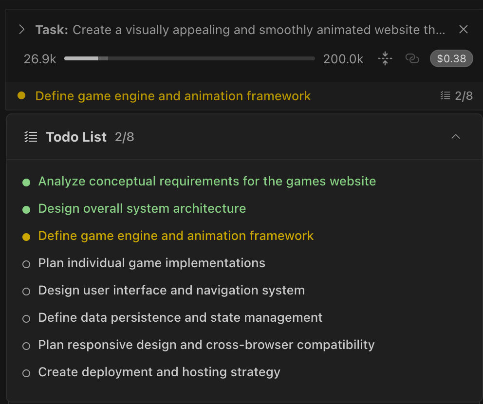
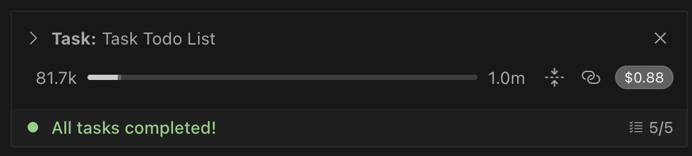
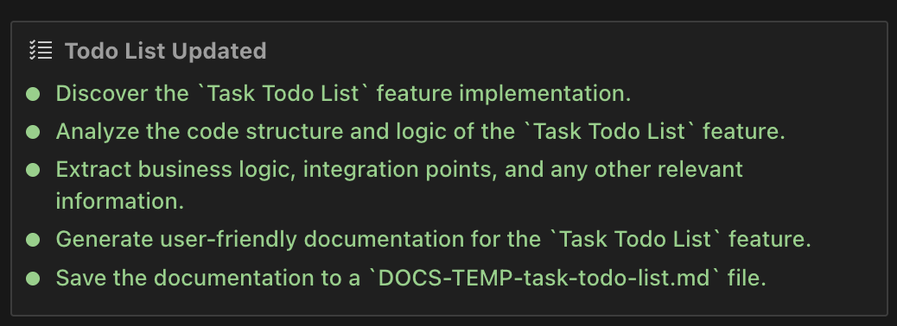
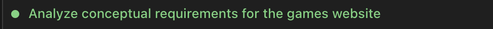

# Task Todo List

ToDo List is a task list designed to clearly reflect CoStrict's upcoming tasks and track the progress of current workflows. It is automatically created in the following scenarios: when handling complex tasks, managing multi-step workflows, or when using the Architect mode. You can also manually trigger them by asking CoStrict: "Use to do list". Example:Please create a Snake game and use the to-do list.

### 

## How It Works

The Task Todo List enables dynamic task management within the chat interface.

#### When CoStrict Creates Todo Lists

CoStrict creates todo lists through both automatic detection and manual requests:

- **Task complexity detected** - Multiple steps, phases, or dependencies identified in your request

- **Working in Architect mode** - Always creates todo lists as the primary planning tool for structuring work

- **Direct tool request** - Say "use the update_todo_list tool" or "please use update_todo_list"

Remember: Even when manually triggered, CoStrict maintains control over the todo list content and workflow. You provide feedback during approval dialogs, but CoStrict manages the list based on task needs.

### **Display and Interaction**

Todo lists appear in multiple places:

**1.Task Header Summary**: A compact, read-only display showing progress and the next important item via the TodoListDisplay component. When you click on the collapsed todo summary in the task header, a floating panel appears with enhanced functionality:

- **Backdrop overlay**: Click outside the panel to close it

- **Full todo list display**: Shows all todos with their current status indicators

- **Auto-scroll**: Automatically scrolls to the current in-progress task

- **Smooth animations**: Collapse and expand transitions for better user experience

- **Persistent state**: Maintains your scroll position when reopening

**2.Interactive Tool Block**: An interface within the chat via the UpdateTodoListToolBlock component that allows you to:

- View all todo items with their current status

- Click the "Edit" button to enter edit mode where you can:Modify task descriptions directly

  - Change task status using dropdown selectors

  - Delete tasks with the × button

  - Add new tasks with the "+ Add Todo" button

- Stage changes that are applied when Roo next updates the list

- View the progression as Roo manages the todo workflow

### **Task Status**

Roo Code automatically manages status progression based on task progress. Each todo item has one of three states:

- **Pending**: Shows an empty circle with a border, indicating the task hasn't been started yet

> 

- **In Progress**: Displays a filled yellow circle, showing the task is currently being worked on

> 

**Completed**: Features a filled green circle, confirming the task is fully finished
