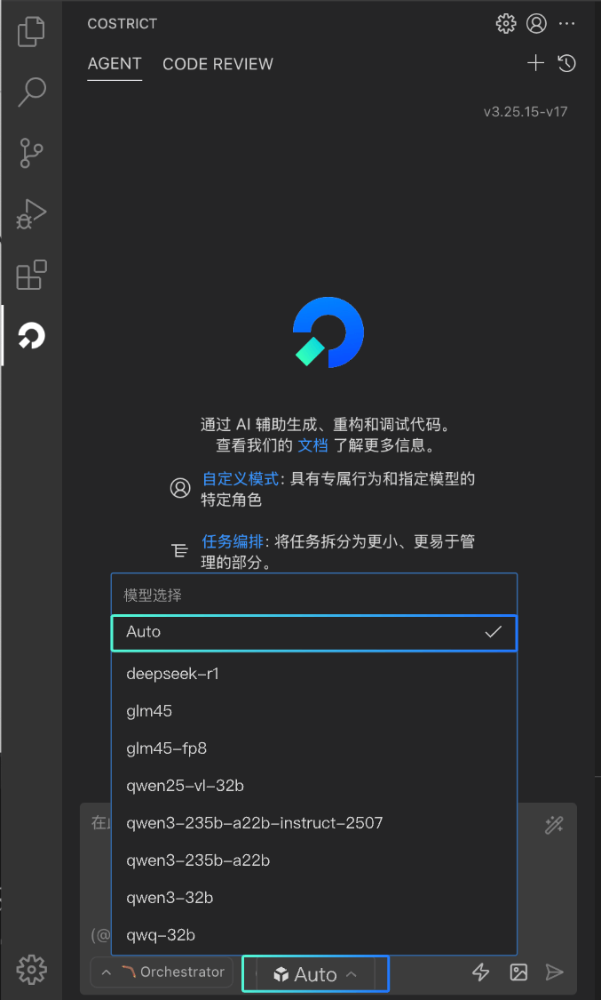
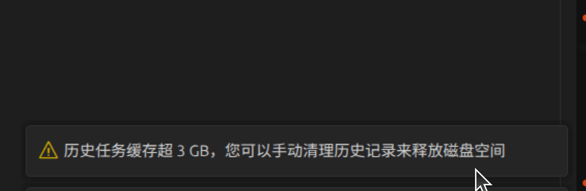
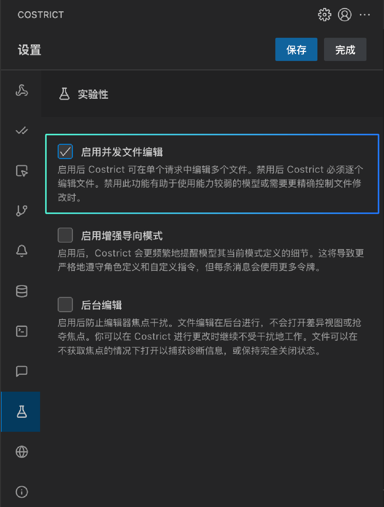
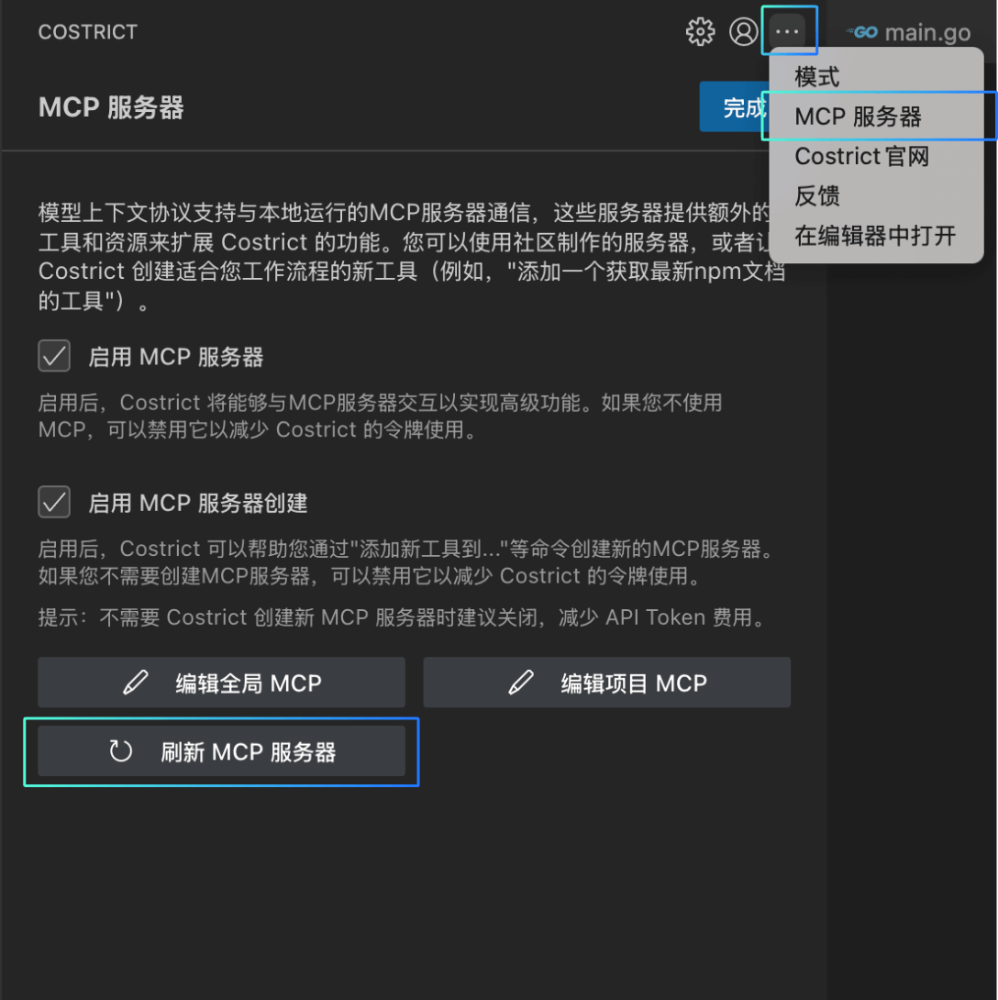

# v1.6.2

## v1.6.2 版本功能预览

### 1.快捷的模型选择 & Agent  Auto模式
CoStrict最新版本推出了Auto模式，Auto模式会综合考量当前模型列表的效果、速度、Credit的消耗情况，根据任务类型智能为用户选择最合适模型来完成任务。用户如果对模型没有特定的偏好，推荐使用该模式。点击输入框下方第二个按钮即可切换模型。

### 2.新增codebase 服务
Codebase索引是一套针对代码库进行结构化解析、关联与存储的智能系统，通过建立代码元素（如函数、类、变量、调用关系等）的高效检索机制，为提高代码审查的准确度，CoStrict在执行代码审查之前会先做Codebase索引构建工作。
你可以在"设置 > 上下文"模块看到构建的进度和具体情况。CoStrict插件默认会几分钟检查同步一次Codebase索引，如果有文件变更，也会自动触发索引同步。支持用户开启或者关闭索引（不推荐，会影响代码审查功能）。
如果用户需要设置排除文件，点击"Ignore文件配置"模块下方的"编辑"按钮可以将索引文件配置到.coignore文件中。、

### 3.执行命令支持黑/白名单
在自动批准的执行模块新增命令白名单和黑名单，白名单是指：当"自动批准命令行操作"启用时可以自动执行的命令前缀。添加 * 以允许所有命令（不推荐使用）。
拒绝的命令（黑名单）：将自动过滤掉（排除掉）的命令前缀。与允许命令冲突时，最长前缀匹配优先。添加 * 拒绝所有命令。

### 4.优化 codereview 精准度
Codereview精准度得到大幅度提升。
用户手动点击“拒绝”的问题，再次做代码审查时会自动过滤掉此问题，或减少该问题出现的概率。
在过滤条件中添加了置信度，置信度值越高，符合条件的问题就越少。反之亦然。建议使用“适中”档位。

### 5.新工具支持（todolist、simpleReadFileTool等）
CoStrict新增Todo List功能，对于复杂的任务、需要多步骤才能完成的任务以及Architect模式下，CoStrict会自动启用Todo List功能。它能列举任务的大致步骤以及实时反映当前的任务阶段。
点击顶部的任务卡片下方栏可以展开查看所有的Todo List项。 白色空心圆形表示待完成，黄色实心圆形表示进行中，绿色实心圆形表示已完成。
在对话过程中该列表也会及时出现帮助你定位任务进度。

### 6.优化任务磁盘使用率/以及体积过大提醒
在历史记录页面，CoStrict自动统计了所有历史任务所占磁盘空间大小，并且在磁盘空间不足时会提醒用户及时清理磁盘空间。

### 7.多文件读取
支持用户在 "设置 > 上下文 > 并发文件读取限制"模块设置并发文件读取数。较高的值可能会加快读取多个小文件的速度，但会增加内存使用量。

### 8.多文件编辑
启用后 CoStrict 可在单个请求中编辑多个文件。禁用后 CoStrict 必须逐个编辑文件。当使用使用能力较弱的模型或需要更精确控制文件修改时，可以考虑禁用此功能。

### 9.独立用户信息板块
新增统一账户管理的入口页面，点击CoStrict插件面板右上角的账户头像进入。点击“查看账户详情”，可跳转至网页查看账户信息和配额等信息。支持“退出登录”、“重新登录”功能。

### 10.支持手动刷新 mcp
点击插件面板右上角的“..."按钮，选中MCP服务器选项，在MCP服务器页面新增“刷新 MCP 服务器“功能

### 11.支持历史输入 方向键导航
支持键盘上下键快速切换历史对话prompt，上键对应上一条历史输入内容，下键对应下一条历史输入内容。

### 12.对话框输入保持
输入文本后，即使切换到其他页面，输入区内容不再会被清空。

### 13.自定义快捷指令
常用提示词现在可以设置成快捷指令了，点击对话框下方的“管理斜杠命令”按钮，支持定义全局命令、工作区命令。斜杠命令让你能够创建可重复使用的提示和工作流，可以即时触发。将复杂的多步流程转换为单个命令，标准化团队实践，并使用简单的markdown自动化重复任务。

### 14.支持【自动批准】隐藏
在“设置 > 自动批准“页面，取消“在聊天框上方显示选项”勾选，该选项将不会固定显示在对话框上方。

#### 更多功能等待你的探索 