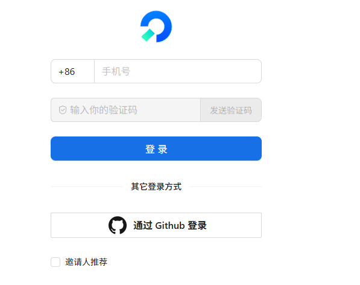

# 账号登录

- 选择CoStrict 供应商
执行cs，工具启动完成后将出现对话框，输入 /connect， 选择 CoStrict 供应商

或者：
```bash
cs auth login
```


- 在浏览器进行登录。（如未自动打开浏览器，可手动复制url到浏览器中进行登录）



- 回到终端，等待登录完成（一般几秒内）。

注：linux无法打开浏览器，有以下几种解决方式：

1.在vscode中打开终端，远程连接服务器，vscode中可自动打开浏览器；

2.复制登录窗口上面的url，手动在浏览器中打开，进行登录（部分终端，比如mobaxterm无法复制url，请更换终端，比如直接使用ssh命令连接服务器）；

3.先在windows上登录CoStrict（cli或者插件均可），然后将 `%USER_PROFILE%/.costrict/share/auth.json`  复制到  服务器 `${HOME}/.costrict/share/auth.json` ，然后进行使用即可。如果目录不存在，请手动创建。

