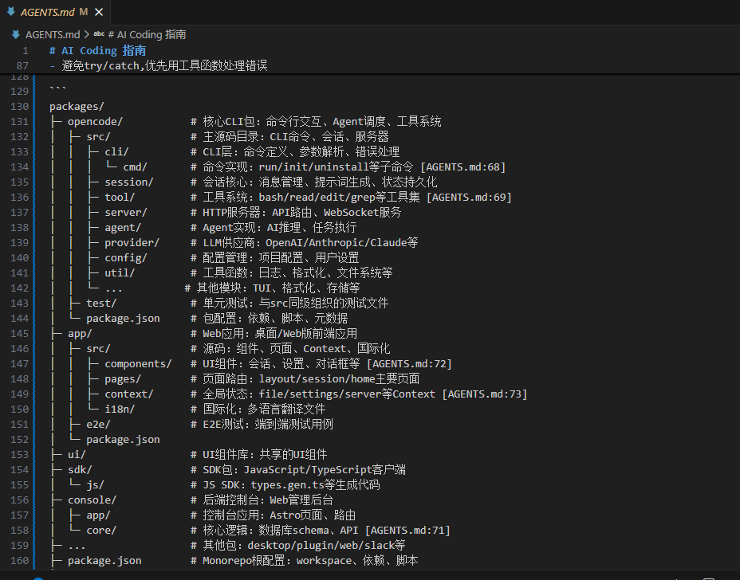

# init 项目知识初始化

**在build模式下，输入 /init** ，然后回车执行，会通过AI对项目进行深度分析，**预计耗时约10分钟左右**。

最终生成包含包含项目技术栈、目录结构、规范约束等内容的 [AGENTS.md](https://AGENTS.md) 文件，每次对话会自动发送给AI，便于AI对项目有全局理解。

一次生成，多次复用，可手动编辑修改该文件，添加自己的rules。

 

 
