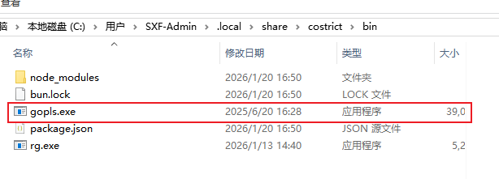

# lsp

## 概述

CoStrict集成了语言服务器协议（LSP），以帮助大语言模型与您的代码库进行交互。它利用诊断信息向大语言模型提供反馈。

## 使用

CoStrict 默认内置了主流语言的lsp。

配置环境变量 COSTRICT_EXPERIMENTAL_LSP_TOOL=1  可启用 lsp 工具。

## 测试

 

**注** ：lsp 程序默认放在  ~\.local\share\costrict\bin\  目录下，如果lsp没有，对于某些语言，可手动下载好放到该目录下，比如go语言：

