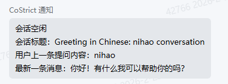
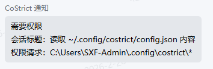
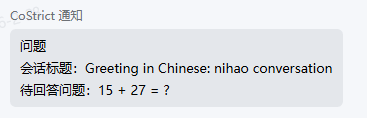
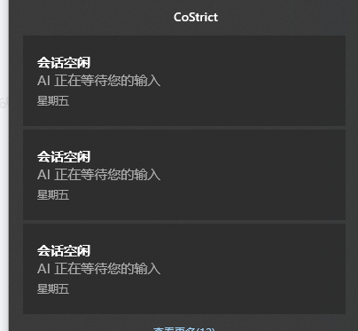
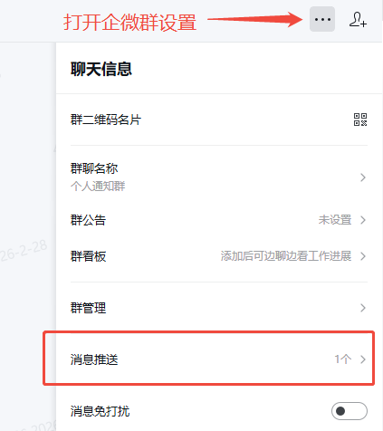
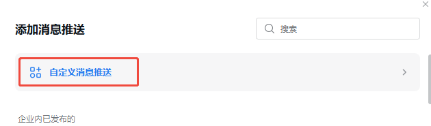

# 通知插件

> CoStrict CLI 系统级通知，让你及时知晓任务何时完成

Github: https://github.com/zgsm-ai/costrict-system-notify

## 版本依赖

请确保 CoStrict CLI 版本号为 3.0.8 以上

## 通知事件

该插件将对以下几种事件进行通知：

- 主会话进入等待



- 询问权限



- 问卷工具调用



## 启用插件

通过修改 CoStrict CLI 配置文件，在 plugin 字段中新增 `@costrict/notify` 来启用通知插件：

```json
{
    "plugin": ["@costrict/notify"]
}
```

CoStrict CLI 配置文件位置：

- 全局：`~/.config/costrict/config.json`
- 项目级：`<project-root>/.costrict/config.json`

## 通知渠道与启用配置

插件提供以下三种通知渠道

### 1. 系统通知栏通知



基于 [node-notify](https://github.com/mikaelbr/node-notifier) 库进行通知，支持 windows、mac、linux

通过配置以下环境变量进行启用，默认关闭：

```bash
export NOTIFY_ENABLE_SYSTEM=true
```

### 2. 企微群消息机器人通知

基于企业微信群消息机器人的 webhook 机制进行通知

通过配置以下环境变量进行启用，默认关闭：

```bash
export NOTIFY_ENABLE_WECOM=true
export WECOM_WEBHOOK_URL=YOUR_WEBHOOK_URL
```

webhook 地址获取途径如下：

1. 打开企微群设置，选择消息推送功能



2. 新增自定义消息推送



3. 新增推送机器人 ，并获取推送 webhook 地址


### 3. Bark 通知（仅针对 ios 用户）

[Bark](https://github.com/Finb/Bark) 是一款免费的通知 APP，基于 Apple 统一推送中心机制实现，不会额外消耗设备电量，app 也无需常驻后台

通过配置以下环境变量进行启用，默认关闭：

```bash
export NOTIFY_ENABLE_BARK=true
export BARK_URL="https://api.day.app/BARK_KEY"
```

BARK_KEY 可在 Bark App 界面上获取：


