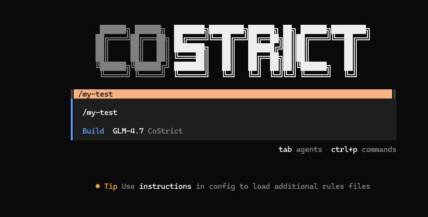

# 自定义command

CoStrict CLI 中常用操作的快捷命令。

## 概述

Slash 命令为常用操作提供快捷方式。

## 配置位置

● 全局：~/.config/costrict/commands/

● 项目：.costrict/commands/

## 示例

项目根目录下，.costrict/commands/my-test.md：

```
---
description: Run tests with coverage
agent: build
---
 
Run the full test suite with coverage report and show any failures.
Focus on the failing tests and suggest fixes.
```

参数说明：agent 是一个可选的配置选项。如果未指定，将默认使用您当前的智能体。

**注意**：配置完成后，建议重启cli，以加载commands。

## 测试



## 其它配置

● 使用 $ARGUMENTS 占位符将参数传递给命令。

```
---
description: Create a new component
---
 
Create a new React component named $ARGUMENTS with TypeScript support.
Include proper typing and basic structure.
```

你也可以使用位置参数访问各个参数：

$1 - 第一个参数、$2 - 第二个参数、$3 - 第三个参数

```
---
description: Create a new file with content
---
 
Create a file named $1 in the directory $2
with the following content: $3
```

使用：`/xxx config.json src "{ \"key\": \"value\" }"`

● subtask: true  ，可选参数，强制以子agent方式执行。

●  model: anthropic/claude-3-5-sonnet-20241022，可选参数，配置命令使用的模型。
