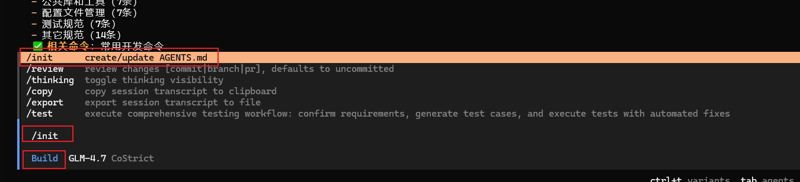
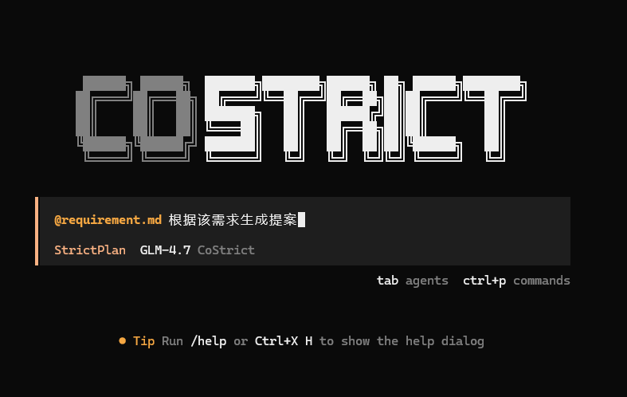
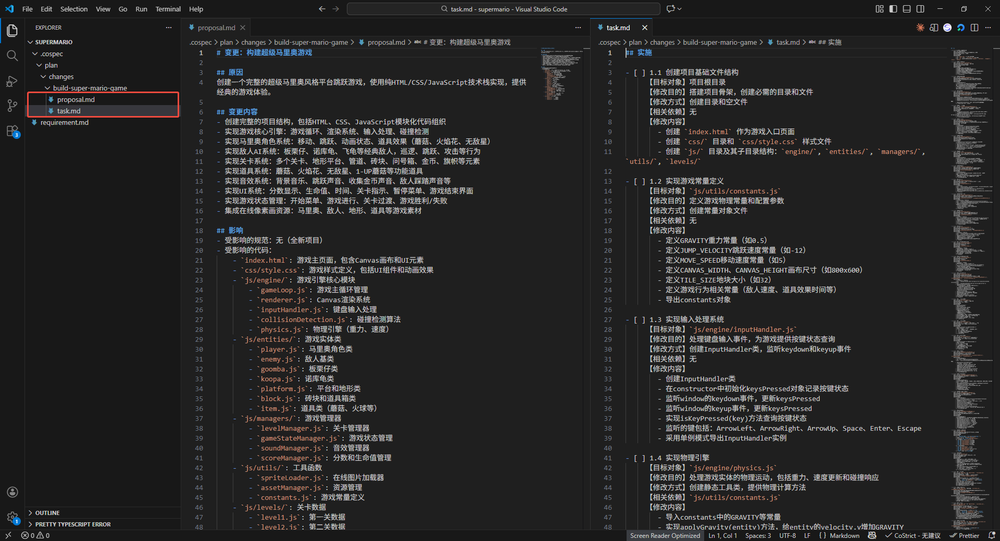
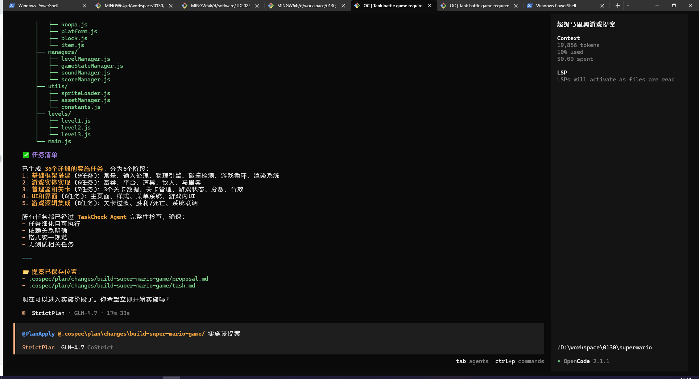
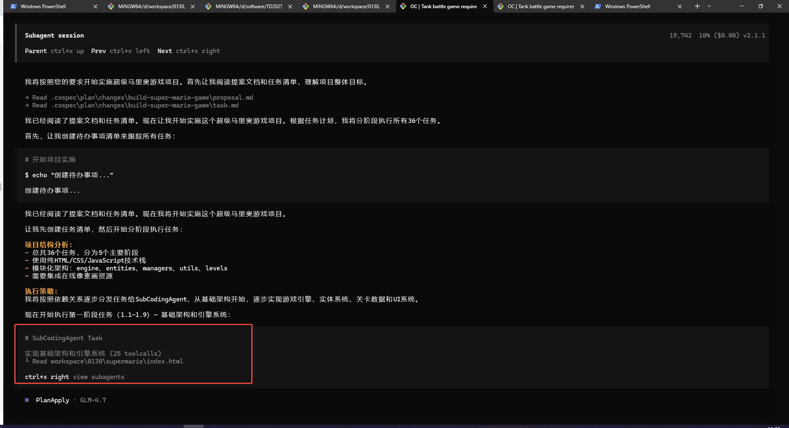
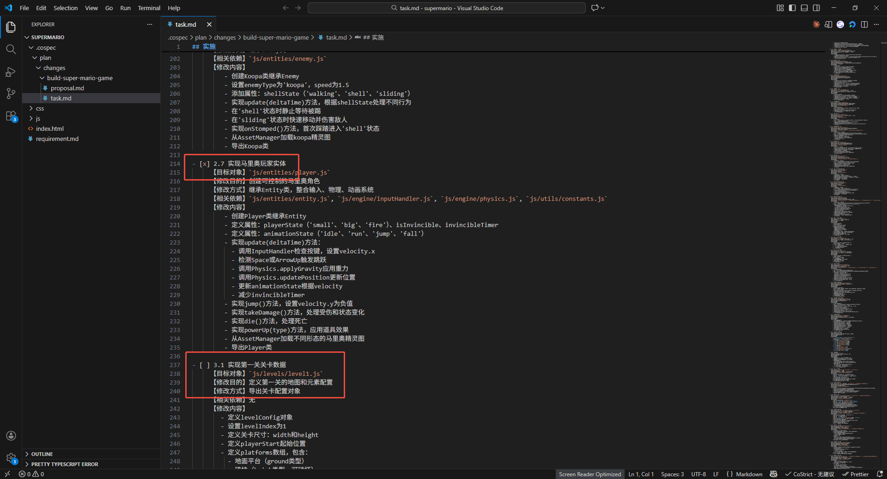

# StrictPlan模式

适合复杂需求场景,遵循需求分析 → 项目探索 → 需求澄清 → 计划生成 → 任务执行 → 测试验证等工作流程。

## 选择StrictPlan模式，开启新会话

Tab 切换到 StrictPlan 模式。并使用/new 开启新会话，避免历史上下文影响，以便取得更好效果

## 输入需求

可以直接输入你的需求

或者@出需求文档或者输入需求文档相对路径。

**Tips:**

1. 如果出现无法粘贴的情况,在终端点击鼠标右键 → 编辑 → 粘贴:

## 项目探索

AI会根据你的需求自动发起多个探索子Agent进行项目探索，了解当前项目情况

上一步双击子Agent对话框，可以进入到探索Agent查看进度，点击Parent可以返回

## 需求澄清

AI会根据需求和探索结果让用户选择修改方向

切换问题推荐用左右键`<-` `->`或者鼠标点击，以免用Tab误触切换了模式。每个问题选择后切换到Confirm按Enter提交

## 生成提案和任务，用户检查任务

至此，AI根据用户原始问题、代码探索结果和用户问卷选择，列出一个变更清单和开发任务清单。

生成开发任务清单，可以人工或者AI提问修改（StrictPlan模式下）

## 触发编码任务（支持多种方式唤醒）

**方法一：**

AI驱动时候弹出选择框，点击立即实施

**方法二：**

@PlanApply和提案文件夹地址（只有一个提案的时候可以省略@）

**方法三：**

@提案文件夹地址（只有一个提案的时候可以省略@）直接会话

## 实施任务

该流程比较长，但是是自动的，可以耐心等待。

出现子Agent:PlanApply则代表唤醒了编码任务进行具体编码，双击该Agent可以看到详情

PlanApply是一个管理任务Agent，会下发到具体SubCodingAgent，执行前序task.md每一个编码任务

点击上一步SubCodingAgent可以看到具体执行流程

每完成一个或者一批任务会在task.md打上完成标记

## 编码结束

对话界面完成

task.md中任务全部标记完成

## 检查和问题修复

如果发现任务未完成或需要调整可以@ReviewAndFix进行通用修复或指定问题修复，也可以直接进入后续TDD环境进行编译测试

