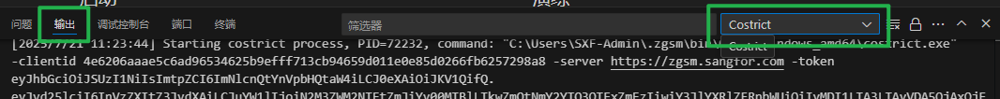

# 常见问题

### 查看 `credit 用量` 显示空白, 或无法访问此网站

**问题原因**: 
> 此前系统存在一个错误的永久重定向规则（HTTP 301），它会将 `https` 请求错误地指向 `http`

**解决措施**:

> 可以确认下协议是否为 `https`, 如果是 `http` , 手动改成 `https` 后再次尝试访问

> 清理 `cookies`, 网页临时文件, 消除永久重定向带来的问题

### 前端登录成功一段时间后, `CoStrict` 插件没有跳转对话页面

**问题原因**: 
> 大概率是因为配置了代理, 导致插件网络出现问题

**错误定位**:

  
 点击终端旁边的输出, 选择 CoStrict 

> 如果显示 `fetch failed` 则大概率就是代理导致的问题

**解决措施**:

1. 在 `VS Code` 中,  键入`crtl + shift + p`, 输入 `user settings`, 如果配置了 http.proxy, 看下配置是否正确？
2. 关掉 `VS Code`, 关闭代理软件
3. 打开 windows 代理服务器设置, 选择关闭
4. 重新打开代理软件和 `VS Code`
