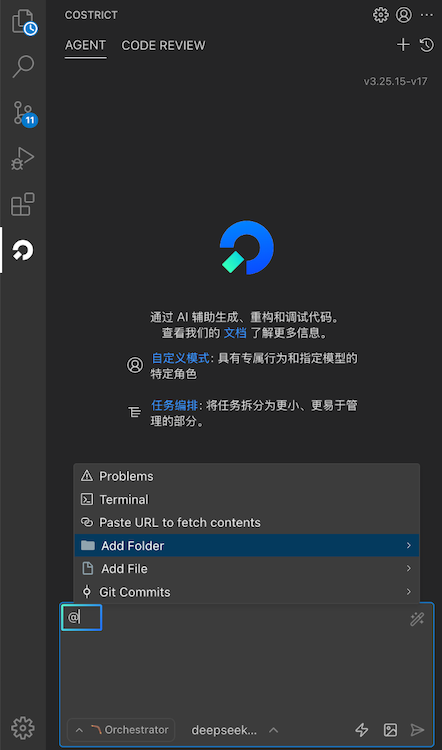
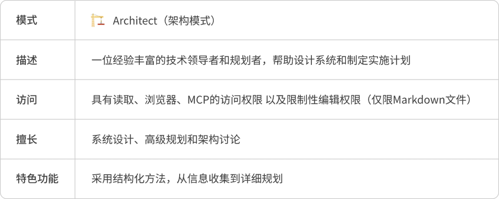
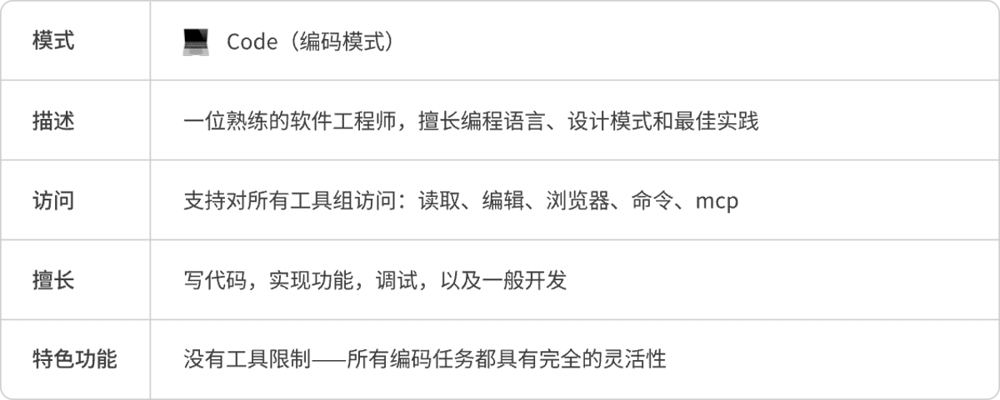
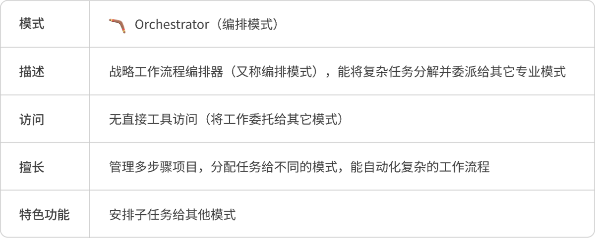

# 产品特性

## 代码审查（Code Review）

Costrict代码审查能够进行全量代码仓库的索引解析（codebase）、公司级编码知识库RAG（即将上线），支持用户对函数、选中代码行、代码文件和整个代码仓库进行代码检查，在发现问题和确认问题上采用"多专家模型专项检查"+"多模型交叉确认"策略。确保审查无死角、漏洞零遗漏，为企业代码筑牢安全防线。

### 触发方式

支持用户对函数、代码块、代码文件和整个代码仓库进行代码审查。

代码行和函数采用通用触发方式，点击鼠标**右键选择"Costrict > 代码审查"**触发

对于函数支持点击顶部**快捷按钮"代码审查"**触发

对于代码文件和代码仓库，打开文件目录，选中其中一个文件，点击鼠标右键选择"**Costrict > 代码审查"**则可对该代码文件进行代码审查，点击"**Costrict > 检查仓库**"则会对检查该文件所在的全量代码仓库。

### 执行过程&结果

代码触发审查之后，Costrict面板的CODE REVIEW栏实时展示代码审查的进度，扫描的时间长短跟执行的代码量成正比，短到几秒，长到几十分钟。

审查结果会以列表形式展示在侧边栏，根据标题描述、左侧颜色和问题标签可以对整体问题以及严重程度做一个大致的了解。

三种颜色条红、黄、蓝对应问题严重等级：高、中、低。点击某个问题可在代码编辑区查看详情，右侧对应的问题代码行会被自动定位，呈高亮显示，问题行下方浮窗展示问题详情。

为了Codereview功能后续能被训练的更智能更好，我们鼓励用户根据实际情况点击详情卡片右上角的按钮，有"接受"、"拒绝"、"关闭"三个按钮。接受：表示你认可AI输出的问题；拒绝：表示你认为这不是一个问题或者输出有误，你不认可输出结果；关闭：关闭当前详情窗口。

### 过滤条件

Codereview支持对问题做过滤，支持对严重程度、问题标签和确信度三个维度过滤。

- **严重程度**：高、中、低，对应问题列表的左侧颜色条：红黄蓝
- **问题标签**：AI会根据问题描述自动给问题进行归类打标，通常一个问题会有一到多个标签。常见的问题标签类型有：语法错误、逻辑错误、内存泄露、安全漏洞等等。
- **确信度**：指的是AI对这个问题的确定程度，确信度越高则可信度越高，符合过滤条件的问题就越少。反之亦然，默认选择适中即可。

### Codebase索引构建

Codebase索引是一套套针对代码库进行结构化解析、关联与存储的智能系统，通过建立代码元素（如函数、类、变量、调用关系等）的高效检索机制，为提高代码审查的准确度，Costrict在执行代码审查之前会先做Codebase索引构建工作。

你可以在**"设置 > 上下文"**模块看到构建的进度和具体情况。Costrict插件默认会几分钟检查同步一次Codebase索引，如果有文件变更，也会自动触发索引同步。

如果用户需要设置排除文件，点击"Ignor文件配置"模块下方的"编辑"按钮可以将索引文件配置到.coignore文件中，插件在做Codebase索引同步时就会自动过滤掉.coignore文件中的文件。该排除文件是与项目绑定的，如果用户切换了项目，则需要重新配置排除文件。如果用户未设置排除文件，则系统会使用默认的排除配置。

## 智能体（AI Agent）

用户只需通过自然语言描述你的诉求，智能体（AI Agent）能够根据需求端到端完成任务，它功能强大，智能可控。具备：自主决策、全仓库上下文检索、调用工具、错误修复、运行终端等能力。

### 智能问答

当您进行编码工作遇到疑问时可以使用智能问答模式，能够帮您答疑解惑，快速为您生成代码，添加代码注释、代码优化、解释代码、修复代码问题、排查编译报错等。

智能体（智能问答）界面元素

### 快速开启对话

1. 打开Costrict插件，默认即为Agent对话模式
2. 找到对话框，输入您的指令并发送，比如：帮我生成一个贪吃蛇小游戏；优化当前代码等等
3. 等待模型返回结果，如果遇到本地文件访问、运行命令、文件保存、浏览器访问等权限问题，请正常批准即可。

### 上下文

上下文能够为Costrict提供关于您项目的具体信息，使其能够更准确、更高效地执行任务。您可以使用上下文来引用文件、文件夹、问题、URL和Git提交等。

快捷键 `@` 能调用上下文。

**类型概览**

**图片上下文**

当需要结合图片生成代码、问题修复、或进行图形化表达时，可点击对话框下方的
按钮添加图片上下文。该功能是否可用取决于模型是否支持图像，若不支持，此处的图片功能则不支持使用。

查看模型对图像的支持情况可前往：设置 > 供应商页面的"模型"描述信息处进行查看。

### 模式选择

Costrict中的模式是针对特定任务而设计的个性化角色，每种模式提供的功能有所不同，擅长的领域和访问权限也有所区别，用户可根据具体情况作出选择。如果您对这些模式不太了解，建议使用Orchestrator（编排模式），它会根据任务类型自行分配模式。

模式选择有两种使用方式，方式一：点击输入框底部的第一个按钮可以手动选择模式。方式二：在输入框使用快捷键"/"能快速调用mode功能。

**各模式功能介绍**

**Architect模式**

**Code模式**

**Ask模式**

**Debug模式**

**Orchestrator模式**

**模式自定义设置**

Costrict支持自定义现有模式或创建新的模式。支持定义模式名称、API、角色定义、规则约束和访问的工具。

### 模型选择

Costrict插件提供了多种模型供用户免费使用。Costrict最新版本推出了Auto模式，新手用户如果对模型没有特定的偏好，推荐使用该模式。Auto模式会综合考量当前模型列表的效果、速度、Credit的消耗情况，根据任务类型智能为用户选择合适模型来完成任务。点击输入框下方第二个按钮即可切换模型。

## 智能代码补全 (Code Completion)

当你在Vscode编辑器区进行代码编写时，在代码补全功能开启的情况下，Costrict会根据当前代码文件及相关代码文件的上下文，自动为你生成行级/函数级的代码建议，此时你可以使用快捷键采纳、废弃。Costrict代码智能补全支持按词或行接受。

**快捷键一览表**

