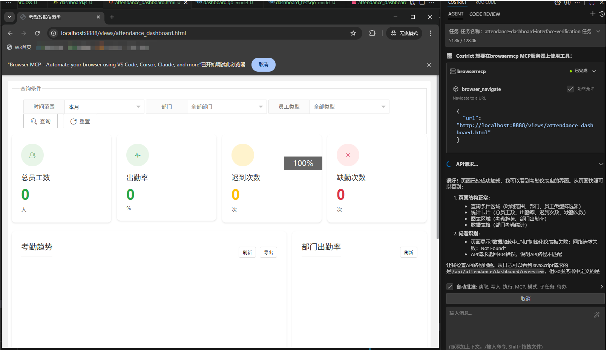

# 案例实践2 - 代码生成，项目从0生成

### 案例背景

前段时间我负责开发一个用户统计功能，需要在前端展示用户活跃度、出勤频次等数据，并设计相应的后端API进行数据统计与提供。作为一个后端开发工程师，我对前端框架和ECharts图表库不够熟悉，这成为了开发过程中的主要瓶颈。

面对这个全栈任务，我决定借助CoStrict AI编程助手来完成这项跨技术栈的工作。

### 如何用AI实现

#### 1、需求分析与框架搭建

我向CoStrict输入了第一段提示词：
```
请分析当前项目结构，帮我设计一个用户考勤统计功能。需要包含前端和后端的设计开发。
请先分析项目结构，然后给出实现方案。
```

CoStrict分析了项目后，识别出这是Python后端+Html前端的项目结构，然后给出了实现方案：
- 后端：新增数据访问层
- 前端：创建统计页面，使用ECharts可视化库
- 数据库：建议在用户行为表中添加操作类型和时间戳字段


#### 2、后端代码生成

我进一步细化需求：
```
请生成后端代码，需要提供以下API：
1. 获取近30天每日出勤用户数
2. 获取考勤数据
3. 获取用户缺勤数据
```
CoStrict生成了完整的Controller、Service代码，包括相应的数据模型和DTO，生成的代码结构清晰。


#### 3、前端界面实现

实现前端代码时，CoStrict对我的功能需求进行了拆解，并逐步进行了实现：
```使用Element UI布局和ECharts图表库，包含：
1. 日期范围选择器
2. 折线图展示每日缺勤用户
3. 饼图展示用户分布
4. 表格展示详细数据

请使用响应式设计，确保在不同屏幕尺寸下正常显示。
```

CoStrict生成了基础前端代码，但初次生成的界面布局不够美观，图表配置也需要调整。我通过多次迭代优化：

```
调整图表颜色为主题系统默认色系，添加动画效果
优化移动端显示，在小屏幕下堆叠图表元素
添加数据加载状态提示和错误处理
```



#### 4、效果测试

代码生成完成后，我使用CoStrict协助编写单元测试和集成测试，并将问题发给CoStrict去debug，最终跑出了最终想要的效果。
在CoStrict的协助下，我仅用一天时间就完成了原本需要一周多的全栈开发任务。


### 心得体会

1. **明确的需求描述是关键**：AI助手需要清晰、具体的指令才能生成高质量的代码。将复杂任务拆解为多个子任务，分步骤实现效果更好。

2. **迭代优化比追求完美初版更重要**：AI生成的代码可能需要多次调整，不要期望一次性得到完美结果，而是通过连续对话逐步完善。

3. **代码审查仍不可少**：虽然AI能快速生成代码，但开发者仍需理解和审查生成代码的逻辑，确保符合项目标准和最佳实践。

4. **跨技术栈开发效率大幅提升**：CoStrict极大降低了全栈开发的技术门槛，让后端开发者也能高效完成前端任务，减少了团队间的依赖和等待成本。

通过这个案例，我深刻体会到AI编程助手不是替代开发者，而是增强开发者能力的强大工具，尤其擅长处理技术栈跨越和样板代码编写，让开发者能更专注于核心业务逻辑和创新设计。
