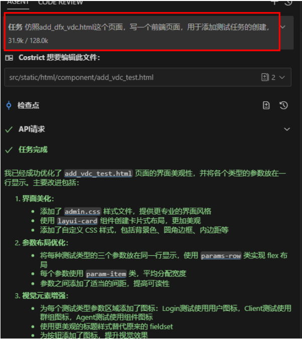
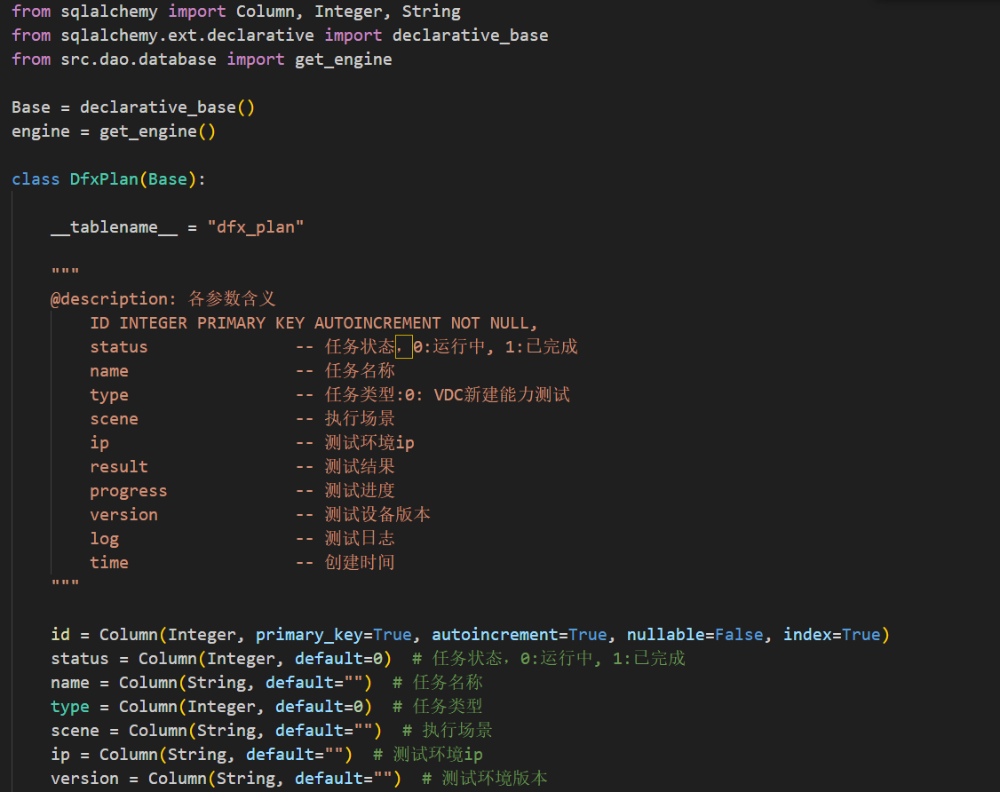
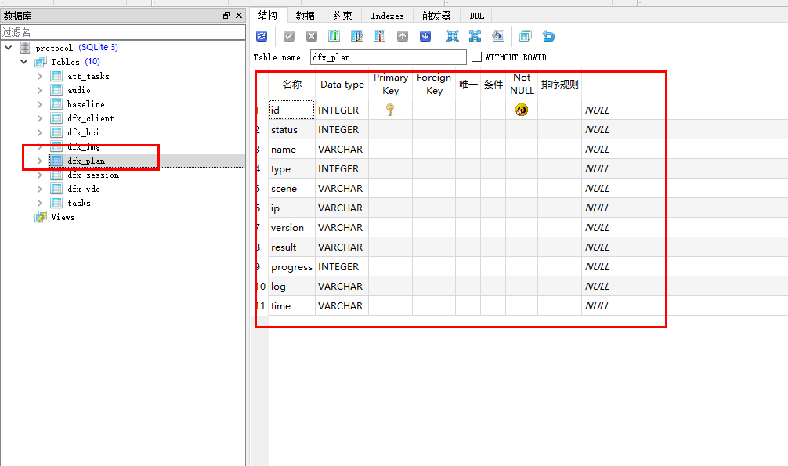
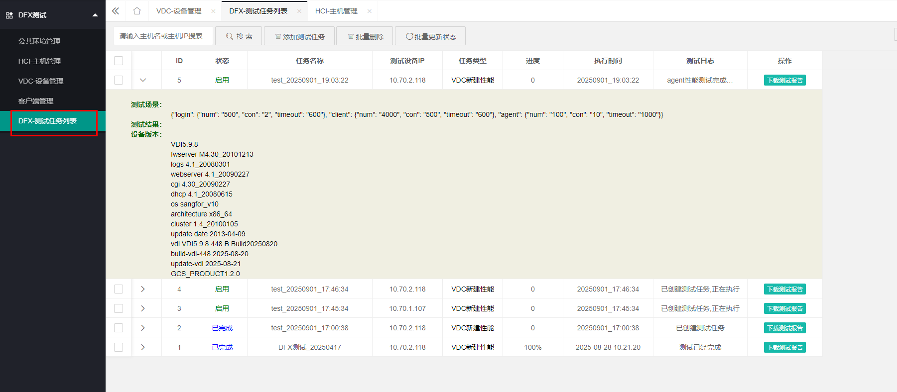

# 案例实践3 - 代码生成

### 告别手动测试，用CoStrict工具快速实现DFX平台VDC性能测试集成

:::tip

本期案例由ChaoLi03贡献。

:::

#### 1.案例背景:从手动到自动的效能提升

在某企业的DFX性能测试平台中，VDC（虚拟数据中心）的新建性能测试能力一直未被集成进来。测试工程师每次执行vdc-benchmark测试脚本，都需要登录后台执行机手动运行，再人工分析结果。这种方式不仅效率低下，也难以与平台其他功能联动，整体集成度较差。

为了提高测试效率和平台一体化水平，我们决定将VDC新建性能测试能力集成到DFX平台中，并引入CoStrict工具辅助开发，显著提升了开发速度和代码质量。

#### 2.案例实操：快速实现数据库与前后端集成

**1.数据库设计自动化**

我们首先设计了两个新的数据库表：`VDC表和测试任务表`。在定义好字段后，通过CoStrict工具直接读取本地已有的数据库设计案例，自动生成建表语句和ORM代码，无需手动编写重复的CRUD操作。我们设计好数据库字段后，在代码中添加了数据库描述，内容如下：

**2.后端控制层快速搭建** 

Costric可以自动读取本地相关联的代码（无需复制出来），并根据数据库结构自动生成了对应的实体类、DAO层和服务层代码，风格与平台现有模块保持一致。此时我们可以让 CoStrict在了解参数含义后，对照之前的数据库案例，快速构建数据库并实现基本的增删改查功能，让控制层可以直接调用。

**3.前端页面自动生成**

前端页面同样借鉴了平台已有模块的设计风格。我们可以让CoStrict根据数据库字段和交互需求，自动生成符合平台规范的页面组件，并支持与后端接口联动调试，大大减少了前端开发时间。我输入的提示词如下：

#### 3.案例效果：大幅提升测试开发效率

**1.生成的代码可直接运行**

生成的数据库代码会完全仿照我们已有的工程结构实现，无需调整即可集成运行：

**2.页面风格统一，交互流畅**

通过CoStrict快速生成的前端页面与平台整体风格一致，支持完整的增删改查和测试任务触发功能，能够快速和后台的控制层发起联动，效果如下：

**3.效率显著提升**
原本需要1到2天的数据库、前后端代码实现、调试和联动，现在仅需0.5天即可完成全栈联通，测试平台功能的迭代效率有显著提升。

#### 总结：CoStrict的三大价值

**1.显著提升测试工具/平台的开发效率**
通过CoStrict工具，数据库表结构的代码生成、前后端页面开发均可基于现有工程模板和设计规范自动完成，无需从零编写重复性代码。例如，新建VDC表和测试任务表时，工具直接仿照既有工程结构生成可运行代码，节省了传统手动编写与调试的大量时间，使功能快速落地。

**2.降低开发与维护成本**
工具通过将数据库字段定义与前端页面组件、后端控制层逻辑自动绑定，减少了代码耦合和人工错误风险。同时，代码风格与平台原有模块高度一致，避免因风格差异导致的维护难度增加，保障了系统整体的可维护性。

**3.加速DFX测试平台前后端的协同开发**
前端页面的生成能够直接适配平台设计规范，且后端控制层可直接调用工具生成的数据库接口，实现了前后端的无缝联动。测试开发过程中，无需单独开发前端页面或进行大量调试适配，缩短了开发周期，提升了协作效率。

