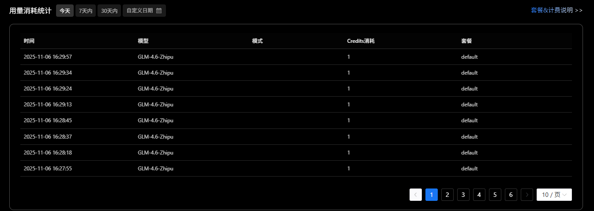

# Credits费用明细

## 什么是 CoStrict Credits？

用户无法无限制地使用高级大语言模型，因此我们采用基于 Credits 的配额机制。Credits 表示 AI 在执行任务时消耗的资源配额。在 CoStrict 中，以下用户请求会消耗 Credits：

- **Vibe Coding**：智能代码补全和生成
- **Code Review**：AI 驱动的代码质量检查
- **测试方案**：分析项目代码生成或总结一套可执行的测试流程，为 AI 提供质量抓手
- **文档生成**：分析已有代码，生成项目知识库与规则，帮助AI和人理解已有业务
- **Strict 模式**：将一句话的需求，系统性地拆解为需求设计、架构设计、测试设计、代码设计等步骤，如同为AI设定了标准工序，确保输出结果高质量、高可控。

请注意，具体消耗的 Credits 数量会因任务复杂度、代码规模和所使用的特定高级模型而有所不同。关于不同任务的 Credits 消耗明细，请参阅我们的任务与 Credits 消耗指南。

## 如何扣减 Credits？

不同时间获取的 Credits 到期时间各不相同。系统会优先使用最先到期的 Credits，帮助您最大化发挥 Credits 的价值。

即使用户已用尽高级模型的配额（即 Credits 已耗尽），我们仍会提供每日限量的基础模型调用额度，确保用户可不间断地使用产品的核心功能。

## 免费 Credits 赠送规则

为了让用户更好地体验 CoStrict 的功能，我们会按照以下规则免费赠送 Credits：

| 网络环境 | 场景 | 用户类型 | 赠送 Credits | 有效期 |
|---------|------|---------|-------------|--------|
| 外网 | 自行注册 | 新用户 | 200 | 30天 |
| 外网 | 首次 Star | 新用户 | 200 | 30天 |
| 外网 | 受邀注册 | 受邀新用户 | 200 | 30天 |
| 外网 | 首次 Star | 受邀新用户 | 300 | 30天 |
| 外网 | 每周一 | 注册并 Star 的用户 | 50 | 月底清零 |

### 赠送规则说明

- **新用户**：首次注册 CoStrict 的用户
- **受邀新用户**：通过邀请链接注册的新用户
- **首次 Star**：在 GitHub 上首次为 CoStrict 项目点 Star
- **每周一赠送**：每周一自动为符合条件的用户发放 Credits
- **月底清零**：每周赠送的 Credits 在当月最后一天 23:59:59 自动清零

### 赠送 Credits 特点

- 赠送的 Credits 优先级低于购买的 Credits
- 赠送的 Credits 不可转让或退款
- 系统会自动检测并发放符合条件的 Credits
- 赠送记录可在 Credits 日志中查看

## 错误处理

失败的 CoStrict 模型请求不会扣减 Credits。只有在模型 API 调用成功并返回有效结果时才会扣除 Credits。

如遇到以下情况，不会扣减 Credits：

- 网络连接失败
- 服务器内部错误
- 请求超时
- 模型返回错误响应

## 模型与 Credits 消耗对照表

不同的 AI 模型具有不同的性能和成本，因此每次调用消耗的 Credits 也不相同。以下是各模型的 Credits 消耗标准：

| 模型名称 | 正常时段消耗 Credits | 夜间时段消耗 Credits | 模型特点 |
|---------|-------------------|-------------------|---------|
| GLM-4.5/GLM-4.6 | 1 | **0.5** 🌙 | 通用大语言模型，平衡性能与成本 |
| GLM-4.6-Zhipu | 1 | **0.5** 🌙 | 智谱 AI 优化版本，适合代码生成 |
| Kimi-K2-Moonshot | 10 | 10 | 月之暗面高性能模型，支持长上下文 |
| Kimi-K2-Turbo-Moonshot | 10 | 10 | 月之暗面加速版本，响应更快 |
| Qwen-2.5-VL | 0.25 | 0.25 | 通义千问视觉语言模型，支持图像理解 |
| Auto |-|-|9折|

### 🌙 夜间半价活动

**活动时间：** 每日 20:00 - 次日 09:00

**参与模型：** GLM-4.5/GLM-4.6、GLM-4.6-Zhipu

**活动内容：**

- GLM 系列模型在夜间时段调用，每次消耗的 Credits 减半（0.5 Credits）
- 系统将根据请求发起的服务器时间自动判断是否为夜间时段
- 夜间半价优惠会在 Credits 日志中单独标记

**活动说明：**

- 🚨 **限时活动**：本活动为限时推广活动，暂未确定结束时间
- 📢 **提前通知**：活动结束前一个月，我们将在 CoStrict 官网 (https://costrict.ai) 发布结束通知
- ⏰ **时间判定**：以服务器时间（UTC+8 北京时间）为准

### 模型选择建议

- **夜间开发**：强烈建议使用 GLM 系列模型，享受半价优惠 🌙
- **复杂代码生成**：白天使用 GLM-4.5/GLM-4.6 或 GLM-4.6-Zhipu，夜间更划算
- **长文档处理**：建议使用 Kimi 系列模型，支持长上下文处理
- **多模态任务**：建议使用 Qwen-2.5-VL，支持图像和文本处理

**注意：** 模型的 Credits 消耗标准可能会根据模型提供商的价格调整而变化。我们会提前通知用户任何消耗标准的变更。

## 任务与 Credits 消耗指南

不同任务需要使用不同的模型，每种模型都有相应成本。为此，我们分析了用户在线活动的资源消耗。基于这些数据，我们建立了各类模型使用与 Credits 消耗之间的对应关系，帮助用户更清晰地了解我们如何对不同操作计算并扣除 Credits。

例如，单次代码生成请求可能会使用高级大型语言模型，消耗一定数量的输入与输出 Token。扣除的 Credits 将依据所用模型以及输入与输出的 Token 总量计算。

当用户发起复杂的代码审查任务时，通常会在后台触发多次高级模型调用，因此比简单的代码补全请求消耗的资源更多。

对于大型项目的文档生成，其资源消耗将根据分析整个代码库并生成相应文档所需的模型推理量来衡量。

| 功能类型 | 基础消耗 (小型文件) | 高级消耗 (大型文件/项目) | 推荐模型 | 夜间建议 🌙 |
|---------|-------------------|------------------------|---------|------------|
| Vibe Coding | ~ 3 次调用 | ~ 5 次调用 | GLM-4.5/GLM-4.6, GLM-4.6-Zhipu | GLM-4.6-Zhipu (1.5-2.5) |
| Code Review | ~ 10 次调用 | ~ 50 次调用 | GLM-4.6-Zhipu | GLM-4.6-Zhipu (5-25) |
| 测试方案 | ~ 80 次调用 | ~ 150 次调用 | GLM-4.5/GLM-4.6 | GLM-4.5/GLM-4.6 (40-75) |
| 文档生成 | ~ 10 次调用 | ~ 80 次调用 | Kimi-K2-Moonshot | GLM-4.6-Zhipu (5-40) |
| Strict模式 | / | 100 ~ 500 次调用 | GLM-4.5/GLM-4.6 | GLM-4.5/GLM-4.6 (50-250) |

**表格中括号内的数字为夜间使用 GLM 系列模型的预估 Credits 消耗。**

**夜间开发优势：**

- 🌙 **成本节省**：GLM 系列模型夜间使用可节省 50% Credits
- ⚡ **性能保持**：模型性能不变，仅价格优惠
- 🎯 **适合场景**：非常适合夜间加班、个人学习时间使用

**表格中的数值为基于统计分析的估算。实际的 Credits 扣减会根据选择的具体模型和使用时段而有所不同，并以实时使用为准。我们也在持续优化，以在完成同等工作的前提下减少资源消耗。**

**注意：** 未来随着新功能推出，我们可能会依据其资源需求更新 Credits 消耗率。这意味着某些操作的 Credits 扣减数可能会调整，以更准确反映新功能的实际资源使用情况。

## 使用监控

您可以在 Usage 仪表板查看您的 Credits 历史和当前用量。

### 查看你的 Credits 使用情况

1. 登录 CoStrict 客户端或访问 CoStrict 官网 (https://zgsm.sangfor.com/credit/manager)
2. 点击右上角头像，进入 Settings > Usage
3. 在这里，你可以查看当前套餐，以及流量包中可用与已使用的 Credits 信息

**Credits 使用优先级：** 我们会优先消耗最先到期的 Credits。对于到期时间相同的 Credits，将按照以下顺序使用：

1. 免费赠送的 Credits（优先消耗即将到期的）
2. 购买的 Credits（按购买时间顺序）

**Credits 到期：**

- 购买的 Credits 有效期为购买后 30 天
- 赠送的 Credits 有效期根据赠送规则确定（30天或月底清零）
- 你可以在 Credits 日志中查看具体的到期时间

通过流量包获得的 Credits 在有效期内始终可用，不会因为新购买而提前失效。

## Credits 日志：Credits 历史与追踪

Credits 获取历史提供了所有已获得 Credits 的完整记录，包括获取原因、数量，以及生效与到期日期，便于你轻松追踪 Credits 来源。

### Credits 日志包含以下信息

- **获取时间**：Credits 到账的具体时间
- **获取方式**：流量包购买、免费赠送、活动奖励等
- **Credits 数量**：本次获取的 Credits 数量
- **获取来源**：具体的获取场景（注册、Star、邀请等）
- **有效期**：该批次 Credits 的到期时间
- **剩余数量**：当前该批次的剩余 Credits
- **消耗记录**：详细的使用历史，包括使用的模型类型

### 关于到期日期的重要说明

- **购买的 Credits**：到期日期为购买时确定的固定日期（购买后30天）
- **赠送的 Credits**：
  - 注册和 Star 赠送：30天有效期
  - 每周一赠送：当月月底 23:59:59 清零
- 与订阅制产品不同，CoStrict 的 Credits 有效期不会因账户变更而改变
- 所有 Credits 均按照既定规则计算到期时间

### 使用统计

Credits 日志不仅显示 Credits 的获取历史，还提供详细的使用统计：

- **每日使用量**：查看每天的 Credits 消耗情况
- **模型使用分布**：了解不同模型的调用次数和 Credits 消耗占比
