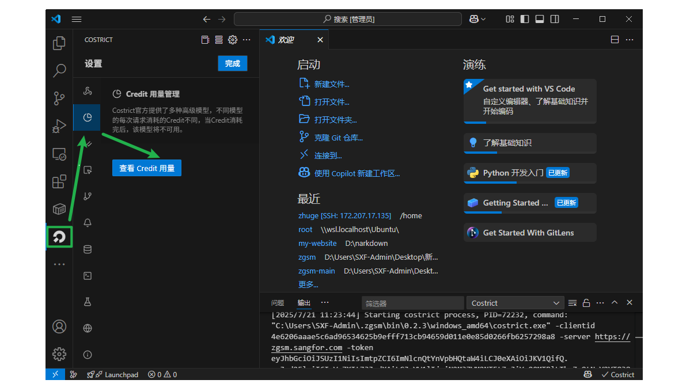
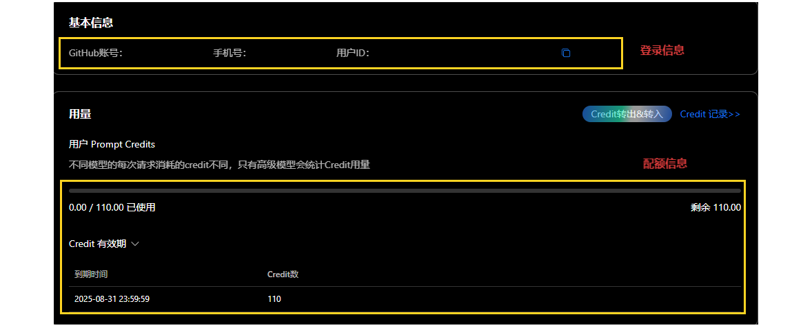
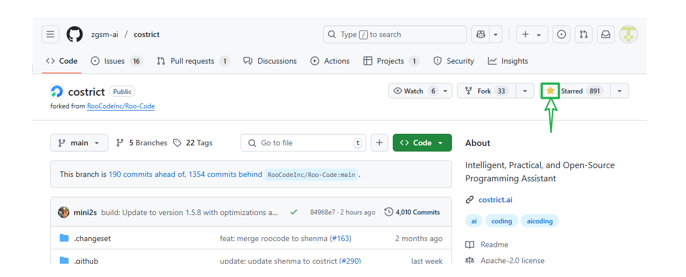

import Tabs from '@theme/Tabs';
import TabItem from '@theme/TabItem';

# 配额获取


## 查看登录信息和配额信息

> 点击 `costrict` 图标, 接着点击 `credit 用量管理`, 最后点击 `查看 Credit 用量`



> 在 `配额管理` 页面查看您的登录信息和 `credit` 使用信息




## 配额获取

> 如果还未进行过账号绑定, 会在 `配额管理` 页面中显示**立即绑定**, 例如:

<Tabs>
  <TabItem value="phone" label="手机 登录" default>

```
基本信息

Github账号: 立即绑定      手机号: 151********      用户id:  ************************
```

  </TabItem>

  <TabItem value="github" label="github 登录">

```
基本信息

Github账号: git用户**   手机号: 立即绑定            用户id:  ************************
```

  </TabItem>
</Tabs>


> 如果您是Github账号登录的用户，前往：https://github.com/zgsm-ai/costrict  用当前账户点亮 `star` 即可获得额外 `50` `Credit`, 到账大约需要 `2-3` 分钟。




## 账号绑定

> 如果您是手机号登录的用户, 可以绑定一个 `github` 账户, 可以同步 `github` 账户额度, 也方便在不使用科学上网的情况下登录。

> 点击立即绑定, 按照要求登录 `github` 账户（不存在会自动创建, 最好还是先注册一个 `github` 账户）

- 点击立即绑定
- 登录github账户

> 完成上述步骤会自动重定向到配额页面

