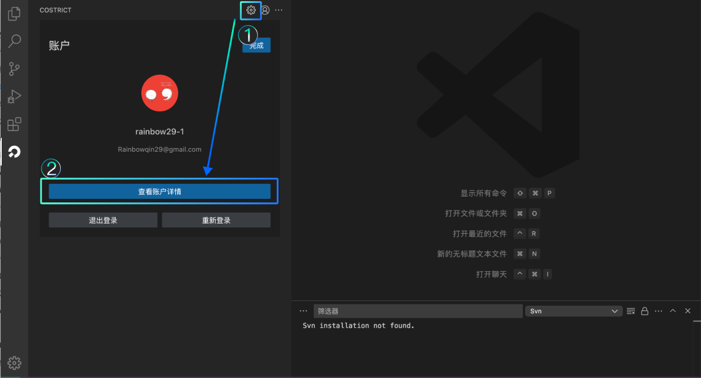
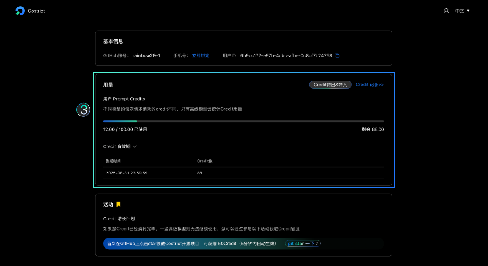
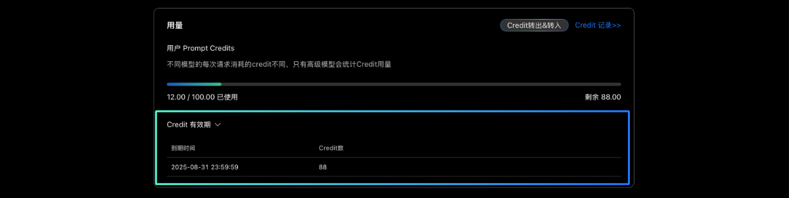
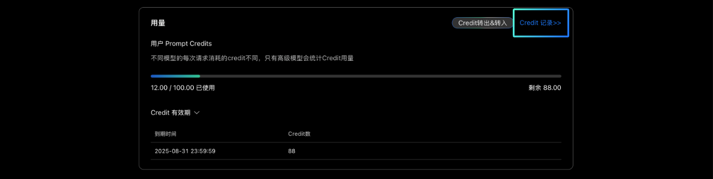
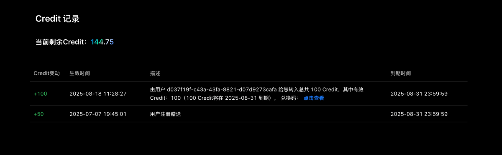

# Credit 配额

### Credie配额说明

CoStrict为免费提供用户使用，但是由于算力资源有限，为保证大规模用户请求的情况下仍能保持较好的用户体验，CoStrict采取按Credit额度计算用户的使用情况（类似积分规则），当你有Credit时，你就可以正常使用CoStrict（使用其它供应商则不受影响）。新用户注册或参与官方运营活动会有Credit额度奖励。

Credit在计算使用额度时，是按照一次对话或请求为 1 Credit的基数来计算，不同的模型消耗的倍率有所区别（模型的收费标准不同，对token的消耗也有所区别，举例：比如deepseek r1模型每次请求消耗可能是0.5 Credit，但是如果是Claude模型可能就是 1.5 Credit）具体以实际的扣除比例为准。

您可以在CoStrict插件端的账户页面 ，点击“查看账户详情” 跳转至网页的 用户信息&配额用量页面，在 “用量”模块可查看Credit的总量和消耗情况。

用户可在：“用量”模块的 “Credit有效期” 区域查看额度的到期时间，请在有效期内及时消费。

### Credie配额获取

官方推出了多种Credit方式：新用户注册会有 50 Credit的奖励额度；官方在每周也会赠送10 Credit左右，如果参与官方的运营活动，如前往Github点亮 Star收藏CoStrict项目（链接地址：https://github.com/zgsm-ai/costrict ），我们也会有奖励额度。（奖励额度定期会调整，因此奖励额度以实际领取的为准）

在“用量“模块的 “Credit 记录” 页面可查看Credit额度的获取的一些详细信息。对于参加点亮 Star 收藏 CoStrict 项目的运营活动获赠的额度，大约需要等待2分钟左右到账。

