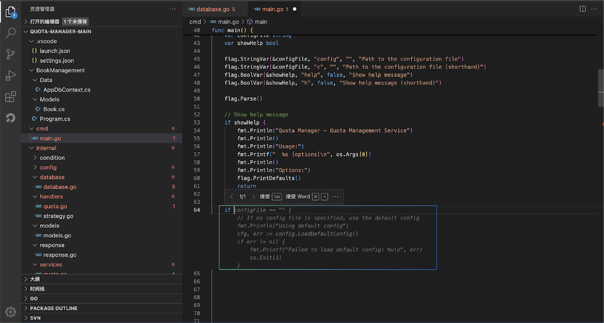

# 基本功能入门

### Agent智能体对话功能

Agent对话面板与传统的聊天软件类似，支持开发者与AI Agent助手进行对话，能够通过自然语言端到端输出结果。对话面板适合咨询一些比较宽泛的问题，一些复杂的问题，需要开发者多回合沟通才能得到最终理想答案。

### 代码智能补全

代码自动补全，Costrict能够根据光标所在位置的上下文代码，自动生成后续代码，快速秒级出码，支持主流开发语言，例如：Python、Go、Java、JavaScript、TypeScript、C/C++等。只需要使用编辑器打开代码文件，编辑代码文件时候，Costrict会在合适时机和位置自动触发智能代码补全提示，如下图所示：

### CodeReview

代码审查有多种触发方式，函数：点击函数上方的快捷键触发；代码行：选中代码行点击右键的代码审查触发；文件/仓库：选文件点击右键支持对文件或者整个仓库进行代码审查。

函数代码审查快捷触发

选中代码行右键触发

选中文件右键触发单文件/全仓库代码审查

