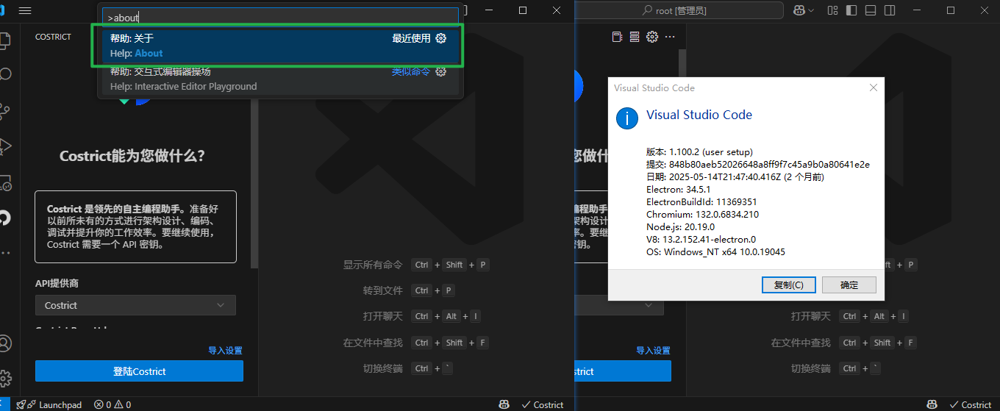
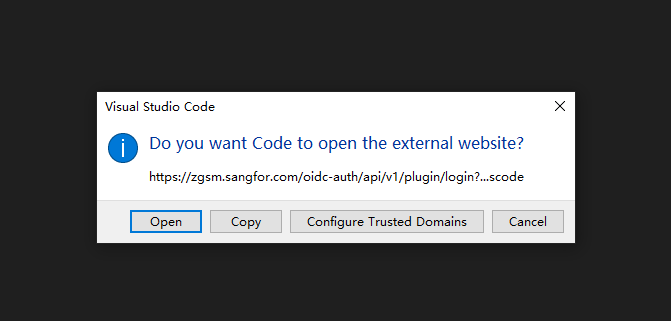
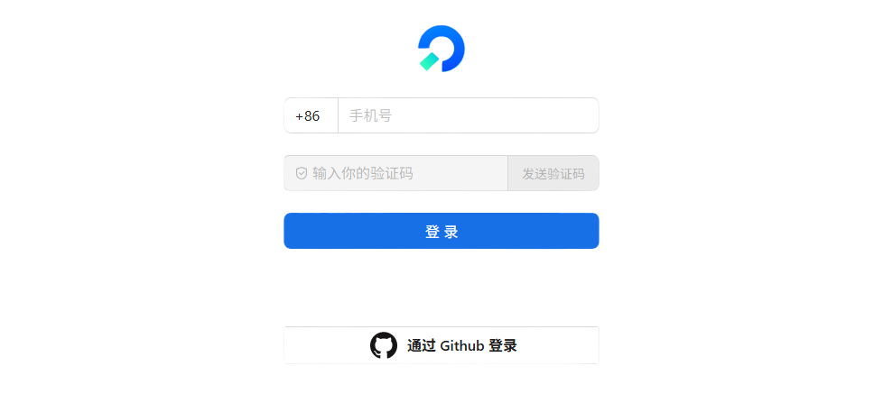

# 安装流程

:::tip[安装要求]

诸葛神码支持的 `vscode` 最低版本是 `1.86`，建议升级到最新的 `vscode` 版本以获得最佳的使用体验

  
 您可以通过快捷键 'Crtl + Shift + p', 输入 'about', 即可查看当前版本 

:::

## 插件安装

- 在 `vscode` 插件商城中搜索 `zgsm` / `shenma` / `costrict` 
- 点击安装
- costrict图标默认会出现在左侧

> 点击左侧的costrict图标, 等待几秒出现如下界面, 即安装成功

## 登陆

> 点击 登陆costrict

> 首次会弹出窗口, 点击打开 (如果点击`配置受信任的域`，后面会直接跳转到浏览器)

> 选择任意一种方式登陆 (推荐使用 `github` 登陆)

> 看到登陆成功页面后，回到vscode，等待几秒即可完成登陆
