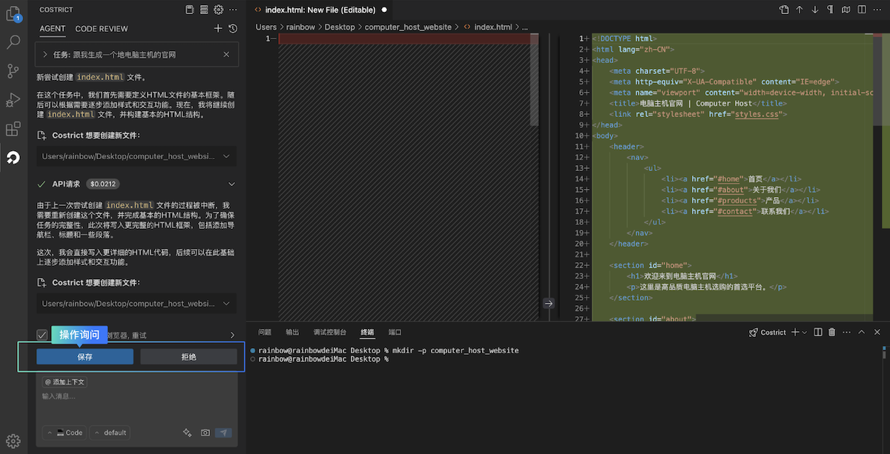
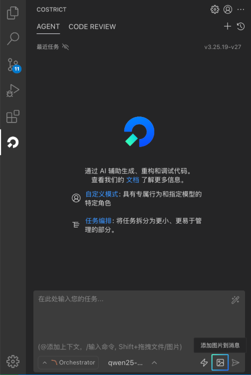

# 智能体（AI Agent）

用户只需通过自然语言描述你的诉求，智能体（AI Agent）能够根据需求端到端完成任务，它功能强大，智能可控。具备：自主决策、全仓库上下文检索、调用工具、错误修复、运行终端等能力。

### 智能问答

当您进行编码工作遇到疑问时可以使用智能问答模式，能够帮您答疑解惑，快速为您生成代码，添加代码注释、代码优化、解释代码、修复代码问题、排查编译报错等。

智能体（智能问答）界面元素

### 快速开启对话

1. 打开CoStrict插件，默认即为Agent对话模式
2. 找到对话框，输入您的指令并发送，比如：帮我生成一个贪吃蛇小游戏；优化当前代码等等
3. 等待模型返回结果，如果遇到本地文件访问、运行命令、文件保存、浏览器访问等权限问题，请正常批准即可。

### 上下文

上下文能够为CoStrict提供关于您项目的具体信息，使其能够更准确、更高效地执行任务。您可以使用上下文来引用文件、文件夹、问题、URL和Git提交等。

快捷键 `@` 能调用上下文。

**类型概览**

**图片上下文**

当需要结合图片生成代码、问题修复、或进行图形化表达时，可点击对话框下方的
按钮添加图片上下文。该功能是否可用取决于模型是否支持图像，若不支持，此处的图片功能则不支持使用。

查看模型对图像的支持情况可前往：设置 > 供应商页面的"模型"描述信息处进行查看。

### 模式选择

CoStrict中的模式是针对特定任务而设计的个性化角色，每种模式提供的功能有所不同，擅长的领域和访问权限也有所区别，用户可根据具体情况作出选择。如果您对这些模式不太了解，建议使用Orchestrator（编排模式），它会根据任务类型自行分配模式。

模式选择有两种使用方式，方式一：点击输入框底部的第一个按钮可以手动选择模式。方式二：在输入框使用快捷键"/"能快速调用mode功能。

**各模式功能介绍**

**Architect模式**

**Code模式**

**Ask模式**

**Debug模式**

**Orchestrator模式**

**模式自定义设置**

CoStrict支持自定义现有模式或创建新的模式。支持定义模式名称、API、角色定义、规则约束和访问的工具。

### 模型选择

CoStrict插件提供了多种模型供用户免费使用。CoStrict最新版本推出了Auto模式，新手用户如果对模型没有特定的偏好，推荐使用该模式。Auto模式会综合考量当前模型列表的效果、速度、Credit的消耗情况，根据任务类型智能为用户选择合适模型来完成任务。点击输入框下方第二个按钮即可切换模型。

