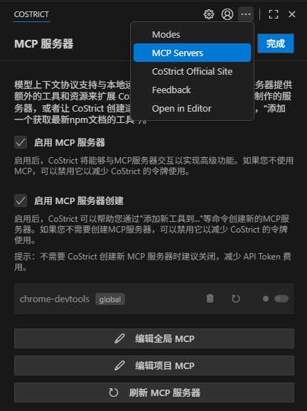
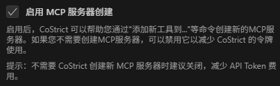
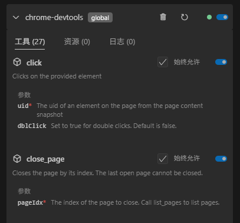
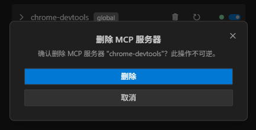
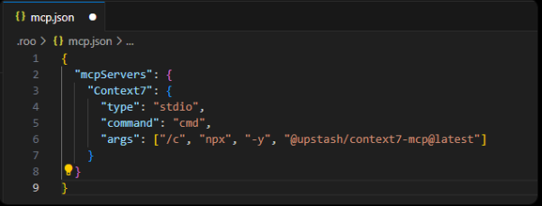
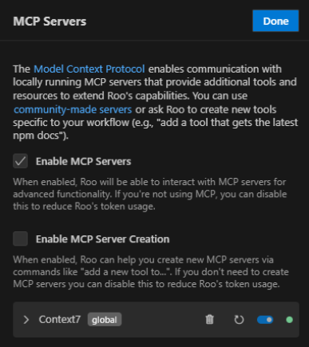

# MCP

### MCP 概述

#### 模型上下文协议 (MCP)

模型上下文协议 (MCP) 是一个通过连接外部工具和服务器来扩展 CoStrict 能力的标准。MCP 服务器提供额外的工具和资源，帮助 CoStrict 完成超出其内置功能的任务，例如访问数据库、自定义 API 和专用功能。

#### MCP 文档

本文档分为以下几个部分：

- **在 CoStrict 中使用 MCP** - 在 CoStrict 中配置、启用和管理 MCP 服务器的完整指南。包括服务设置、工具批准和故障排除。

<!-- -->

- **什么是 MCP？** - 对模型上下文协议、其客户端-服务器架构以及如何使 AI 系统与外部工具交互的清晰解释。

- **推荐的 MCP 服务器** - 为 CoStrict 精心挑选的经过测试和推荐的 MCP 服务器列表，包括 Context7 的设置指南。

### 在CoStrict中使用MCP

#### 配置 MCP 服务器

MCP 服务器配置可在两个层级进行管理：

- **全局配置**：存储于 mcp_settings.json 文件中，可通过 VS Code 设置访问（详见下文）。除非被项目级配置覆盖，否则这些设置将应用于所有工作区。

- **项目级配置：** 定义在项目根目录下的 .roo/mcp.json 文件中。此配置支持设置项目专属服务器，并可通过提交文件至版本控制系统与团队共享配置。CoStrict 会自动检测并加载该文件（若存在）。

**优先级规则：** 若全局配置与项目配置中存在相同服务器名称，则以项目级配置为准。

##### 编辑MCP设置文件

您可直接在CoStrict的MCP设置视图中编辑全局和项目级别的MCP配置文件：

1.  点击CoStrict窗格顶部导航栏中的图标。



2.  滚动至 MCP 设置视图底部。

3.  点击相应按钮：

    1.  编辑全局 MCP：打开全局 mcp_settings.json 文件。

    2.  编辑项目 MCP：打开项目专属的 .roo/mcp.json 文件。若该文件不存在，CoStrict 将为您创建。


这两个文件均采用JSON格式，其中包含一个名为mcpServers的对象，该对象存储了命名服务器配置：

```json
{
    "mcpServers": {
        "server1": {
            "command": "python",
            "args": ["/path/to/server.py"],
            "env": {
                "API_KEY": "your_api_key"
            },
            "alwaysAllow": ["tool1", "tool2"],
            "disabled": false
        }
    }
}
```

*CoStrict中 MCP服务器的配置示例（STDIO传输）*

##### 传输类型说明

MCP支持三种服务器通信传输类型：本地服务器使用的STDIO传输、推荐用于新远程服务器的可流式HTTP传输，以及适用于旧版远程服务器的SSE传输。

###### STDIO传输

适用于本地机器运行的服务器：

- 通过标准输入/输出流通信

- 延迟更低（无网络开销）

- 安全性更高（无网络暴露风险）

- 配置更简便（无需HTTP服务器）

- 在本地机器作为子进程运行

**STDIO配置参数：**

- command（必填）：待执行程序（如node、python、npx或绝对路径）

- args（可选）：传递给命令的字符串参数数组。可使用 \$\{env:VARIABLE_NAME\} 语法引用系统环境变量。

- cwd（可选）：启动服务器进程的工作目录。省略时默认为首个工作区文件夹路径或主进程工作目录。当服务器脚本依赖相对路径时尤为实用。

- env（可选）：包含需为服务器进程设置的环境变量的对象。

- alwaysAllow（可选）：来自本服务器的工具名称数组，用于自动批准。

- disabled（可选）：设为 true 可禁用此服务器配置。

**STDIO 配置示例：**
```json
{
    "mcpServers": {
        "local-server": {
            "command": "node",
            "args": ["server.js"],
            "cwd": "/path/to/project/root", // Optional: Specify working directory
            "env": {
                "API_KEY": "your_api_key"
            },
            "alwaysAllow": ["tool1", "tool2"],
            "disabled": false
        }
    }
}
```

###### 在参数中使用系统环境变量

您可以在 args 数组中使用 \$\{env:VARIABLE_NAME\} 语法引用系统级环境变量。这允许您从系统环境传递 API 密钥或令牌等敏感信息，而无需在配置中硬编码这些信息：
```json
{
    "mcpServers": {
        "github": {
            "command": "docker",
            "args": [
                "run",
                "-i",
                "--rm",
                "-e",
                "GITHUB_PERSONAL_ACCESS_TOKEN=${env:GITHUB_PERSONAL_ACCESS_TOKEN}",
                "ghcr.io/github/github-mcp-server"
            ],
            "alwaysAllow": [
                "get_pull_request"
            ]
        }
    }
}
```

在此示例中，\$\{env:GITHUB_PERSONAL_ACCESS_TOKEN\} 将被替换为系统中 GITHUB_PERSONAL_ACCESS_TOKEN 环境变量的值。这在以下场景中尤为有用：

- 处理需要传递环境变量的 Docker 容器

<!-- -->

- 避免将敏感凭据写入配置文件

<!-- -->

- 在不同凭据的环境中使用相同配置

注意：环境变量必须存在于系统环境中才能生效。您可通过操作系统设置或shell配置文件（如.bashrc、.zshrc或Windows环境变量）设置系统环境变量。

###### 可流式传输的HTTP传输协议

这是通过HTTP/HTTPS访问远程服务器的现代标准，提供更高灵活性，并取代传统SSE传输协议用于新实现。

- 通过HTTP POST/GET向单一MCP端点通信

- 可选支持服务器发送事件(SSE)实现流式传输

- 可部署于独立服务器

- 支持多客户端并发连接

- 需网络访问权限

- 支持集中式部署与管理

有关流式HTTP传输机制的深度解析，请参阅流式HTTP传输文档。

可流式传输的HTTP配置参数：

- type（必填）：必须设置为"streamable-http"。

- url（必填）：远程MCP服务器的完整单一端点URL（例如：https://your-server.com/mcp）。

- headers（可选）：包含随请求发送的自定义HTTP头信息的对象（例如用于认证令牌）。

- alwaysAllow（可选）：来自本服务器的工具名称数组，用于自动批准。

- disabled（可选）：设置为true可禁用此服务器配置。

流式HTTP配置示例：
```json
{
    "mcpServers": {
        "modern-remote-server": {
            "type": "streamable-http",
            "url": "https://your-modern-server.com/api/mcp-endpoint",
            "headers": {
                "X-API-Key": "your-secure-api-key"
            },
            "alwaysAllow": ["newToolA", "newToolB"],
            "disabled": false
        }
    }
}
```

###### SSE传输（传统版）

用于通过HTTP/HTTPS访问的旧版远程服务器。对于新版远程服务器实现，建议使用可流式传输的HTTP传输。

- 通过服务器发送事件协议通信（通常需要客户端到服务器和服务器到客户端通信的独立端点）

- 可部署在不同机器上

- 支持多客户端连接

- 需要网络访问权限

- 支持集中部署与管理

有关旧版 SSE 传输工作原理的详细信息，请参阅 SSE 传输（旧版）。

SSE（旧版）配置参数：

- type（可选，但建议明确声明）：若提供 SSE 服务器网址，应设置为 "sse" 以区别于可流式 HTTP。当 url 存在而 type 被省略时，Roo Code 可能尝试推断类型，但显式声明更安全。

- url（必填）：远程MCP服务器的基准URL。对于传统SSE，这通常意味着服务器会推导或预期独立路径（如/events用于SSE流，/message用于POST请求）。

- headers（可选）：包含随请求发送的自定义HTTP头信息的对象（例如认证令牌）。

- alwaysAllow（可选）：来自本服务器的工具名称数组，用于自动批准。

- disabled（可选）：设为true可禁用此服务器配置。

SSE（旧版）配置示例：
```json
{
    "mcpServers": {
        "legacy-remote-server": {
            "type": "sse", // Explicitly define as SSE
            "url": "https://your-legacy-server-url.com/mcp-base", // Base URL
            "headers": {
                "Authorization": "Bearer your-legacy-token"
            },
            "alwaysAllow": ["oldToolX"],
            "disabled": false
        }
    }
}
```

#### 启用或禁用MCP服务器

在此禁用MCP服务器将从系统提示中移除所有MCP相关逻辑和定义，从而减少令牌消耗。此操作将阻止CoStrict接任何MCP服务器，且use_mcp_tool与access_mcp_resource工具将不可用。若不打算使用MCP服务器，请取消勾选此项。默认处于启用状态。

1.  点击 CoStrict 面板顶部导航栏中的"MCP Servers"

2.  勾选/取消勾选“启用 MCP 服务器”


#### 启用或禁用 MCP 服务器创建功能

在此处禁用 MCP 服务器创建功能仅会移除系统提示中的相关指令（CoStrict 用于编写 MCP 服务器时调用的指令），但不会移除与服务器操作相关的上下文环境。此操作可减少令牌消耗。该功能默认处于启用状态。

1.  点击 CoStrict 面板顶部导航栏中的"MCP Servers"

2.  勾选/取消勾选“启用 MCP 服务器创建”选项



#### 如何使用CoStrict创建MCP服务器

若您需要现有MCP服务器无法提供的特定工具或功能，可请求CoStrict为您构建全新服务器。

**前提条件：** 请确保在MCP设置面板中勾选"启用MCP服务器创建"选项。若此功能处于禁用状态，CoStrict将无法获取构建服务器的必要指令。

**如何启动：**

1.  提出请求：明确向CoStrict请求新工具或功能。例如：

    1.  "创建一个能获取天气的MCP工具。"

    2.  "我需要一个通过API连接公司内部用户数据库的工具。"

    3.  "构建一个与GitHub Gist API交互的MCP服务器。"

2.  CoStrict处理流程（简化版）：提交请求后（且设置已启用），CoStrict将执行：

    1.  获取服务器创建的内部指令。

    2.  在默认MCP目录（macOS系统默认为~/Documents/Cline/MCP）搭建基础服务器项目（通常为TypeScript），除非另有指定。

    3.  编写实现所请求工具的代码，包括处理必要的API调用。

    4.  密钥管理：若工具需API密钥等凭证，CoStrict将通过ask_followup_question工具引导您安全配置为服务器环境变量。

    5.  配置：自动将新服务器配置添加至全局mcp_settings.json或项目目录的.roo/mcp.json文件。

    6.  激活：尝试连接新配置的服务器，使其工具立即可用。

3.  结果：若成功，CoStrict将确认创建完成，新服务器及其工具将出现在您的MCP服务器列表中，随时可供使用。

#### 管理独立的MCP服务器



每个MCP服务器都有独立的配置面板，您可在其中修改设置、管理工具并控制其运行。访问设置步骤如下：

1.  点击 CoStrict 面板顶部导航栏中的"MCP Servers"

2.  在列表中定位需要管理的MCP服务器


##### 删除服务器

1.  点击您要删除的MCP服务器旁的删除按钮

2.  在确认框中点击删除按钮



##### 重启服务器

1.  点击需重启的MCP服务器旁的重启按钮

##### 启用或禁用服务器

1.  点击MCP服务器旁的切换开关进行启用/禁用

##### 网络超时

设置工具调用MCP服务器后等待响应的最大时限：

1.  点击单个MCP服务器配置框底部的"网络超时"下拉菜单，修改时间值。默认值为1分钟，可设置范围为30秒至5分钟。


##### 自动批准工具

MCP工具的自动批准功能按工具单独生效，默认处于禁用状态。配置自动批准步骤如下：

1.  首先在auto-approving-actions中启用全局"使用MCP服务器"自动批准选项

2.  在MCP服务器设置中，定位需要自动批准的具体工具

3.  勾选工具名称旁的"始终允许"复选框


启用后，CoStrict 将自动批准此特定工具而无需提示。请注意全局设置"使用 MCP 服务器"具有优先级——若该设置被禁用，则不会自动批准任何 MCP 工具。

#### 查找并安装MCP服务器

CoStrict未预装任何MCP服务器，您需要自行查找并安装。

- 社区仓库：在GitHub上查看社区维护的MCP服务器列表

- 询问CoStrict：可请求CoStrict协助查找甚至创建MCP服务器（需启用"启用MCP服务器创建"功能）

- 自主构建：使用SDK创建自定义MCP服务器，通过自有工具扩展CoStrict功能

完整SDK文档请访问MCP GitHub仓库[Model Context Protocol · GitHub](https://github.com/modelcontextprotocol/)。

### 什么是MCP

MCP（模型上下文协议）是大型语言模型系统与外部工具及服务交互的标准化通信协议。它作为人工智能助手与各类数据源或应用程序之间的通用适配器发挥作用。

#### 工作原理

MCP采用客户端-服务器架构：

1.  AI助手（客户端）连接至MCP服务器

2.  每台服务器提供特定功能（文件访问、数据库查询、API集成）

3.  AI通过标准化接口调用这些功能

4.  通信采用JSON-RPC 2.0消息协议

可将MCP类比为USB-C接口：任何兼容的大型语言模型都能连接任意MCP服务器以调用其功能。这种标准化消除了为每项工具和服务构建定制集成方案的需求。

例如，使用MCP的AI可执行"搜索公司数据库并生成报告"等任务，而无需为每个数据库系统编写专用代码。

#### 常见问题

- MCP是云服务吗？MCP服务器可根据使用场景和安全需求，在本地计算机上运行，也可作为云服务远程运行。

- MCP会取代其他集成方式吗？不会。MCP与现有工具（如API插件和检索增强生成）互补，提供工具交互的标准化协议，但不会替代专业集成方案。

- 如何保障安全性？用户可自主控制连接的MCP服务器及权限范围。与任何访问数据或服务的工具相同，请使用可信来源并配置适当的访问控制。

#### CoStric中的MCP

CoStric通过实现模型上下文协议实现：

- 连接本地及远程MCP服务器

- 提供统一的工具访问接口

- 无需修改核心即可扩展功能

- 按需启用专业化能力

MCP为AI系统与外部工具服务的交互提供标准化途径，使复杂集成更易实现且更具一致性。

### 推荐的MCP服务

虽然CoStric能够连接任何遵循规范的模型上下文协议（MCP）服务器，但社区已构建了多个开箱即用的优质服务器。本页面精选了我们积极推荐的服务器，并提供分步配置指南，助您在数分钟内高效投入工作。

#### Context7

Context7 是我们首选的通用 MCP 服务器。它内置了一系列需求量极高的工具，仅需一条命令即可完成安装，并在所有支持 MCP 的主流编辑器中均提供卓越支持。

##### 推荐理由

- 一键安装——所有组件打包集成，无需本地构建步骤。

- 跨平台支持——兼容 macOS、Windows、Linux 及 Docker 容器环境。

- 持续维护——Upstash 团队定期发布更新。

- 功能丰富——涵盖数据库访问、网络搜索、文本工具等多元功能。

- 开源许可——采用 MIT 许可证发布。

#### 在CoStrict中安装Context7

注册服务器的常见方式有两种：

1.  全局配置——适用于所有工作区。

2.  项目级配置——与代码一同提交至版本控制系统。

下面我们将分别介绍这两种方式。

##### 1. 全局配置

1.  点击图标打开CoStrict MCP设置面板。

2.  点击编辑全局MCP。

3.  将下方JSON代码粘贴至mcpServers对象内并保存。
```json
{
    "mcpServers": {
        "context7": {
            "command": "npx",
            "args": ["-y", "@upstash/context7-mcp@latest"]
        }
    }
}
```
**Windows (cmd.exe)**
```json
{
    "mcpServers": {
        "context7": {
            "type": "stdio",
            "command": "cmd",
            "args": ["/c", "npx", "-y", "@upstash/context7-mcp@latest"]
        }
    }
}
```
##### 2. 项目级配置

若需将配置提交至代码仓库，请在项目根目录创建名为 .roo/mcp.json 的文件，并添加相同配置片段：
```json
{
    "mcpServers": {
        "context7": {
            "command": "npx",
            "args": ["-y", "@upstash/context7-mcp@latest"]
        }
    }
}
```
**Windows (cmd.exe)**
```json
{
    "mcpServers": {
        "context7": {
            "type": "stdio",
            "command": "cmd",
            "args": ["/c", "npx", "-y", "@upstash/context7-mcp@latest"]
        }
    }
}
```


当全局文件和项目文件都定义了同名服务器时，项目配置优先。

#### 验证安装

1.  请确保在MCP设置面板中已启用"启用MCP服务器"选项。

2.  此时应能看到Context7的列表项。若尚未运行，请点击切换按钮启动它。

3.  首次调用Context7工具时，CoStrict将弹出提示。请批准请求以继续操作。


