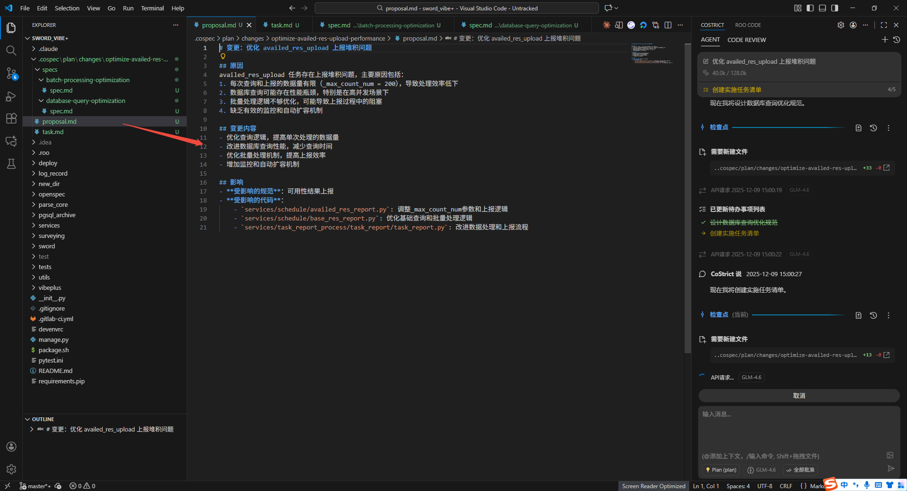
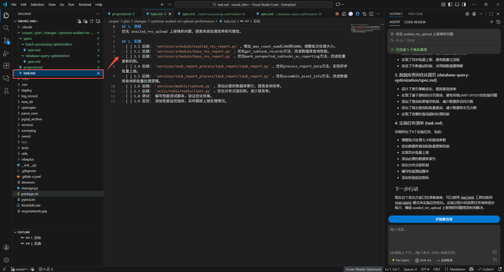
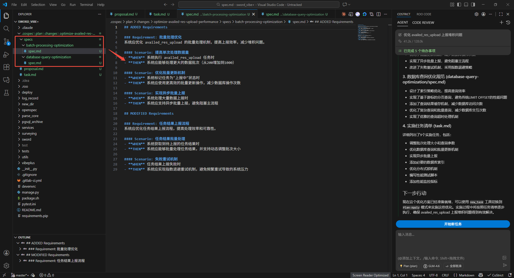
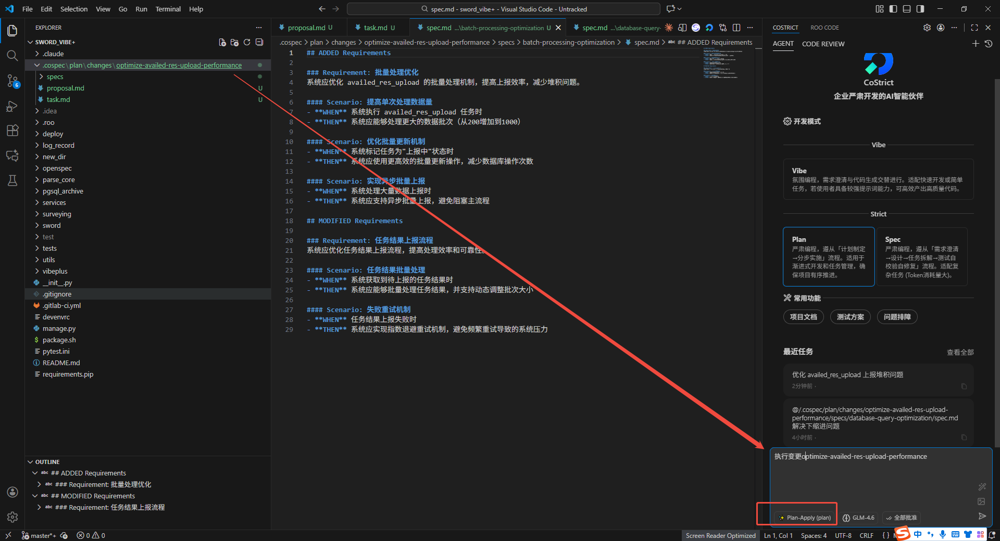
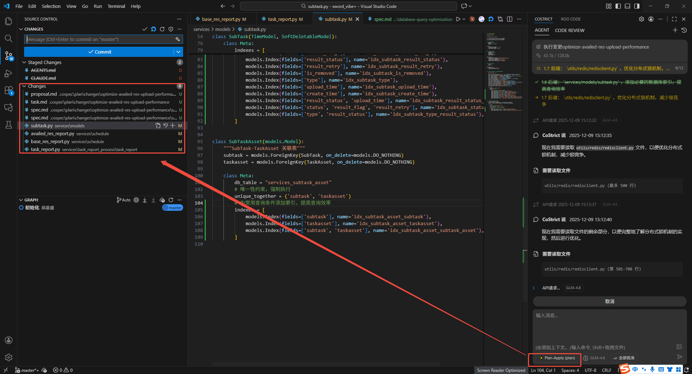
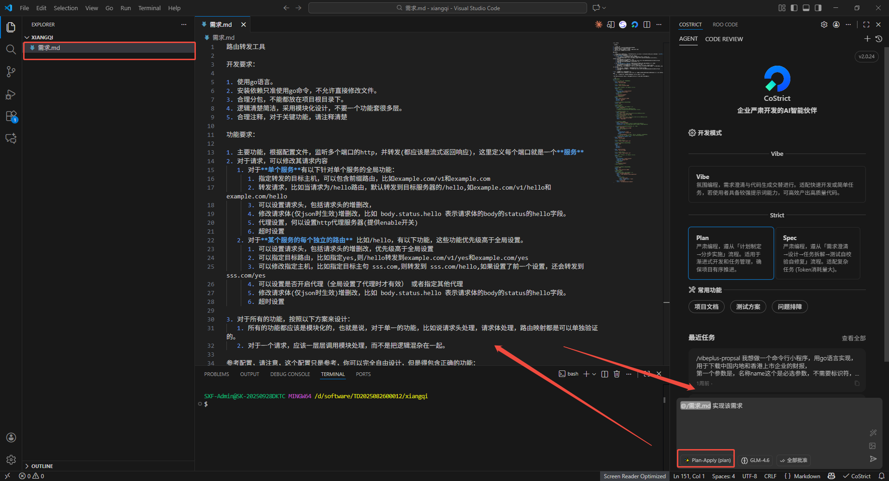
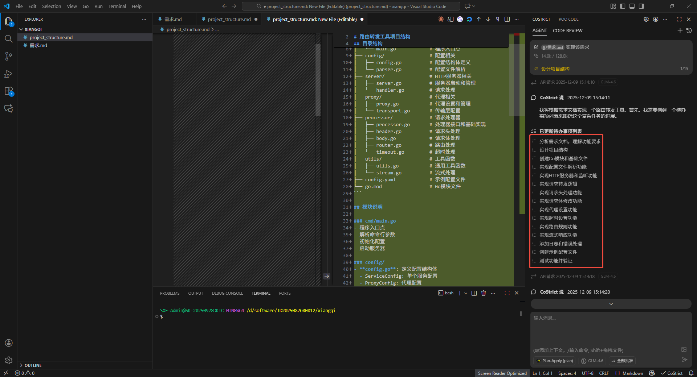

# 严肃编程模式（Plan Mode）

严肃编程，遵从「计划制定→分步实施」流程。适用于渐进式开发和任务管理，确保项目有序推进。

## 软件版本

CoStrict版本更新至2.0.24及以上

## 使用步骤

### 发起提案

#### 点击plan模式，在对话框输入你的需求

经过AI根据你的需求，生成提案、spec、任务、设计（AI会判断是否需要生成）

#### 生成的提案

#### 生成的任务

#### 生成的Spec

### 执行任务

#### 执行变更

当只有一个变更文件夹的时候可以省略变更的名称，可以直接输入执行变更

#### 成功修改任务里面对应代码

### 用户已有需求文档执行

已有写好需求的情况下可以在Plan-Apply Agent下直接实现需求

#### 根据文档中需求执行任务

