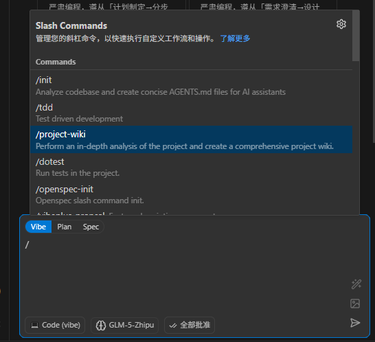
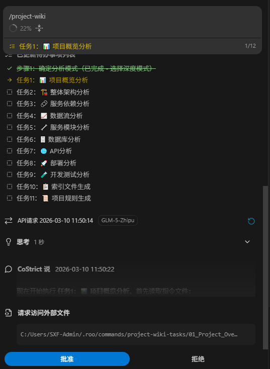

# 项目文档

该功能通过AI对代码仓库进行全方位、多维度深度分析，结合项目特点，生成适配项目的技术文档体系。

## 使用

输入  `/project-wiki` ，输入Enter 执行，等待完成即可。执行时间在数分钟到数十分钟不等，视项目规模而定。





最终输出示例：

```
└─wiki/
    01-项目概览和架构分析.md
    02-核心模块深度分析.md
    03-数据流和状态管理.md
    04-API和接口设计.md
    05-技术实现细节.md
    06-测试和质量保证.md
    index.md
```

