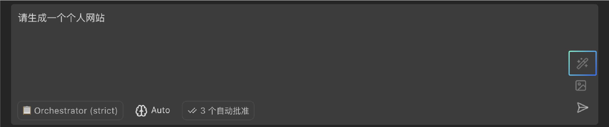
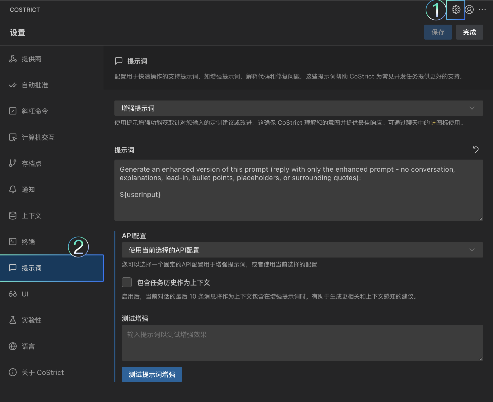

# Prompt提示词

### 增强提示词

CoStrict 的“提示词增强”功能可在您向 AI 模型发送提示词前，有效提升其质量与效果。只需点击聊天输入框中的“魔杖”图标，系统便会自动优化您的初始请求，使表达更清晰明确、指向更具体，从而更容易获得理想结果。

**如何使用提示词增强？**

1.  **输入内容：** 在 CoStrict 聊天框中输入您的需求（可以是简单疑问或复杂任务说明）

2.  **点击魔杖图标：** 切勿直接按回车，请点击输入框右上角的魔杖图标。处理期间图标将呈现旋转动画

3.  **审阅优化结果：** 增强版提示词将替换原始内容，请确认其准确反映您的需求：

    a.  发送前可继续调整优化后的内容

    b.  若需撤销优化，使用 Ctrl+Z（Mac 用户按 Cmd+Z）即可恢复原始内容

4.  **发送最终提示：** 按回车键或点击发送图标即可将优化后的提示词传送出去

注意：当输入框有内容时（非空状态），魔杖图标才会显示出来。

**为何使用提示词增强功能？**

• **提升表达清晰度：** CoStrict会重新组织您的提示词语句，使其更易于 AI 模型理解

• **自动补充关联信息：** 增强过程会为提示词添加相关背景内容（如当前文件路径或已选代码段）

• **优化指令结构：** 通过智能添加指导说明，引导 AI 生成更有价值的回复（例如要求特定格式或详细层级）

• **消除语义歧义：** 有效规避表述模糊问题，确保 CoStrict 能准确理解您的真实意图

• **保持交互一致性：** 所有提示词都将以统一格式传递给 AI 系统

• **情境感知增强：** 启用后可基于近期对话记录，生成更贴合当前语境的优化建议

**增强提示词设置**

"提示词增强"功能采用可定制的提示模板，您可通过修改模板来量身定制增强过程。

**如何设置增强提示词**

**·打开设置：** 点击CoStrict面板中的齿轮图标，或使用设置命令

**·导航至提示设置：** 进入设置页面的"提示词"选项卡

**·选择"增强"：** 从下拉菜单中选取"增强提示词"选项，即可查看并编辑增强提示模板

**·编辑提示词：** 不建议用户自行修改，如有必要可修改提示词输入框内的内容，其中\$\{userInput\}占位符将被替换为您的原始提示词。

**·测试自定义提示：** 编辑完成之后，可点击“测试提示词增强”按钮预览自定义增强提示的效果：

### 提示词结构

本文段将详细介绍 CoStrict 中提示词的技术架构，又是如何与大语言模型（LLM）传递与响应的。

**核心消息类型**

CoStrict 在与大语言模型（LLM）进行传递与响应时，主要涉及三种基础消息类型：

**系统提示词：** 作为初始指令，用于定义 CoStrict 的核心能力、角色设定与操作规则

**用户消息：** 由您主动向 CoStrict 发送的内容

**助手消息：** 大语言模型根据您的请求所生成的回复

在技术实现层面，还存在第四种消息角色：

**工具消息：** 由工具执行后返回的结果，这些结果会作为新的输入信息再次传递给大语言模型

理解这些消息类型的工作机制，不仅能帮助您更高效地与 CoStrict 协作，也对问题排查和高级功能定制具有重要价值。

**系统提示词**

系统提示词是 CoStrict 行为模式的根基，其中包含以下关键组成部分：

- **角色定义：** 根据当前使用模式（如编程、问答、调试等）设定的核心身份指令

- **工具说明：** 可用工具的详细信息，包括参数定义与使用示例

- **工具使用规范：** 工具调用规则，包括顺序执行机制与结果等待要求

- **功能范围：** 描述在当前环境下 CoStrict 能够执行的操作

- **可用模式：** 列出所有可用的工作模式及其功能说明

- **操作规则：** 处理文件、项目结构及用户交互的关键准则

- **系统信息：** 运行环境的具体详情，包括操作系统、命令行工具和工作目录

- **自定义指令：** 您的全局设置及针对特定模式的个性化配置

系统提示词会在您每次与 CoStrict 交互时动态生成，并根据您当前的使用模式、可用工具及个性化设置自动调整。

**用户消息**

用户消息不仅包含您直接向 CoStrict 发送的指令，还会自动附加以下上下文信息：

- **您的提问：** 您在对话界面中输入的具体内容

- **图片内容：** 消息中包含的视觉素材（受支持的模型可使用此功能）

- **环境状态：** 自动采集的工作区实时信息：

  - 已开启的文件与标签页

  - 当前光标所在位置

  - 正在运行且带有输出内容的终端

  - 近期被修改的文件记录

  - 当前时间信息

  - 令牌使用量与成本统计

  - 当前启用的工作模式

  - 文件目录结构（仅在初始连接时提供）

这种自动化的上下文增强机制，使 CoStrict 能够直接理解您的工作环境，无需您再额外进行文字描述。

**助手消息**

助手消息是大语言模型（LLM）生成的响应，其中可能包含以下内容：

- **文本回复：** 针对您的提问直接回答

- **思考过程：** 模型内部的推理逻辑（此功能需手动开启查看）

- **工具调用：** 使用特定工具（如读取文件、执行命令）的操作请求

需要注意的是，虽然助手消息中会包含工具调用请求，但这些工具执行后产生的结果，将通过独立的工具消息传回给大语言模型，而不会直接包含在助手消息中。

**消息流转流程**

以下是各环节协同运作的完整过程：

1.  **初始设置：** CoStrict 根据您选定的工作模式和配置生成系统提示词

2.  **用户输入：** 您发送的指令会与当前工作环境的实时信息进行自动整合

3.  **LLM 处理：** 大语言模型接收所有先前的对话记录及您的新输入内容

4.  **助手响应：** 大语言模型生成回复，此过程可能会调用相关工具

5.  **工具执行：** 若大语言模型请求使用工具，CoStrict 将执行该工具并返回操作结果

6.  **对话记录：** 所有消息都会以结构化形式保存，为后续交互提供完整上下文

### Prompt输入原则

**通用原则**

- **清晰具体：** 明确说出您需要 CoStrict 完成的任务，避免模棱两可

  - **不推荐示例：** “修复代码”

  - **推荐示例：** “修复 calculateTotal 函数中导致返回错误结果的缺陷”

- **提供背景：** 使用“上下文提及”功能来关联特定文件、文件夹或问题

  - **推荐示例：** @/src/utils.ts 使用 async/await 语法重构 calculateTotal 函数

  - **分解任务：** 将复杂需求拆解成多个步骤清晰的小任务

- **给出范例：** 如果您期望特定的代码风格或模式，最好能提供参考示例

- **明确输出格式：** 若需要 JSON、Markdown 等特定格式的输出，请在提示词中事先说明

- **迭代优化：** 如果初次生成的效果不理想，请大胆地优化和调整您的提示词

**思考与行动**

引导 CoStrict 遵循“先思考，后行动”的流程通常会更加高效：

1.  **分析：** 请 CoStrict 先分析现有代码、定位问题或规划解决方案

2.  **规划：** 让 CoStrict 列出它准备执行的具体步骤

3.  **执行：** 指导 CoStrict 按照规划，一步步地实施操作

4.  **检查：** 仔细审阅每一步的执行结果，确认无误后再继续推进

**使用自定义指令**

您可以通过两类自定义指令进一步微调 CoStrict 的行为方式：

- **全局自定义指令：** 对所有模式都生效

- **模式专属指令：** 仅对特定模式（如编程、架构、问答、调试或自定义模式）有效

这些指令会被添加到系统提示词中，为 AI 模型提供持续的指导。您可以用它们来：

- 统一代码风格规范

- 指定首选的程序库或开发框架

- 定义项目特有的约定

- 调整 CoStrict 的回应风格

**处理模糊需求**

当您的请求不够明确或缺乏细节时，CoStrict 可能会：

- **自行推测：** 基于它的理解继续执行，但结果可能不符合您的本意

- **追问澄清：** 使用追问工具来请求您提供更详细的信息

建议从一开始就提供清晰具体的指令，这样可以避免不必要的来回沟通。

**提供反馈**

如果 CoStrict 未能产生理想的结果，您可以通过以下方式提供反馈：

- **拒绝操作：** 当 CoStrict 建议了您不希望执行的操作时，点击"拒绝"按钮

- **说明原因：** 拒绝时，请解释清楚拒绝的理由，这能帮助 CoStrict 从错误中学习

- **重新表述：** 尝试换一种方式重新描述您的初始任务，或给出更具体的说明

- **手动修正：** 如果只有一些小问题，您也可以在接受更改前，直接手动修改代码

**实例对比**

**推荐示例：** “@/src/components/Button.tsx 将 Button 组件从 useReducer Hook 重构为 useState Hook”

**欠佳示例：** “修复按钮”

**推荐示例：** “创建名为 utils.py 的新文件，并在其中添加一个名为 calculate_average 的函数，该函数接收一个数字列表并返回它们的平均值”

**欠佳示例：** “写点 Python 代码”

**推荐示例：** “@problems 请处理当前文件中的所有错误和警告”

**欠佳示例：** “全部修复”

遵循这些技巧，您将能编写出高效的提示词，从而更充分地发挥 CoStrict 的各项能力。
