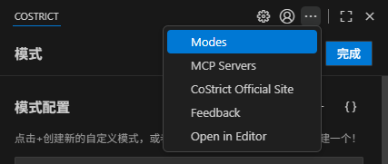
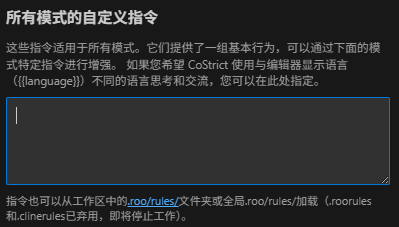

# Rules

Rules可让您个性化设置CoStrict的行为方式，通过提供具体指导来塑造其响应模式、编码风格及决策流程。

### Rules 文件位置

您可以通过全局rules（适用于所有项目）、工作区rules（项目特定）或通过“提示”选项卡界面提供自定义说明。

**全局rules目录：自动应用于所有项目。**

- Linux/macOS: <u>/.roo/rules/ and</u> /.roo/rules-\{modeSlug\}/

<!-- -->

- Windows: %USERPROFILE%\\roo\rules\\ and %USERPROFILE%\\roo\rules-\{modeSlug\}\\

**工作区rules：仅适用于当前项目，若与全局rules存在冲突，优先于全局规则。**

- 目录 (.roo/rules/).
```
.

├── .roo/

│ └── rules/ \# 工作区全局规则

│ ├── 01-general.md

│ └── 02-coding-style.txt

└── ... (其他项目文件)
```

**特定模式rules：仅适用于特定模式（例如code模式）。**

- 目录 (.roo/rules-\{modeSlug\}/).
```

├── .roo/

│ └── rules-code/ \# code模式规则

│ ├── 01-js-style.md

│ └── 02-ts-style.md

└── ... (其他项目文件)
```

rules按顺序加载：全局rules优先，其次是工作区rules。若存在冲突，工作区rules优先。详情参见全局rules目录。

### 什么是自定义rules？

自定义rules定义了超越CoStrict基本角色定义的特定行为、偏好和限制。例如编码风格、文档标准、测试要求和工作流程指南。

### 设置自定义rules



#### 全局自定义rules

这些rules适用于所有工作区，无论您在哪个项目上工作，都能保持您的偏好设置。

设置方法：




1.  **打开提示词标签页**：点击CoStrict 顶部菜单栏中的图标

2.  **找到部分**：找到"所有模式的自定义指令"部分

<!-- -->

3.  **输入指令**：在文本区域中输入您的指令

4.  **保存更改**：点击"完成"保存更改

#### 全局rules目录

全局rules目录功能提供了可重复使用的规则和自定义规则，这些rules会自动应用到您的所有项目中。该系统支持全局配置和项目特定覆盖。

##### 主要优势

**没有全局rules时**：您必须在每个项目中维护单独的规则文件：

- 将相同的规则复制到每个新项目

<!-- -->

- 在多个项目中手动更新规则

<!-- -->

- 项目之间缺乏一致性

**有全局rules时**：创建一次规则，随处使用：

- 全局设置您偏好的编码标准

<!-- -->

- 在需要时按项目自定义特定规则

<!-- -->

- 在所有工作中保持一致

<!-- -->

- 轻松为所有项目更新规则

#### 

##### 目录结构

全局rules目录的位置是固定的，无法自定义：

**Linux/macOS：**
```

~/.roo/ \# 您的全局 CoStrict 配置

├── rules/ \# 适用于所有项目的通用规则

│ ├── coding-standards.md

│ ├── formatting-rules.md

│ └── security-guidelines.md

├── rules-code/ \# 代码模式专用规则

│ ├── typescript-rules.md

│ └── testing-requirements.md

├── rules-docs-extractor/ \# 文档提取规则

│ └── documentation-style.md

└── rules-{mode}/ \# 其他特定模式规则

└── mode-specific-rules.md
```

Windows：
```

%USERPROFILE%\\roo\\ \# 您的全局 CoStrict 配置

├── rules\\ \# 适用于所有项目的通用规则

│ ├── coding-standards.md

│ ├── formatting-rules.md

│ └── security-guidelines.md

├── rules-code\\ \# 代码模式专用规则

│ ├── typescript-rules.md

│ └── testing-requirements.md

└── rules-{mode}\\ \# 其他特定模式规则

└── mode-specific-rules.md
```

##### 设置全局规则

1\. **创建全局规则目录**：
```

\# Linux/macOS

mkdir -p ~/.roo/rules

\# Windows

mkdir %USERPROFILE%\\roo\rules
```

2\. **添加通用规则** (~/.roo/rules/coding-standards.md)：
```

\# Global Coding Standards

1\. Always use TypeScript for new projects

2\. Write unit tests for all new functions

3\. Use descriptive variable names

4\. Add JSDoc comments for public APIs
```

3\. **添加模式特定规则** (~/.roo/rules-code/typescript-rules.md)：
```

\# TypeScript Code Mode Rules

1\. Use strict mode in tsconfig.json

2\. Prefer interfaces over type aliases for object shapes

3\. Always specify return types for functions
```

##### 可用的rules目录

\| 目录 \| 用途 \|

\|------\|------\|

\| \`rules/\` \| 应用于所有模式的通用规则 \|

\| \`rules-code/\` \| 特定于代码模式的规则 \|

\| \`rules-docs-extractor/\` \| 文档提取规则 \|

\| \`rules-architect/\` \| 系统架构任务规则 \|

\| \`rules-debug/\` \| 调试工作流程规则 \|

\| \`rules-\{mode\}/\` \| 任何自定义模式的规则 \|

##### 规则加载顺序

规则按以下顺序加载：

1\. 全局规则（来自 ~/.roo/）

2\. 项目规则（来自 project/.roo/）- 当与全局规则冲突时，优先于全局规则

在每个级别中，模式特定规则在通用规则之前加载。

#### 工作区级rules

这些规则仅适用于您当前的工作区，允许您为特定项目自定义CoStrict的行为。

##### 通过文件/目录 设置工作区范围rules

工作区范围rules适用于当前项目中的所有模式，可以通过文件定义：

- **首选方法：基于目录** (.roo/rules/)

\- 在工作区根目录创建名为 \`.roo/rules/\` 的目录

\- 将指令文件（如 .md, .txt）放入其中。CoStrict 会递归读取文件（包括子目录），按文件名字母顺序将其内容附加到系统提示中

\- 当此目录存在且包含文件时，其内容将与任何全局rules目录一起加载

\- 注意：如果 \`.roo/rules/\` 目录存在但为空，CoStrict将回退使用 \`.roorules\` 文件

- **备用方法：基于文件** (.roorules)

\- 如果 \`.roo/rules/\` 不存在或为空，CoStrict 会在工作区根目录查找单个 \`.roorules\` 文件

\- 如果找到，则加载其内容

##### 模式特定rules

模式特定rules可以通过两种独立的方式设置，可以同时使用：

1.  **使用提示词标签页**：


- 打开标签页：点击 CoStrict 顶部菜单栏中的"Modes"的按钮

- 选择模式：在"模式"标题下，点击要自定义的模式按钮

- 输入指令：在"模式特定自定义指令（可选）"下的文本区域输入指令

- 保存更改：点击"完成"保存更改

**全局模式rules**：如果模式本身是全局的（非工作区特定），您为其设置的任何自定义指令也将全局适用于该模式的所有工作区。

2\. **使用rules文件/目录**：通过文件提供模式特定规则：

- 在工作区根目录创建名为 \`.roo/rules-\{modeSlug\}/\` 的目录（例如 \`.roo/rules-docs-writer/\`）

- 将指令文件放入其中（递归加载，包括子目录）。文件按文件名字母顺序读取并附加到系统提示中

- 如果目录存在且包含文件，此方法优先于回退文件方法

来自提示选项卡的指令、全局规则、工作区规则以及模式特定规则均被合并。具体顺序请参见下文。

## 

### Rules如何组合

rules按以下格式放置在系统提示中：
```

====

USER'S CUSTOM INSTRUCTIONS

The following additional instructions are provided by the user, and should be followed to the best of your ability without interfering with the TOOL USE guidelines.

Language Preference:

\[Language preference if set\]

Global Instructions:

\[Global Instructions from Prompts Tab\]

Mode-specific Instructions:

\[Mode-specific Instructions from Prompts Tab for the current mode\]

Rules:

\# Rules from rules-\{modeSlug\} directories:

\[Contents of ALL files from ~/.roo/rules-\{modeSlug\}/ AND .roo/rules-\{modeSlug\}/ if they exist\]

\# Rules from .roorules-\{modeSlug\}:

\[Contents of .roorules-\{modeSlug\} file if no mode-specific directories have files\]

\# Rules from .rooignore:

\[.rooignore-related instructions if applicable\]

\# Agent Rules Standard (AGENTS.md):

\[Contents of AGENTS.md or AGENT.md from workspace root if present and enabled\]

\# Rules from rules directories:

\[Contents of ALL files from ~/.roo/rules/ AND .roo/rules/ if they exist\]

\# Rules from .roorules:

\[Contents of .roorules file if no general rules directories have files\]

====
```

*注意：系统会从所有适用的目录（包括全局目录 ~/.roo/ 和工作区目录 .roo/）加载规则，而不仅限于首个包含文件的目录。模式特定规则优先于通用规则显示。基于目录的规则仅在确定使用何种方法时优先于基于文件的备用方案，但所有适用目录均会被读取。*

### 关于 .rules 文件的规则

- **文件位置**：首选方法使用 \`.roo/\` 内的目录（\`.roo/rules/\` 和 \`.roo/rules-\{modeSlug\}/\`）。

<!-- -->

- **递归读取**：rules目录递归读取，包括子目录中的所有文件

<!-- -->

- **文件过滤**：系统自动排除缓存和临时文件（.DS_Store, *.bak,* .cache, *.log,* .tmp, Thumbs.db 等）

<!-- -->

- **空文件**：空或缺失的rules文件会被静默跳过

<!-- -->

- **来源标头**：基于目录的rules包含每个文件的标头 \`# Rules from \{absolute path\}:\`，而基于文件的规则包含 \`# Rules from \{filename\}:\` 标头

<!-- -->

- **聚合**：全局和工作区规则目录都会为模式特定和通用规则进行聚合（非二选一）

<!-- -->

- **排序**：文件仅按基本名称排序，不区分大小写

<!-- -->

- **标头路径**：标头路径是绝对的并遵循符号链接

<!-- -->

- **规则交互**：模式特定规则是对全局规则的补充而非替换

<!-- -->

- **符号链接**：完全支持文件和目录，最大解析深度为 5，以防止无限循环

### AGENTS.md 支持

CoStrict 还支持从工作区根目录的 AGENTS.md 文件加载规则：

- **目的**：为 AI 行为提供agent特定规则和指南

<!-- -->

- **位置**：必须位于工作区根目录

<!-- -->

- **加载**：默认自动加载。要禁用 AGENTS.md 加载，请在 VSCode 设置中设置 \`"zgsm.useAgentRules": false\`

<!-- -->

- **设置**：zgsm.useAgentRules（默认：true）

<!-- -->

- **偏好**：如果两者都存在，优先使用 AGENTS.md 而非 AGENT.md

<!-- -->

- **优先级**：在模式特定规则和 .rooignore 之后加载，在来自 ~/.roo/rules 和 .roo/rules 的通用规则之前

<!-- -->

- **标头**：添加到系统提示中，标头为 \`# Agent Rules Standard (AGENTS.md):\` 或相应的 \`(AGENT.md):\`

<!-- -->

- **空文件**：空或仅包含空白的 AGENTS.md 会被忽略

<!-- -->

- **符号链接**：在读取之前解析指向文件或目录的符号链接

此功能允许团队维护标准化的 AI agent行为规则，这些规则可以与项目代码一起进行版本控制。

### 自定义rules示例

- "始终使用空格进行缩进，宽度为 4 个空格"

<!-- -->

- "变量名使用驼峰命名法"

<!-- -->

- "为所有新函数编写单元测试"

<!-- -->

- "在提供代码前解释您的推理"

<!-- -->

- "专注于代码的可读性和可维护性"

<!-- -->

- "优先使用社区中最常见的库"

<!-- -->

- "当向网站添加新功能时，确保它们是响应式且可访问的"

**专业提示：团队标准化**

对于团队环境，请考虑以下方法：

- **项目标准**：使用版本控制下的工作区 \`.roo/rules/\` 目录来标准化特定项目的 CoStrict 行为。这确保了团队成员之间一致的代码风格和开发工作流程。

<!-- -->

- **组织标准**：使用全局规则（\`~/.roo/rules/\`）建立适用于所有项目的组织范围编码标准。团队成员可以设置相同的全局规则，以在所有工作中保持一致。

<!-- -->

- **混合方法**：将组织标准的全局规则与项目特定要求的工作区规则相结合。当规则冲突时，工作区规则优先。

### 与自定义模式结合使用

对于高级自定义，可以与自定义模式结合使用，以创建具有特定工具访问、文件限制和定制rules的专门环境。
