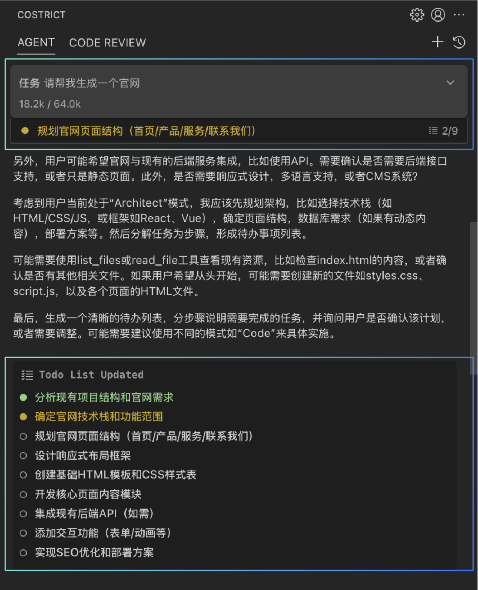
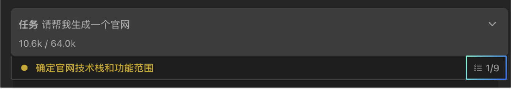
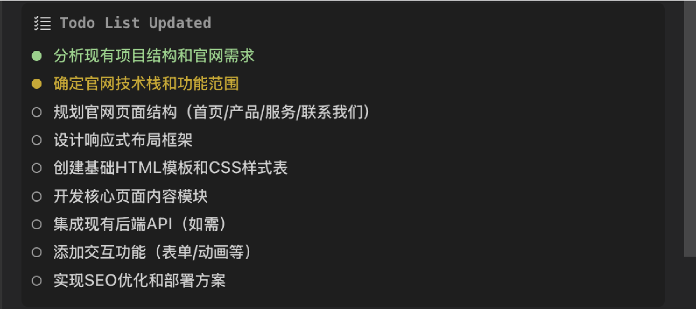

# Todo List

待办事项管理是一个待办事项列表，它能够清晰的反应 CoStrict 接下来要做的事任务以及跟踪当前工作流程的进度。在以下场景中它会被自动创建：处理复杂任务时、有多个工作步骤流程或者使用 Architect 模式时。你也可以手动触发该功能，只需要在对话中要求 CoStrict ：“使用 to do list”。举例：请创建一个贪吃蛇小游戏，使用 to do list.

### 工作原理

任务待办清单功能由update_todo_list工具驱动，该工具支持在聊天界面内实现动态任务管理。

**CoStrict 何时创建待办清单**

CoStrict 通过自动检测和手动请求两种方式创建待办清单：

• **任务复杂性** - 当识别到您的请求包含多个步骤、阶段或依赖关系时

• **Architect模式** - 该模式下始终将待办清单作为规划工作的核心

• **直接工具请求** - 说出“使用todo list”即可。

请注意：即使手动触发时，CoStrict 仍会主导待办清单的内容与流程。您可在确认环节提供反馈，但清单内容始终由 CoStrict 根据任务需求进行管理。

## 

### 显示与交互操作

待办事项列表会在多个位置显示：

1.  **任务标题摘要：**

在聊天界面顶部展示代办事项，为只读视图，展示进度和下一个重要事项，任务标题摘要中显示的待办列表进度。点击标题右侧的折叠按钮，会出现一个待办事项的浮动面板：

- **关闭ToDo List浮窗：** 点击面板以外区域即可关闭

- **完整的待办事项列表：** 显示所有待办事项及其当前状态指示器

- **自动滚动：** 自动滚动到当前进行中的任务

- **流畅动画：** 折叠/展开动效提升用户体验

- **状态保持：** 重新打开时维持之前的滚动位置

2.  **交互式工具区块：**

聊天界面内提供的ToDo List的界面，支持以下功能：

- 查看所有待办事项及其当前状态

- 点击"编辑"按钮进入编辑模式后可：

  - 直接修改任务描述

  - 使用下拉选项更改任务状态

  - 通过任务右侧的 ×按钮删除任务

  - 通过列表下方的"＋添加待办事项"按钮新增任务

- 查看 CoStrict 管理待办工作流的进度

### 状态说明

CoStrict 基于任务进度自行控制状态的流转。每个待办事项包含以下三种状态之一：

- **待开始：** 显示带边框的空心圆圈，表示任务尚未启动

- **进行中：** 显示实心黄色圆圈，表明任务正在处理中

- **已完成：** 显示实心绿色圆圈，确认任务已全部完成

